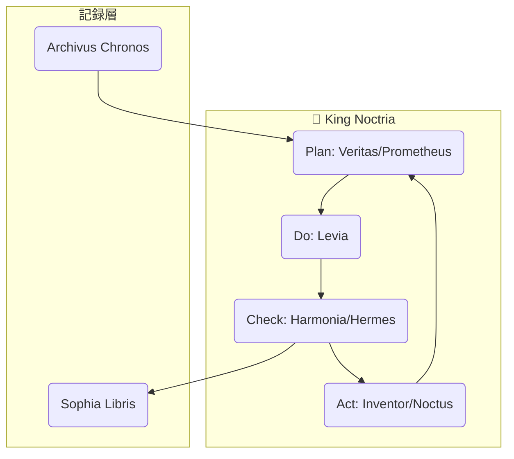

# 🧭 Noctria Kingdom — 現状とロードマップ（CrewAI導入期・拡張登用追記版）

## I. 現状サマリー（2025-10-05 時点）

| 項目 | 状況 | 概要 |
|------|------|------|
| 🏗️ システム基盤 | ✅ 稼働中 | GUI（FastAPI＋HUD）、Airflow DAG群、PDCA統合パイプライン（pytest＋ruff＋Git Push連動）を構築済み。 |
| 🧠 LLM連携 | ✅ 稼働 | GPT API / Ollama 両対応。LangGraph による自律PDCAフロー試験運用開始。 |
| 🧩 モジュール構成 | ✅ 整備 | `src/` 以下で Plan / Strategy / Codex / Core / GUI の分層アーキテクチャ確立。 |
| 🧮 観測性 / 記録 | ✅ 稼働 | Postgres Chronology / JSONL ログ / pdca_summary GUI ダッシュボードが機能。 |
| 🧰 AutoFix 系統 | ✅ 稼働 | `scripts/auto_fix_loop.py` によりPDCA強化ループが回転。LangGraphとの統合を検証中。 |
| 🧠 CrewAI基盤 | 🧩 導入準備中 | CrewAI import 成功。臣下AIの定義と役割分担を整備中。 |
| 🔁 PDCA可視化 | ✅ 稼働 | `/pdca/graph` による LangGraph フロー可視化・LiveLog永続化を実装済み。 |
| 🪶 ログ管理 | 🟡 改善中 | JSONL 永続化＋ローテーション対応完了。リロード後の再接続復元を強化中。 |

---

## II. 現行構造（7臣体制）

| 役職 | コード | 主要責務 |
|------|--------|-----------|
| ⚙️ **Veritas Machina** | `src/veritas/` | 機械学習戦略生成。Optuna最適化とモデル出力。 |
| ⚡ **Levia Tempest** | `src/strategies/levia_tempest.py` | 即時シグナル判断・短期トレード。 |
| 🛡️ **Noctus Sentinella** | `src/strategies/noctus_gate.py` | リスク上限・ドローダウン管理。 |
| 🔮 **Prometheus Oracle** | `src/strategies/prometheus_oracle.py` | 市場予測（信頼区間付き）。 |
| 🧠 **Hermes Cognitor** | `src/hermes/` | 戦略説明・説明責任・言語レポート生成。 |
| ⚖️ **Harmonia Ordinis** | `src/codex/harmonia_review.py` | コード/戦略品質審査・理念整合チェック。 |
| 🧩 **Inventor Scriptus** | `src/codex/inventor_agent.py` | コード生成・修正・テスト合格後自動提案。 |

これらは王（King Noctria）の指揮下で自律的にPDCAを回す **戦略AI群（臣下AI）** として機能する。

---

## III. 拡張登用構想（CrewAI期に向けた新臣）

| 名称 | 象徴 | 目的 |
|------|------|------|
| 🪶 **Archivus Chronos** | “時の書記官” | 全PDCA・会話・成果をChronicleDBへ永続記録。 |
| 📚 **Sophia Libris** | “知識の司書” | LlamaIndex等で過去の文書・議事・コード検索を自動化。 |
| 🧬 **Mentis Refiner** | “学習補佐官” | AI群の成果メトリクスを分析して自己改善ループを生成。 |
| 🧩 **Metron Strategos** | “戦略監査官” | KPI/KGI監視、CrewAI活動のPDCA分析。 |
| ⚙️ **Regulus Mechanis** | “機構管理官” | GPU/CPU/メモリ等のリソース配分・負荷調整。 |
| 🛰️ **Hermod Communis** | “外務官” | GPT / Ollama / API切替の通信最適化。 |
| 🤝 **Consilium Agora** | “評議会官” | CrewAI・AutoGen・LangGraph間の意見調整。 |

---

## IV. 今後の拡張登用候補（将来検討）

| 名称 | 象徴 | 主な構想領域 |
|------|------|--------------|
| 🧭 **Oraculum Visionis** | “市場遠望者” | 世界経済・為替ニュース・地政学イベントをマルチソース解析し、Prometheusへ助言。 |
| 🧮 **Fintokei Praetor** | “規律監察官” | Fintokei 準拠のコンプライアンスルール自動適用・取引制限調整。 |
| 🧠 **Daemon Auditrix** | “監査精霊” | すべてのエージェント行動・出力・決定の監査証跡を生成し、透明統治を保証。 |
| ⚔️ **Executor Bellator** | “実行将軍” | MetaTraderや実取引APIとの接続・自動発注統制を司る。 |
| 🪙 **Aurum Vindex** | “財務執政官” | 取引コスト・収益率・手数料の最適化分析とポートフォリオ調整。 |
| 🌌 **Aeon Architectus** | “システム設計官” | LangGraph・CrewAI・AutoGen・Ollamaのアーキ融合を行い、統治層設計を進化させる。 |
| 🌿 **Ethica Guardian** | “倫理守護官” | AI判断の倫理基準・説明責任ポリシー策定と遵守監査。 |
| 📊 **Numerae Analysta** | “統計参謀” | 市場統計・モデル精度・取引分布のメタ分析と信頼区間モニタリング。 |

> 🏛️ これらの臣下は「7臣核構造」を保ちつつ、必要に応じて追加登用される。  
> 目的は、Noctria 王国の知性を階層的に拡張し、「統治AIの多脳化」を実現すること。

---

## V. 現在のPDCA連携状態

- **LangGraph** がこのループを制御（各ノード＝臣下AIをCrew化予定）  
- **PDCA GUI** (`/pdca/graph`) はループ状態の観測＋実行トリガを提供。

---

## VI. ロードマップ（CrewAI 統治化）

| フェーズ | 内容 | 到達目標 |
|-----------|------|----------|
| **Phase 1:** CrewAI 基盤構築 | Crew/Agent 定義・7臣マッピング | 各臣下AIをCrew上のエージェント化 |
| **Phase 2:** LangGraph × CrewAI 連携 | PDCAループをCrewワークフローに統合 | 部分的自律化（提案・審査・修正連鎖） |
| **Phase 3:** Ollama / GPT 自動切替 | Hermod Communisによる通信制御 | 負荷分散＋コスト最適化 |
| **Phase 4:** Archivus Chronos 永続知能化 | ログからLlamaIndexへ自動転写 | ナレッジグラフ型自己学習体制 |
| **Phase 5:** Metron & Refiner 導入 | 成果のKPI/KGI最適化 | 自己改善PDCA（Auto-Tuning Governance） |
| **Phase 6:** 完全自律統治 | 王（King Noctria）がCrew全体を統括 | 自律戦略国家「Noctria Kingdom」完成 |

---

## VII. 哲学的指針（King Noctria の三則）

1. **「数の知恵を集めよ」** — 複数AIの知見を統合せよ。  
2. **「透明な統治を行え」** — 全ての判断を記録し説明可能にせよ。  
3. **「PDCAを絶やすな」** — 改善の火を絶やさず王国を磨け。

---

## VIII. 現在地と次の一手

| 現在 | 次の一手 |
|------|-----------|
| LangGraph と GUI の連携・永続ログ安定化済 | CrewAI フェーズ移行：臣下エージェントの定義（Python or YAML）開始 |
| LiveLog 永続化＋ローテーション稼働中 | Crew 状態監視ダッシュボード設計へ |
| Ollama/GPT 両系統稼働確認済 | Hermod Communis で動的振り分けロジック導入へ |

---

> 🔮 **最終目的:**  
> Noctria 王が自律的に PDCA を回し、Crew（臣下AI）と共に  
> 勝率・利益・知識を増やして王国を繁栄させる。  

---

📜 **次の作業提案:**  
CrewAI 用の「7臣Crew構成定義（`crew_config.py` or `crew.yaml`）」を作成し、  
LangGraph の `pdca_langgraph.py` に接続できるよう整備する。

