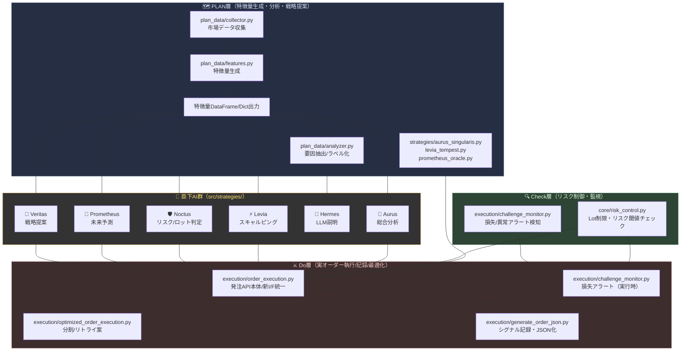

# Noctria Kingdom System Design（v2025-08 統合版）

## 1. 目的と範囲
- プロジェクト全体の構造・責務・連携・運用ルールを**単一の真実**として管理  
- PDCA（Plan–Do–Check–Act）循環を**DAG/コード/DB**で実装・観測・調整するための仕様

## 2. 全体アーキテクチャ（P/D/C/A）
- **Plan (P)**: 特徴量定義・戦略設計・ハイパラ探索  
  - `src/plan_data/*`, `src/scripts/optimize_params_with_optuna.py`
- **Do (D)**: 生成・学習・評価・昇格・発注  
  - 生成/学習: `src/veritas/*`, `src/training/*`  
  - 昇格: `src/scripts/apply_best_params_to_kingdom.py`  
  - 発注: `src/execution/*`（`src/noctria_ai/noctria.py` は現状ほぼ未使用）
- **Check (C)**: 取引妥当性検証・運用監査・メトリクス収集  
  - DBテーブル: `validation_events`, `execution_events`, `perf_timeseries`  
  - ユーティリティ: `src/core/utils.py` の `log_*` 群
- **Act (A)**: 政策更新・閾値調整・リリース手順  
  - `policies` / `policy_versions`（DB）、`src/core/risk_control.py`（反映先）

## 3. 主要コンポーネントと責務
- **データ取得（正規API）**: `src/core/data/market_data_fetcher.py: MarketDataFetcher`  
  - `fetch(source="yfinance"|"alphavantage")` で統一（Alpha Vantage は `src/core/data_loader.py` をブリッジ／Deprecation 警告あり）
- **経路依存の吸収**: `src/core/path_config.py`（ルート/データ/GUI/DAG など全パス）  
- **DAG群**: `airflow_docker/dags/*`
  - `noctria_kingdom_dag.py`: 定時の観測→（前検証）→会議→記録
  - `noctria_kingdom_pdca_dag.py`: Optuna → MetaAI適用 → Kingdom昇格 → 王決断
- **モデル昇格**: `src/scripts/apply_best_params_to_kingdom.py`（`models/official/model_registry.json` を更新）  
- **GUI**: `noctria_gui/*`（ダッシュボード/戦略一覧/履歴表示）

## 4. PLAN層・Check層・AI臣下・Do層 全体構造（組み込み）

## 5. データモデル（C層の中核）
作成済テーブル：
- `validation_events(id, created_at, dag_id, task_id, run_id, symbol, check_name, passed, severity, details(jsonb), context(jsonb))`
- `execution_events(id, created_at, dag_id, task_id, run_id, symbol, action, qty, price, status, broker_order_id, latency_ms, error, extras(jsonb))`
- `perf_timeseries(id, ts, metric_name, value, tags(jsonb))`
- `policies(id, key(unique), version, is_active, body(jsonb), created_at)`
- `policy_versions(id, policy_key, version, body(jsonb), changes, created_at)`

ログ書き込みユーティリティ（追加済）：
- `src/core/utils.py`: `log_validation_event`, `log_execution_event`, `log_metric`

## 6. 取引前チェック仕様（P層→C層に定義・運用はDAGで実行）
チェックID / 目的 / 最低限の入力 / 失敗時動作（既定）：
1. **position_limit** / 既存 + 今回注文が許容量超過しないか / 口座ポジ, 注文量 / BLOCK  
2. **hedge_restriction** / 同通貨ペアで両建てにならないか / 既存建玉方向, 注文方向 / BLOCK  
3. **lot_caps_single/day** / ロット単体上限 / 日合計上限 / 注文量, 当日実績 / BLOCK  
4. **margin_check** / 必要証拠金不足なし / 口座余力, 証拠金試算 / BLOCK  
5. **leverage_cap** / 規制上限（国内25倍）遵守 / 口座通貨, レバ設定 / BLOCK  
6. **slippage_anomaly** / 指値/成行の乖離異常 / 市場価格, 指定価格 / CANCEL  
7. **tick_spike** / 急変・スパイク検知 / 直近期・ボラ / CANCEL  
8. **duplicate_signal** / 短時間の同一条件連発 / シグナルID, 時刻 / SKIP  
9. **signal_freshness** / シグナル鮮度（≦30s） / 発生時刻 / WARN→継続 or SKIP（選択式）  
10. **macro_event_filter** / 指標前後回避 / 経済カレンダー / SKIP  
11. **low_liquidity** / 早朝・週末流動性低下 / 時刻/曜日/流動性 / SKIP  
12. **legal_restrictions** / 禁止銘柄/時間帯/注文種別 / ポリシー参照 / BLOCK

C層への記録規約：
- `details` に閾値・実測値・判断根拠を入れる（例：`{"limit":100000,"would_be":120000}`）  
- `severity` は `INFO|WARN|ERROR|BLOCK`  
- 失敗時は `passed=false`（WARNは `passed=true` でも可）

## 7. DAGカタログ（主要DAG）
- **`noctria_kingdom_dag.py`**
  - `fetch_market_data` → **`pretrade_validate`（追加推奨）** → `hold_council` → `log_decision`
- **`noctria_kingdom_pdca_dag.py`**
  - `optimize_worker_*`×N → `select_best_params` → `apply_best_params_to_metaai` → `apply_best_params_to_kingdom` → `royal_decision`

## 8. 依存とバージョン整合
- 正：`requirements.txt` に `yfinance==0.2.65`, `statsmodels==0.14.5`  
- Airflow：`airflow_docker/requirements.txt` も **同一バージョン**に固定（再ビルド時の差分防止）

## 9. 命名・インポート規約（決定事項）
- **正規Fetcher**: `from src.core.data.market_data_fetcher import MarketDataFetcher`  
- 旧 `src.core.data_loader.MarketDataFetcher` は**非推奨**（Deprecation Warning 付与済）  
- Alpha Vantage 利用時のシンボルは `"USDJPY"|"USDJPY=X"|"USD/JPY"` を受け付け、自動正規化

## 10. ファイル一覧（要点だけ抜粋・役割）
- `src/core/path_config.py` … ルート/データ/GUI/DAGのパス一元管理  
- `src/core/data/market_data_fetcher.py` … 統一データ取得API（YF/AV）  
- `src/core/data_loader.py` … AV専用（非推奨・互換）  
- `src/core/utils.py` … ロガー＋DBロギング（validation/execution/metric）  
- `src/scripts/optimize_params_with_optuna.py` … Optuna最適化（PPO＋Pruning）  
- `src/scripts/apply_best_params_to_metaai.py` … （現状あまり使用せず／保持）  
- `src/scripts/apply_best_params_to_kingdom.py` … モデル昇格・レジストリ更新  
- `airflow_docker/dags/*.py` … PDCA/D決裁/構造検査などのDAG群  
- `noctria_gui/*` … ダッシュボード、戦略一覧、PDCA可視化

## 11. 運用ルール
- Airflow の再ビルドは DB に影響なし（**volumesを消さない**）  
- 依存更新は `requirements*.txt` を**まず修正** → ビルド → 起動順は webserver → scheduler  
- DB変更は **DDLファイル化**して `docker exec -f` で適用（手貼りは避ける）

## 12. 未決定/ToDo
- GUIに**validation_events** 一覧・検索UIを追加（ルート/テンプレ決め）  
- `pretrade_validate_task` を `noctria_kingdom_dag.py` に正式導入  
- 経済指標カレンダーの取得源（外部API or ローカルCSV）を選定  
- `execution_events` の入力点（実発注コード or 模擬執行）を確定  
- `policies.body` のスキーマ標準形（YAML/JSONのキー）を確定
