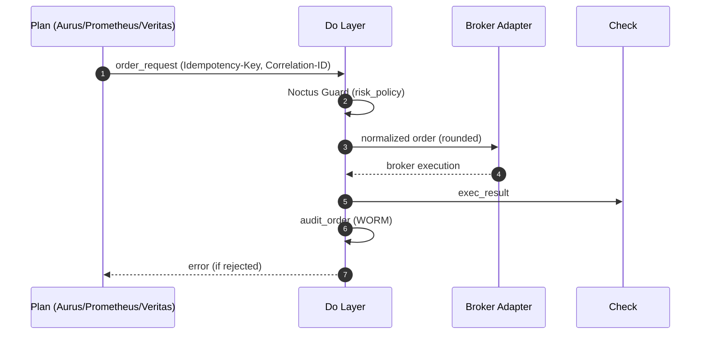

<!-- AUTODOC:BEGIN mode=file_content path_globs=docs/_partials/apis/Do-Layer-Contract/02_flow_overview.md title=フロー（概観） -->
### フロー（概観）

<!-- AUTODOC:BEGIN mode=file_content path_globs=docs/_partials/apis/Do-Layer-Contract/02_flow_overview.md title=フロー（概観） -->
### フロー（概観）

<!-- AUTODOC:BEGIN mode=file_content path_globs=docs/_partials/apis/Do-Layer-Contract/02_flow_overview.md title=フロー（概観） -->
### フロー（概観）

---
<!-- AUTODOC:END -->
<!-- AUTODOC:END -->
<!-- AUTODOC:END -->
<!-- AUTODOC:END -->
