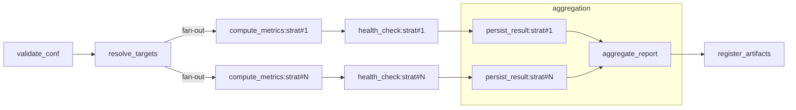

# Airflow DAG — PDCA Recheck
**Last Updated:** 2025-08-24 (JST)  
**Owner:** PDCA / Data Platform

関連文書:
- `docs/apis/PDCA-Recheck-API-Spec.md`
- `docs/architecture/patterns/Outbox-Worker-Protocol.md`
- `docs/observability/DoLayer-Metrics.md`
- `docs/security/Secrets-Policy.md`

---

## 0. 目的
GUI/API からの再チェック要求を受け、対象戦略のメトリクス再計算・健全性評価・結果登録を**安定運用**する DAG を定義する。

---

## 1. DAG 定義
- **DAG ID:** `pdca_recheck`
- **スケジュール:** 非スケジュール（on-demand トリガ専用）
- **start_date:** `2025-08-24`
- **catchup:** `False`
- **Concurrency:**
  - `max_active_runs`: `8`（初期）
  - `concurrency`: `64`（タスク並列上限）
- **Owner:** `pdca`

### 1.1 conf（API から渡す）
```json
{
  "request_id": "01JABCXYZ-ULID-5678",
  "strategies": ["strat.meanrev.m1","strat.breakout.h1"],
  "window": {"from":"2025-08-01T00:00:00Z","to":"2025-08-24T00:00:00Z"},
  "reason": "daily-healthcheck",
  "params": {"recalc_metrics":["winrate","sharpe"], "retrain": false},
  "trace_id": "gui-req-1234",
  "client_id": "ops-ui",
  "dry_run": false
}
```

---

## 2. タスク構成（概要）


- **validate_conf**: 入力検証・期間/件数チェック・dry_run 処理
- **resolve_targets**: `strategies[]` の正規化（メタDB参照）・重複除去
- **compute_metrics:\***: 期間でバックテスト/再集計（並列）
- **health_check:\***: KPI を閾値で判定（healthy/degraded/unknown）
- **persist_result:\***: 結果をメタDBへ upsert（結果 digest 生成）
- **aggregate_report**: 全体統計・失敗一覧をまとめる
- **register_artifacts**: XCom/外部ストレージへレポート登録

---

## 3. タスク詳細

### 3.1 validate_conf（PythonOperator）
- 検証:
  - `request_id` (ULID 形式)  
  - `strategies`（1〜500、GUI は 1〜50 を想定／APIがバルク分割する場合あり）
  - `window`（`from<=to`, 最大180日、`lookback_days` との排他）
- **dry_run=true** の場合:
  - `resolve_targets` まで実行して `estimated_count` を XCom 返却
  - 以降のタスクは **skip**

### 3.2 resolve_targets（PythonOperator）
- メタDB（例: `strategies` テーブル）から存在確認・disable戦略を除外
- 返却: 正規化済み `targets[]`（[{id, instrument, tags, ...}]）

### 3.3 compute_metrics:\*（TaskGroup / dynamic map）
- 実処理:  
  - ローデータ→特徴量→KPI計算（`params.recalc_metrics`）  
  - `params.retrain=true` の場合は軽量学習を実施
- 失敗時: **再試行 2 回**（指数バックオフ: 30s, 120s）
- 出力: `{strategy_id, metrics: {...}, artifacts: [...], latency_ms}`

### 3.4 health_check:\*（PythonOperator）
- 入力: KPI と既定閾値（例: `winrate>=0.52`, `sharpe>=0.8`, `max_dd<=0.1`）
- 出力: `health ∈ {healthy, degraded, unknown}` と `reason_codes[]`

### 3.5 persist_result:\*（PythonOperator / DB Hook）
- メタDBへ upsert:
  - `pdca_results`（`request_id, strategy_id, window, metrics_json, health, result_digest, completed_at`）
- `result_digest`: `ExecResult` と同様の**安定キー正規化→SHA-256**
- 監査ログに `request_id, strategy_id, result_digest` など

### 3.6 aggregate_report（PythonOperator）
- 集計: 成功/失敗件数、health 分布、主要 KPI の概要
- レポート JSON/HTML を生成

### 3.7 register_artifacts（BashOperator or PythonOperator）
- Artifacts ストアへアップロード（S3/minio/ローカル）
- XCom に `report_url` を保存（API から後で参照）

---

## 4. リトライ・タイムアウト・失敗処理
- 各 compute タスク: `retries=2`, `retry_delay=30s`, `execution_timeout=15m`
- 他タスク: `retries=1`, `execution_timeout=3m`
- **全体失敗ハンドリング:**
  - 50%以上のタスクが失敗 → DAG は `failed`、エラー集計を Slack/Webhook 通知
  - 一部失敗 → DAG は `success`、`aggregate_report` に失敗一覧を含める

---

## 5. XCom スキーマ（抜粋）
- `validate_conf.estimated`:
  ```json
  {"strategies": 37, "batches": 2}
  ```
- `compute_metrics:*`:
  ```json
  {
    "strategy_id":"strat.meanrev.m1",
    "metrics":{"sharpe":1.2,"winrate":0.55,"max_dd":0.08},
    "artifacts":["s3://.../charts/strat.meanrev.m1-20250824.png"],
    "latency_ms": 980
  }
  ```
- `aggregate_report.result`:
  ```json
  {
    "summary":{"total":37,"success":34,"failed":3},
    "health_dist":{"healthy":29,"degraded":5,"unknown":3},
    "report_url":"s3://.../reports/pdca_recheck/01JABC....html"
  }
  ```

---

## 6. 可観測性（Airflow 側）
- Metrics（StatsD/PrometheusExporter）:
  - `pdca.recheck.tasks_total{task,outcome}`
  - `pdca.recheck.compute_latency_ms` (histogram)
  - `pdca.recheck.health_count{state}`
- Logs（構造化推奨）:
  - `request_id, strategy_id, health, reason_codes, latency_ms, result_digest`
- トレース（任意）:
  - DAG run を root span、各タスクを child span として OTLP 出力

---

## 7. セキュリティ/Secrets
- 入力 JSON はバリデーション後に**サニタイズ**してログ
- 認証情報（データ源やストレージ）は Secrets Backend から取得
- Artifacts URL は**署名付き（期限付き）**を推奨

---

## 8. 失敗シナリオと運用
| シナリオ | 兆候 | 対応 |
|---|---|---|
| データ源ダウン | compute タスク大量失敗 | 再試行ウィンドウ延長 / 次回スケジューリング |
| 閾値厳しすぎ | degraded が急増 | 閾値レポートを見直し、運用値更新 |
| ストレージ満杯 | artifacts 登録失敗 | 古い成果物の TTL 清掃 / 容量拡張 |
| メタDB 過負荷 | persist_result 遅延 | バルク upsert / コネクションプール調整 |

---

## 9. サンプルコード（最小骨子）
```python
# airflow_docker/dags/pdca_recheck.py
from airflow import DAG
from airflow.operators.python import PythonOperator
from datetime import datetime
from typing import Dict, Any

def validate_conf_fn(**ctx):
    conf: Dict[str,Any] = ctx["dag_run"].conf or {}
    # ... validate, raise ValueError on bad input
    ctx["ti"].xcom_push(key="estimated", value={"strategies": len(conf.get("strategies", []))})

def resolve_targets_fn(**ctx):
    # ... query metadata DB / filter / normalize
    targets = [{"id": s} for s in ctx["dag_run"].conf["strategies"]]
    ctx["ti"].xcom_push(key="targets", value=targets)

def compute_metrics_fn(strategy: Dict[str,Any], **ctx):
    # ... run compute, return dict
    return {"strategy_id": strategy["id"], "metrics": {"sharpe": 1.0}, "latency_ms": 123}

with DAG(
    dag_id="pdca_recheck",
    start_date=datetime(2025,8,24),
    schedule=None,
    catchup=False,
    max_active_runs=8,
    tags=["pdca"],
) as dag:
    validate_conf = PythonOperator(task_id="validate_conf", python_callable=validate_conf_fn)
    resolve_targets = PythonOperator(task_id="resolve_targets", python_callable=resolve_targets_fn)
    validate_conf >> resolve_targets
    # 以降は TaskGroup + dynamic task mapping で fan-out 実装
```

---

## 10. バージョニング/変更履歴
- **v1.0 (2025-08-24)**: 初版（on-demand、並列再チェック、dry-run対応、レポート集計）
