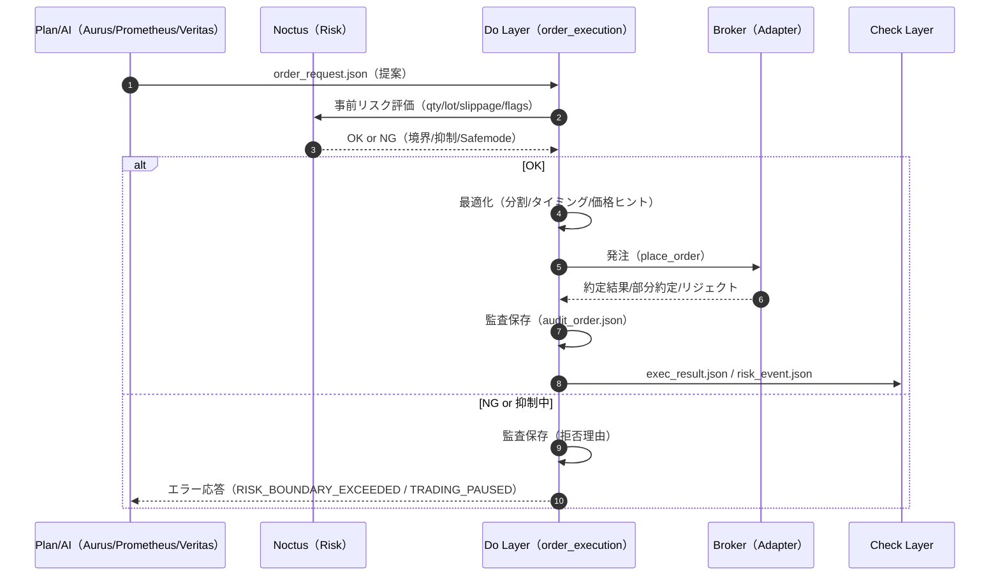
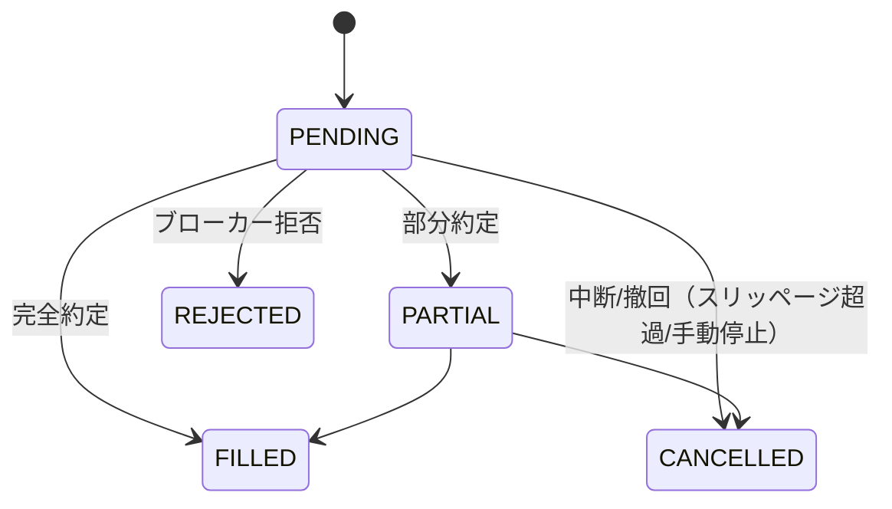

# ⚔️ Do-Layer Contract — 発注レイヤの契約仕様

**Version:** 1.0  
**Status:** Draft → Adopted (when merged)  
**Last Updated:** 2025-08-12 (JST)

> 目的：Plan/AI からの**提案**を、安全ガードレール（Noctus）下で**実行**し、監査と評価（Check層）へ**再現可能な結果**を返すための契約を定義する。  
> 参照：`../governance/Vision-Governance.md` / `../operations/Runbooks.md` / `../operations/Config-Registry.md` / `../operations/Airflow-DAGs.md` / `./API.md` / `../schemas/*.schema.json`  
> 実装の所在：`src/execution/{order_execution.py, optimized_order_execution.py, broker_adapter.py, generate_order_json.py}`

---

## 0. スコープ（Scope）
- 対象：**Plan/AI → Do → Check** の I/F と、Do 内部の実行規約。  
- 非対象：ブローカー固有仕様の詳細（`broker_adapter.py` が吸収）。

---

## 1. I/F とアーティファクト（Artifacts）

### 1.1 入力（Plan/AI → Do）
- **`order_request.json`**（必須）: `docs/schemas/order_request.schema.json` 準拠  
  - 最小キー：`symbol`, `side(BUY|SELL)`, `proposed_qty`, `time(ISO-8601 UTC)`, `rationale`  
  - 任意：`max_slippage`, `meta.strategy`, `meta.confidence` ほか自由メタ

### 1.2 出力（Do → Check/GUI）
- **`exec_result.json`**（必須）: `docs/schemas/exec_result.schema.json` 準拠  
  - `status ∈ {FILLED, PARTIAL, CANCELLED, REJECTED}`, `avg_price`, `filled_qty`, `fees`, `ts`  
- **`risk_event.json`**（任意）: `docs/schemas/risk_event.schema.json` 準拠  
  - 例：`LOSING_STREAK`, `ABNORMAL_FILL`, `RULE_VIOLATION`  
- **`audit_order.json`**（必須・監査）: 完全記録（下記 §7.2 推奨構造）

> すべて **UTC 時刻**, 小数は **JSON number**, 通貨桁はブローカー仕様に合わせ **丸め規約**を統一（§5.3）。

---

## 2. 典型フロー（シーケンス）



---

## 3. リクエスト契約（Order Request）

### 3.1 必須フィールド
| フィールド | 型 | 制約 | 説明 |
|---|---|---|---|
| `symbol` | string | 1+ 文字 | `Config-Registry` の `do.broker.symbol_map` でブローカー記号へ変換 |
| `side` | string | `BUY` / `SELL` | 売買方向 |
| `proposed_qty` | number | `>= 0` | 希望数量（ロット換算前でもよい） |
| `time` | string | ISO-8601 UTC | 提案生成時刻（遅延評価に使用） |
| `rationale` | string | 任意長 | 戦略名や要因のテキスト要約 |

### 3.2 任意フィールド（推奨）
| フィールド | 型 | 例 | 説明 |
|---|---|---|---|
| `max_slippage` | number | `0.2` | 許容スリッページ（%） |
| `meta.strategy` | string | `Prometheus-PPO` | 発注の戦略ラベル |
| `meta.confidence` | number | `0.0..1.0` | シグナル確信度 |
| `meta.shadow` | boolean | `true` | シャドー運用時（Do 側で dry-run） |
| `meta.safemode_override` | boolean | `false` | 一時的に Safemode を弱める（既定禁止） |

> 仕様の正は `docs/schemas/order_request.schema.json`。追加フィールドは **`meta.*`** 直下に入れること。

---

## 4. 応答契約（Execution Result / Error）

### 4.1 `exec_result.json`
- スキーマ：`docs/schemas/exec_result.schema.json`  
- 追加メタ（任意）：`"raw": { broker_payload... }`（ブローカー応答の最小限コピー）

### 4.2 エラー形式（共通）
```json
{
  "error": {"code": "RISK_BOUNDARY_EXCEEDED", "message": "max_drawdown_pct exceeded"},
  "correlation_id": "6f1d3b34-...",
  "ts": "2025-08-12T06:58:03Z"
}
```

### 4.3 代表エラーコード
| code | 説明 | 返却条件 |
|---|---|---|
| `TRADING_PAUSED` | 全局停止中 | `flags.global_trading_pause=true` |
| `RISK_BOUNDARY_EXCEEDED` | Noctus 境界違反 | qty/SL/TP/連敗など越境 |
| `BROKER_REJECTED` | ブローカー拒否 | 価格/数量/規制等で拒否 |
| `TIMEOUT_RETRYING` | タイムアウト再試行 | リトライ継続中の暫定応答（非同期時） |
| `RATE_LIMITED` | レート制限 | Adapter がレート制限に該当 |
| `INVALID_REQUEST` | 契約不備 | schema 不一致 / 必須欠落 |

---

## 5. 実行セマンティクス（Do 内部規約）

### 5.1 リスクガード（Noctus）
- **Non-Negotiables**（禁止越境）：`max_drawdown_pct`, `stop_loss_pct`, `take_profit_pct`, `max_position_qty`, `losing_streak_threshold`, `max_slippage_pct`  
- `flags.risk_safemode=true` のとき、**主要境界値を 0.5x** に縮小。  
- 越境 or 抑制中は **発注せず**、`RISK_BOUNDARY_EXCEEDED` or `TRADING_PAUSED` を即時返却。

### 5.2 発注アルゴリズム（最適化の要点）
- 価格ヒント（mid/last/bbo）を考慮し、**分割発注** + **間引き** + **タイミング最適化**。  
- 連続部分約定は**一定閾値でまとめ**て `avg_price` を再計算。  
- スリッページ実績が `max_slippage` 超過で **中断→残量キャンセル**。  

#### 擬似コード（骨子）
```python
qty = normalize_qty(proposed_qty)          # §5.3
if is_trading_paused(): raise TRADING_PAUSED
if violates_risk_bounds(qty): raise RISK_BOUNDARY_EXCEEDED

for slice in split(qty, policy):           # 例: 40/30/30
    oid = broker.place_order(symbol, side, slice, price_hint())
    r = broker.wait_fill_or_timeout(oid, t=policy.timeout)
    audit.append(r)
    if slippage_exceeded(r): cancel_rest(); break

result = aggregate(audit)                  # avg_price, filled_qty, fees
save_audit_json(request, audit, result)    # §7.2
emit_exec_result(result); maybe_emit_risk_event(result)
```

### 5.3 精度・丸め（Precision / Rounding）
- **数量**：ブローカーの `lot_size.step_size / min_qty / min_notional` を Adapter が強制。  
- **価格**：`tick_size` に合わせ `ROUND_HALF_UP`（四捨五入）。  
- **通貨小数**：暗号資産は最大 8 桁を上限とし、ブローカー小数に切り詰め。  
- **手数料**：可能ならブローカー実績、なければ見積り（`fees_estimate`）を `raw` に併記。

> 実際のフィルタは `Config-Registry.md` の `do.broker.symbol_map` と Adapter が参照する **exchange info** に準拠。

---

## 6. オーダー状態機械（State Machine）



- Do 層の最終 `exec_result.status ∈ {FILLED, PARTIAL, CANCELLED, REJECTED}`  
- `CANCELLED` でも**部分約定があれば `filled_qty>0`** とし、平均価格を返す。

---

## 7. 監査（Audit）と可観測性

### 7.1 ログ配置
- 実行ログ：`/data/execution_logs/*.json`（`exec_result.json`）  
- リスクイベント：`/data/pdca_logs/risk_event/*.json`  
- 監査：`/data/audit/{YYYYMMDD}/{order_id}.json`（**完全記録**）

### 7.2 `audit_order.json` 推奨構造
```json
{
  "request": { "symbol": "BTCUSDT", "side": "BUY", "proposed_qty": 0.5, "time": "2025-08-12T06:58:00Z", "meta": {"strategy":"Prometheus-PPO"} },
  "env": { "env": "prod", "safemode": true, "global_trading_pause": false, "git":"abc1234" },
  "adapter": { "kind": "ccxt", "symbol_mapped": "BTC/USDT", "filters": {"min_qty":0.001,"step_size":0.0001,"tick_size":0.1} },
  "slices": [
    {"order_id":"OID-1","status":"FILLED","qty":0.2,"avg_price":58990.0,"fees":0.05,"ts":"2025-08-12T06:58:02Z"},
    {"order_id":"OID-2","status":"FILLED","qty":0.3,"avg_price":59010.0,"fees":0.07,"ts":"2025-08-12T06:58:04Z"}
  ],
  "result": {"status":"FILLED","filled_qty":0.5,"avg_price":59001.0,"fees":0.12,"slippage":0.18},
  "raw": {"broker_responses": [{}, {}]}
}
```

---

## 8. 同一性・再実行（Idempotency / Retries）
- **Idempotency-Key**（API 経由）または **ハッシュ（request body）** をキーに **24h** 重複防止。  
- **リトライ**：通信系のみ自動。**ビジネス NG（越境/抑制）** はリトライしない。  
- **タイムアウト**：都度キャンセル→`PARTIAL` で確定し、残量は再起案を要求。

---

## 9. QoS / SLA
- 目標レイテンシ（ブローカー往復除く）: **p95 < 500ms**  
- 重要ルートは **専用キュー/Pool** を使用（`Airflow-DAGs.md §5`）  
- レート制限は Adapter が吸収。超過時は **指数バックオフ** し `RATE_LIMITED` を返す場合あり。

---

## 10. セキュリティ
- 秘密（API キー等）は **ENV / Secrets Backend** のみ（Variables 禁止）。  
- 操作は**最小権限**ロールで実行（`Security-And-Access.md`）。  
- 監査：全コールに `X-Correlation-ID` を付与し、**ボディハッシュ**を記録。

---

## 11. 具体例（Examples）

### 11.1 依頼（Plan/AI → Do）
```json
{
  "symbol": "BTCUSDT",
  "side": "BUY",
  "proposed_qty": 0.5,
  "max_slippage": 0.2,
  "time": "2025-08-12T06:58:00Z",
  "rationale": "Prometheus action=+0.82 (sigma=0.3), vol=mid",
  "meta": {"strategy":"Prometheus-PPO","confidence":0.78}
}
```

### 11.2 成功応答（Do → Check/GUI）
```json
{
  "symbol":"BTCUSDT",
  "side":"BUY",
  "avg_price":59001.0,
  "filled_qty":0.5,
  "fees":0.12,
  "slippage":0.18,
  "status":"FILLED",
  "order_id":"SIM-20250812-0001",
  "ts":"2025-08-12T06:58:05Z",
  "raw":{"adapter":"ccxt","exchange":"example"}
}
```

### 11.3 エラー応答（抑制中）
```json
{
  "error":{"code":"TRADING_PAUSED","message":"Global trading pause is ON"},
  "correlation_id":"6f1d3b34-...",
  "ts":"2025-08-12T06:58:01Z"
}
```

---

## 12. コントラクトテスト（Contract Tests）
- **Schema**：`jsonschema` で `order_request/exec_result/risk_event` を検証。  
- **ゴールデン**：固定入力→`exec_result` の **丸め・桁**・`status` を比較。  
- **統合**：Adapter をモックして **REJECTED/PARTIAL/FILLED** の 3 パターンをカバー。

---

## 13. バージョニング & 互換性
- **後方互換**：`order_request` への追加は原則 **`meta.*`** に限定。  
- **重大変更**：`/api/v2` でパス分岐（`API.md §15` に準拠）。  
- **変更管理**：本書・`API.md`・`Runbooks.md`・関連スキーマを**同一PR**で更新、必要なら `ADRs/` を作成。

---

## 14. よくある質問（FAQ）
- **Q:** `proposed_qty` はロット前？ **A:** どちらでも可。Adapter/Noctus が正規化し、`audit` に根拠を残す。  
- **Q:** `shadow` のときは？ **A:** 実発注せず `exec_result` を「推定」で返し `audit` に `shadow:true` を記録。  
- **Q:** ブローカー障害時？ **A:** `global_trading_pause` を Ops が検討。復旧後に再起案（Runbooks 参照）。

---

## 15. 変更履歴（Changelog）
- **2025-08-12**: 初版作成（I/F・セマンティクス・State・監査・精度・契約テスト）

