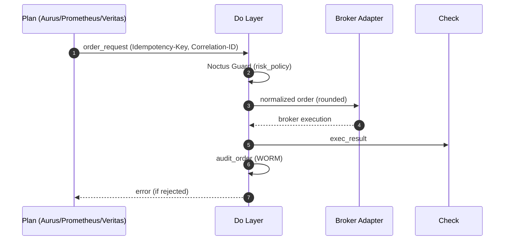

<!-- ================================================================== -->
<!-- FILE: docs/apis/Do-Layer-Contract.md -->
<!-- ================================================================== -->
# ⚔️ Do-Layer Contract — Order/Execution/Audit（決定版）

**Version:** 1.0  
**Status:** Adopted  
**Last Updated:** 2025-08-12 (JST)

> 目的：Plan→Do→Check の境界で用いる **発注（Order）/約定（Execution）/監査（Audit）/リスクイベント（Risk Event）** の I/F を固定し、  
> **安全（Noctus 境界）/再現性（Idempotent）/完全監査（WORM）** を保証する。  
> 参照：`../apis/API.md` / `../observability/Observability.md` / `../qa/Testing-And-QA.md` / `../security/Security-And-Access.md`

---

## 1) スコープ & 原則
- **対象**：`order_request`（入力）/ `exec_result`（出力）/ `audit_order`（監査）/ `risk_event`（警報）の**データ契約**。  
- **原則**：  
  1. **Guardrails First** — Noctus の `risk_policy` を**強制**（越境は**拒否**）。  
  2. **Idempotent** — 書き込みは **24h** の同一キーで**同一結果**（衝突は 409）。  
  3. **WORM 監査** — `audit_order.json` は**改変不可**（追記のみ）。  
  4. **後方互換** — フィールド追加は**互換**、Breaking は `/v2` と ADR 必須。

---

## 2) フロー（概観）


---

## 3) エンティティ（Schemas）
- `docs/schemas/order_request.schema.json`  
- `docs/schemas/exec_result.schema.json`  
- `docs/schemas/audit_order.schema.json`  
- `docs/schemas/risk_event.schema.json`  

> JSON Schema の**単一情報源（SoT）**。CI では **100% 適合**が必須（`Testing-And-QA.md §3.2`）。

---

## 4) `order_request`（Plan → Do）
**必須**：`symbol`, `side`, `proposed_qty`, `time`, `meta.strategy`  
**オプション**：`max_slippage_pct`, `time_in_force`, `constraints.qty_step/price_tick`, `meta.shadow`

```json
{
  "symbol": "BTCUSDT",
  "side": "BUY",
  "proposed_qty": 0.50,
  "max_slippage_pct": 0.20,
  "time": "2025-08-12T06:58:00Z",
  "time_in_force": "IOC",
  "constraints": {"qty_step": 0.001, "price_tick": 0.1},
  "meta": {"strategy": "Prometheus-PPO", "shadow": false}
}
```

**意味論**  
- `proposed_qty` は **正規化されたアクション**（Lot 計算後の数量）。Noctus が**上限**を適用。  
- `constraints` を省略した場合、Do 層がブローカー仕様から**自動補完**して**丸め**を行う。  
- 市場成行 + `max_slippage_pct`（許容 slippage）。指値は将来 `/v2`。

---

## 5) `exec_result`（Do → Check）
**必須**：`order_id`, `status`, `filled_qty`, `ts`  
**オプション**：`avg_price`, `fees`, `reason.code`, `slippage_pct`, `latency_ms`

```json
{
  "order_id": "SIM-12345",
  "status": "FILLED",
  "filled_qty": 0.50,
  "avg_price": 58999.5,
  "fees": 0.12,
  "slippage_pct": 0.18,
  "ts": "2025-08-12T06:58:03Z",
  "meta": {"symbol": "BTCUSDT", "strategy": "Prometheus-PPO"}
}
```

**ステータス規約**  
- `FILLED`：完全約定。`filled_qty>0` / `avg_price` 必須。  
- `PARTIAL`：一部約定＋キャンセル/期限切れ。`filled_qty>0`。  
- `REJECTED`：実行されず。`reason.code` 必須（例 `RISK_BOUNDARY_EXCEEDED`）。  
- `CANCELLED`：ユーザ/システムキャンセル。`filled_qty` は 0 または >0（部分）。

---

## 6) `audit_order`（WORM 監査）
**完全記録**：入力/正規化/丸め/リスク判定/ブローカー応答/遅延/署名

```json
{
  "audit_id": "AUD-20250812-0001",
  "correlation_id": "6f1d3b34-....",
  "received_ts": "2025-08-12T06:58:00Z",
  "idempotency_key": "6b8f7e...f1",
  "request": {... order_request ...},
  "normalized": {
    "symbol": "BTCUSDT",
    "side": "BUY",
    "qty_rounded": 0.5,
    "rounding": {"qty_mode": "floor", "qty_step": 0.001, "price_tick": 0.1}
  },
  "risk_eval": {
    "policy_version": "2025-08-01",
    "checks": [{"name":"max_position_qty","ok":true,"limit":2.0,"value":0.5}]
  },
  "broker": {
    "provider": "sim",
    "sent_ts": "2025-08-12T06:58:01Z",
    "response": {"orderId":"SIM-12345","status":"FILLED","avgPrice":58999.5}
  },
  "latency_ms": {"do_submit": 120, "broker": 190},
  "exec_result": {... exec_result ...},
  "signature": {"alg":"HMAC-SHA256","value":"ab12..."}
}
```

---

## 7) 数値精度・丸め（Financial Correctness）
- **数量**：`qty_step` に **floor**（例：0.5004 → 0.500）  
- **価格**：`price_tick` に **side 別**丸め  
  - `BUY` → **floor**（過大価格を避ける）  
  - `SELL` → **ceil**（過小価格を避ける）  
- **手数料**：非負、最大 1e-6 単位、表記は `number`（JSON）  
- **スリッページ**：`slippage_pct` は **0..100**（%）。内部は小数点 **2 桁**まで保持。

> シンボルごとの `qty_step/price_tick` は `constraints` 指定が**最優先**、なければアダプタが注入。

---

## 8) Idempotency / Concurrency
- ヘッダ `Idempotency-Key` を**必須**（24h 保持）。  
- **完全一致**でない同一キーは `409 IDEMPOTENCY_KEY_CONFLICT`。  
- 同一キー再送は**最初の結果**を**そのまま返却**。`audit_order` は**追記なし**。

---

## 9) エラーコード（対照表）
| code | HTTP | 説明 | 再試行 |
|---|---:|---|---|
| `TRADING_PAUSED` | 409 | 全局抑制中 | ❌ |
| `RISK_BOUNDARY_EXCEEDED` | 422 | Noctus 境界越え | ❌ |
| `BROKER_REJECTED` | 424 | ブローカー拒否 | ⭕（修正後） |
| `TIMEOUT_RETRYING` | 504 | ブローカー遅延 | ⭕（指数バックオフ） |
| `RATE_LIMITED` | 429 | レート超過 | ⭕（`Retry-After`） |
| `INVALID_REQUEST` | 400 | スキーマ違反/丸め不能 | ❌ |

---

## 10) サンプル（テスト用最小セット）
```json
// FILLED
{"order_id":"SIM-1","status":"FILLED","filled_qty":0.5,"avg_price":59001.0,"fees":0.12,"ts":"2025-08-12T06:58:03Z"}

// PARTIAL
{"order_id":"SIM-2","status":"CANCELLED","filled_qty":0.3,"avg_price":59010.0,"ts":"2025-08-12T07:01:00Z"}

// REJECTED
{"order_id":"SIM-3","status":"REJECTED","filled_qty":0.0,"ts":"2025-08-12T07:02:00Z","reason":{"code":"RISK_BOUNDARY_EXCEEDED"}}
```

---

## 11) 契約テスト（CI 要件）
- `docs/schemas/*.schema.json` に **100% 適合**。  
- `FILLED / PARTIAL / REJECTED` の**3パターン**を**必須**（`Testing-And-QA.md §9`）。  
- 丸め/桁（§7）と Idempotency 再送（§8）を含む**再現テスト**。

---

## 12) 変更履歴
- **2025-08-12**: v1.0 決定版（丸め/境界/Idempotent/WORM/エラー表/サンプル）

---

<!-- ================================================================== -->
<!-- FILE: docs/schemas/order_request.schema.json -->
<!-- ================================================================== -->
{
  "$schema": "https://json-schema.org/draft/2020-12/schema",
  "$id": "https://noctria.example/schemas/order_request.schema.json",
  "title": "order_request",
  "type": "object",
  "required": ["symbol", "side", "proposed_qty", "time", "meta"],
  "additionalProperties": false,
  "properties": {
    "symbol": { "type": "string", "minLength": 1 },
    "side": { "type": "string", "enum": ["BUY", "SELL"] },
    "proposed_qty": { "type": "number", "minimum": 0 },
    "max_slippage_pct": { "type": "number", "minimum": 0, "maximum": 100 },
    "time": { "type": "string", "format": "date-time" },
    "time_in_force": { "type": "string", "enum": ["GTC", "IOC", "FOK"] },
    "constraints": {
      "type": "object",
      "additionalProperties": false,
      "properties": {
        "qty_step": { "type": "number", "exclusiveMinimum": 0 },
        "price_tick": { "type": "number", "exclusiveMinimum": 0 }
      }
    },
    "meta": {
      "type": "object",
      "required": ["strategy"],
      "additionalProperties": true,
      "properties": {
        "strategy": { "type": "string", "minLength": 1 },
        "shadow": { "type": "boolean" }
      }
    }
  }
}

<!-- ================================================================== -->
<!-- FILE: docs/schemas/exec_result.schema.json -->
<!-- ================================================================== -->
{
  "$schema": "https://json-schema.org/draft/2020-12/schema",
  "$id": "https://noctria.example/schemas/exec_result.schema.json",
  "title": "exec_result",
  "type": "object",
  "required": ["order_id", "status", "filled_qty", "ts"],
  "additionalProperties": true,
  "properties": {
    "order_id": { "type": "string", "minLength": 1 },
    "status": { "type": "string", "enum": ["FILLED", "PARTIAL", "REJECTED", "CANCELLED"] },
    "filled_qty": { "type": "number", "minimum": 0 },
    "avg_price": { "type": "number", "minimum": 0 },
    "fees": { "type": "number", "minimum": 0 },
    "slippage_pct": { "type": "number", "minimum": 0, "maximum": 100 },
    "reason": {
      "type": "object",
      "additionalProperties": true,
      "properties": {
        "code": { "type": "string", "minLength": 1 },
        "message": { "type": "string" }
      }
    },
    "meta": {
      "type": "object",
      "additionalProperties": true,
      "properties": {
        "symbol": { "type": "string" },
        "strategy": { "type": "string" }
      }
    },
    "latency_ms": {
      "type": "object",
      "additionalProperties": false,
      "properties": {
        "do_submit": { "type": "number", "minimum": 0 },
        "broker": { "type": "number", "minimum": 0 }
      }
    },
    "ts": { "type": "string", "format": "date-time" }
  }
}

<!-- ================================================================== -->
<!-- FILE: docs/schemas/audit_order.schema.json -->
<!-- ================================================================== -->
{
  "$schema": "https://json-schema.org/draft/2020-12/schema",
  "$id": "https://noctria.example/schemas/audit_order.schema.json",
  "title": "audit_order",
  "type": "object",
  "required": ["audit_id","correlation_id","received_ts","idempotency_key","request","normalized","risk_eval","exec_result"],
  "additionalProperties": false,
  "properties": {
    "audit_id": { "type": "string" },
    "correlation_id": { "type": "string" },
    "received_ts": { "type": "string", "format": "date-time" },
    "idempotency_key": { "type": "string" },
    "request": { "$ref": "order_request.schema.json" },
    "normalized": {
      "type": "object",
      "additionalProperties": true,
      "properties": {
        "symbol": { "type": "string" },
        "side": { "type": "string", "enum": ["BUY","SELL"] },
        "qty_rounded": { "type": "number", "minimum": 0 },
        "rounding": {
          "type": "object",
          "additionalProperties": false,
          "properties": {
            "qty_mode": { "type": "string", "enum": ["floor","ceil","nearest"] },
            "qty_step": { "type": "number", "exclusiveMinimum": 0 },
            "price_tick": { "type": "number", "exclusiveMinimum": 0 }
          }
        }
      }
    },
    "risk_eval": {
      "type": "object",
      "additionalProperties": true,
      "properties": {
        "policy_version": { "type": "string" },
        "checks": {
          "type": "array",
          "items": {
            "type": "object",
            "additionalProperties": true,
            "properties": {
              "name": { "type": "string" },
              "ok": { "type": "boolean" },
              "limit": { "type": "number" },
              "value": { "type": "number" }
            }
          }
        }
      }
    },
    "broker": {
      "type": "object",
      "additionalProperties": true,
      "properties": {
        "provider": { "type": "string" },
        "sent_ts": { "type": "string", "format": "date-time" },
        "response": { "type": ["object","null"] }
      }
    },
    "latency_ms": {
      "type": "object",
      "additionalProperties": false,
      "properties": {
        "do_submit": { "type": "number", "minimum": 0 },
        "broker": { "type": "number", "minimum": 0 }
      }
    },
    "exec_result": { "$ref": "exec_result.schema.json" },
    "signature": {
      "type": "object",
      "required": ["alg","value"],
      "additionalProperties": true,
      "properties": {
        "alg": { "type": "string" },
        "value": { "type": "string" }
      }
    }
  }
}

<!-- ================================================================== -->
<!-- FILE: docs/schemas/risk_event.schema.json -->
<!-- ================================================================== -->
{
  "$schema": "https://json-schema.org/draft/2020-12/schema",
  "$id": "https://noctria.example/schemas/risk_event.schema.json",
  "title": "risk_event",
  "type": "object",
  "required": ["kind","severity","observed","threshold","ts"],
  "additionalProperties": true,
  "properties": {
    "kind": { "type": "string", "minLength": 1 },
    "severity": { "type": "string", "enum": ["LOW","MEDIUM","HIGH","CRITICAL"] },
    "observed": { "type": "number" },
    "threshold": { "type": "number" },
    "symbol": { "type": "string" },
    "strategy": { "type": "string" },
    "ts": { "type": "string", "format": "date-time" }
  }
}

<!-- ================================================================== -->
<!-- FILE: docs/schemas/kpi_summary.schema.json -->
<!-- ================================================================== -->
{
  "$schema": "https://json-schema.org/draft/2020-12/schema",
  "$id": "https://noctria.example/schemas/kpi_summary.schema.json",
  "title": "kpi_summary",
  "type": "object",
  "required": ["schema_version","window","metrics","generated_at"],
  "additionalProperties": false,
  "properties": {
    "schema_version": { "type": "string", "pattern": "^[0-9]+\\.[0-9]+$" },
    "window": { "type": "string" },
    "metrics": {
      "type": "object",
      "additionalProperties": false,
      "properties": {
        "sharpe_adj": { "type": "number" },
        "sortino": { "type": "number" },
        "max_drawdown_pct": { "type": "number" },
        "win_rate": { "type": "number", "minimum": 0, "maximum": 1 },
        "turnover": { "type": "number", "minimum": 0 }
      }
    },
    "generated_at": { "type": "string", "format": "date-time" }
  }
}

<!-- ================================================================== -->
<!-- FILE: docs/schemas/risk_policy.schema.json -->
<!-- ================================================================== -->
{
  "$schema": "https://json-schema.org/draft/2020-12/schema",
  "$id": "https://noctria.example/schemas/risk_policy.schema.json",
  "title": "risk_policy",
  "type": "object",
  "required": ["version","limits"],
  "additionalProperties": false,
  "properties": {
    "version": { "type": "string" },
    "limits": {
      "type": "object",
      "additionalProperties": false,
      "properties": {
        "max_drawdown_pct": { "type": "number", "minimum": 0, "maximum": 100 },
        "max_position_qty": { "type": "number", "minimum": 0 },
        "max_slippage_pct": { "type": "number", "minimum": 0, "maximum": 100 },
        "losing_streak_threshold": { "type": "integer", "minimum": 0 }
      }
    }
  }
}
