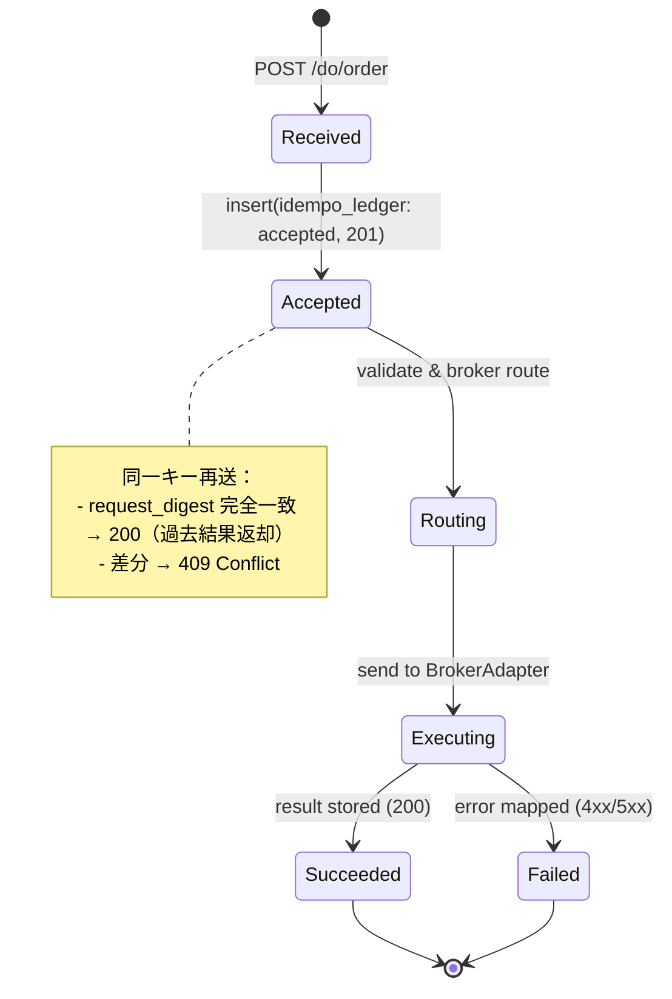

# Do-Layer — Order API 詳細設計 (v1.1)
**Last Updated:** 2025-08-24 (JST)  
**Owner:** Do-Layer / Execution Team

---

## 0. 概要
本書は Do 層の注文実行 API `/do/order` の**実装仕様**を定義する。  
契約は `OrderRequest v1.1` に準拠し、**ヘッダ `Idempotency-Key` と `body.idempotency_key` は一致必須**。  
幂等性は `idempo_ledger` により担保される。

- 参照: `../architecture/contracts/OrderRequest.md`  
- 参照: `../observability/Idempotency-Ledger.md`  
- 参照: `../architecture/contracts/ExecResult.md`

---

## 1. エンドポイント
- **POST** `/do/order`
  - Content-Type: `application/json`
  - Headers:
    - `Idempotency-Key: <ULID/UUID>` **(required; MUST equal body.idempotency_key)**
    - `Authorization: Bearer <token>`（将来拡張、現状 optional）

### 1.1 リクエスト
- Body: `OrderRequest v1.1`（成行は `price=null`）
- バリデーション（抜粋）
  - `instrument` は許可リスト内
  - `qty` はブローカー最小LOT/STEPに整合
  - `time_in_force ∈ {IOC,FOK,GTC}`（既定 `IOC`）
  - `idempotency_key` がヘッダと一致

### 1.2 代表例
```json
{
  "order_id": "ord-20250824-0001",
  "instrument": "USDJPY",
  "side": "BUY",
  "qty": 0.10,
  "price": null,
  "time_in_force": "IOC",
  "tags": ["pdca","recheck"],
  "idempotency_key": "01JABCXYZ-ULID-5678",
  "requested_at": "2025-08-24T00:00:00Z",
  "risk_constraints": {
    "max_dd": 0.1,
    "max_consecutive_loss": 3,
    "max_spread": 0.002
  }
}
```

---

## 2. ステートマシン（idempo_ledger 連携）


- `idempo_ledger` フィールド利用
  - `status ∈ {accepted, succeeded, failed}`
  - `request_digest` = 正規化JSONの SHA-256
  - `result_digest` = `ExecResult` 主要フィールドから SHA-256
  - `expires_at` = 48h（推奨）

---

## 3. レスポンス仕様
| HTTP | 条件 | 本文 |
|---|---|---|
| **201 Created** | 初回受理（実行開始） | `ExecResult` または軽量 ack（実装選択。最小は ack→後続更新でも可） |
| **200 OK** | 同一キー再送かつボディ完全一致 | 前回の `ExecResult` を返却 |
| **409 Conflict** | 同一キーでボディ差分 | `{"error":"IDEMPOTENCY_CONFLICT", "message":"body differs", "idempotency_key":"..."}` |
| **422 Unprocessable Entity** | バリデーション不一致 | `{"error":"VALIDATION_ERROR", ...}` |
| **429 Too Many Requests** | レート超過 | `{"error":"RATE_LIMITED", "retry_after": "...seconds"}` |
| **5xx** | ブローカー/内部障害 | `{"error":"BROKER_DOWN"}` 等（下記表参照） |

### 3.1 エラーコード表（抜粋）
- `IDEMPOTENCY_MISMATCH`（422）: ヘッダとボディのキー不一致
- `IDEMPOTENCY_CONFLICT`（409）: 同一キーかつボディ差分
- `VALIDATION_ERROR`（422）
- `BROKER_REJECTED`（400/409）: ブローカー側事前拒否
- `BROKER_TIMEOUT`（504 equivalent → 502/504 運用）
- `BROKER_DOWN`（503）
- `INTERNAL_ERROR`（500）

---

## 4. タイムアウト / リトライ / レート制限
- **Server-side**:
  - Broker送信タイムアウト: 2.5s（IOC）、5s（FOK/GTC）目安
  - リトライ: **しない**（OutboxがP1で別設計。現仕様ではアプリレベル単発送信）
- **Client-side**（推奨）:
  - 同一 `Idempotency-Key` で指数バックオフ（1s, 2s, 4s 最大3回）
  - 201 受領後の不達疑いは**同一キーで再送**し 200 を期待
- レート: 60 RPM / client（例）。溢れたら 429 + `Retry-After`

---

## 5. ブローカー連携（BrokerAdapter I/F）
**目的:** 送信・結果正規化・例外マップを抽象化。

```python
class BrokerAdapter:
    async def send(self, order_request: dict) -> dict:
        """ブローカーへ送信し、ExecResult（正準）で返す。
        例外は Adapter 内でマッピングし、{error, reason_code} を返す。"""
```

- 例外マッピング方針
  - 接続/タイムアウト → `BROKER_TIMEOUT` / `BROKER_DOWN`（503）
  - 取引不可/数量不正 → `VALIDATION_ERROR`（422） or `BROKER_REJECTED`（400）
- ペーパー実装 `PaperAdapter` を既定に用意。実ブローカーは差し替え。

---

## 6. 実装擬似コード
```python
async def do_order(req, idem_key):
    # 0) ヘッダ一致
    if idem_key != req.idempotency_key:
        return 422, {"error":"IDEMPOTENCY_MISMATCH"}

    request_digest = sha256(normalize(req))

    # 1) 予約
    sql("INSERT ... accepted ... ON CONFLICT DO NOTHING", idem_key, request_digest)

    # 2) 既存レコード参照
    row = sql("SELECT request_digest,status,http_status,response_payload_json FROM idempo_ledger WHERE idempotency_key=$1", idem_key)

    if row.request_digest != request_digest:
        return 409, {"error":"IDEMPOTENCY_CONFLICT","idempotency_key": idem_key}

    if row.status == "succeeded":
        return 200, row.response_payload_json

    # 3) 送信
    result = await broker.send(req)

    # 4) 成功 or 失敗確定（ExecResult 正準化済みを保存）
    http = 200 if result.get("status") == "ok" else map_error_to_http(result)
    sql("""
      INSERT ... VALUES (..., 'succeeded' or 'failed', http, json, result_digest)
      ON CONFLICT (idempotency_key) DO UPDATE SET ...""",
      ...)

    return http, result
```

---

## 7. 可観測性
- Logs:
  - trace_id, idempotency_key, status, reason_code, latency_ms
- Metrics（例）:
  - `order.requests_total{status}`  
  - `order.idempotency_conflicts_total`  
  - `order.broker_latency_ms`（histogram）
- Tracing:
  - `do.order` span に broker送信spanを子として付与

---

## 8. セキュリティ
- `IDEMPO_SECRET` は KMS/SecretsManager で管理（DecisionEngine 側でキー生成時に使用）
- リクエスト検証で PII をログに残さない（要約のみ）

---

## 9. 互換性・移行
- v1.0 → v1.1 で `idempotency_key` を追加。既存クライアントは**早期移行**必須。
- v1.1 ではヘッダ/ボディ一致を**強制**。

---

## 10. 変更履歴
- **2025-08-24**: 初版（OrderRequest v1.1 対応、幂等仕様・エラーマップ明記）
