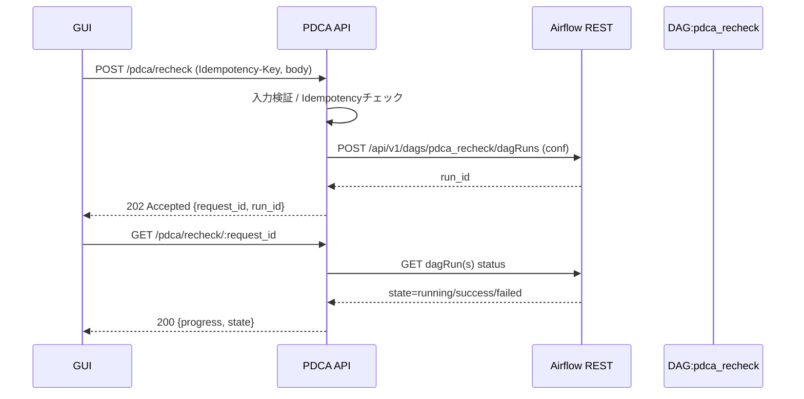

# PDCA — Recheck API 仕様 (GUI向け)
**Last Updated:** 2025-08-24 (JST)  
**Owner:** PDCA / Platform

関連文書:
- `docs/security/AuthN-AuthZ-DoLayer.md`
- `docs/platform/RateLimit-Quota-DoLayer.md`
- `docs/architecture/PDCA-Spec.md`
- `docs/operations/Runbook-PDCA.md`

---

## 0. 目的
GUI（運用者UI）から **戦略の再評価（Recheck）** を安全にリクエストし、Airflow DAG をトリガして **Check→Act** のループを回すための API を定義する。  
- 単一戦略再評価: `POST /pdca/recheck`  
- 一括再評価: `POST /pdca/recheck_all`  
- 実行状態の参照: `GET /pdca/recheck/:request_id`（簡易ステータス）

---

## 1. 認証・認可・レート
- 認証: **JWT (RS256)** 必須（`aud=pdca`, `iss=noctria.auth`, `sub=client_id`）  
- 認可: `scope ∋ pdca:recheck`（単体）, `pdca:recheck_all`（一括）  
- レート制御（初期推奨値）:
  - 単体: 120 req/min/client
  - 一括: 10 req/min/client
- 監査ログ: `client_id(sub), scope, request_id, strategy_id(s), window, reason, trace_id`

---

## 2. エンドポイント概要
| Method | Path | 説明 | 権限 | 成功HTTP |
|---|---|---|---|---|
| POST | `/pdca/recheck` | 単一 or 少数戦略の再評価を受け付け | `pdca:recheck` | 202 |
| POST | `/pdca/recheck_all` | 全戦略/フィルタ対象の一括再評価 | `pdca:recheck_all` | 202 |
| GET  | `/pdca/recheck/:request_id` | 再評価リクエストの進捗/結果参照 | `pdca:recheck` | 200 |

> 202 Accepted: **非同期**で Airflow DAG をトリガ。`request_id` を返す。

---

## 3. リクエスト仕様

### 3.1 `POST /pdca/recheck`
- **Headers**
  - `Authorization: Bearer <JWT>`
  - `Content-Type: application/json`
  - `Idempotency-Key: <ULID/UUID>`（推奨。過剰二重トリガ抑止）
- **Body**
```json
{
  "strategies": ["strat.meanrev.m1", "strat.breakout.h1"],
  "window": {
    "from": "2025-08-01T00:00:00Z",
    "to":   "2025-08-24T00:00:00Z"
  },
  "reason": "daily-healthcheck",
  "dry_run": false,
  "params": {
    "recalc_metrics": ["winrate","sharpe","max_dd"],
    "retrain": false
  },
  "trace_id": "gui-req-1234"
}
```
- **フィールド定義**
  - `strategies[]`: 1〜50件。**空不可**。IDのプレフィクス指定（`strat.*`）は不可（`/recheck_all` を使う）
  - `window.from/to`: RFC3339。`from <= to`、最大期間は 180日推奨
  - `reason`: GUI側の業務タグ（`daily-healthcheck`, `manual`, `anomaly-detected` 等）
  - `dry_run`: true で DAG を起動せず、対象件数と推定コストのみ返す
  - `params.recalc_metrics[]`: 再計算する指標名
  - `params.retrain`: true で学習含む（時間/コスト増）

### 3.2 `POST /pdca/recheck_all`
- **Headers**: 上に同じ
- **Body**
```json
{
  "filter": {
    "tags_any": ["daily","priority"],
    "health": ["degraded","unknown"],
    "instrument_any": ["USDJPY","EURUSD"]
  },
  "batch_size": 25,
  "window": { "lookback_days": 14 },
  "reason": "daily-bulk",
  "dry_run": true,
  "trace_id": "gui-bulk-5678"
}
```
- **フィールド定義**
  - `filter.tags_any`: 戦略メタのタグで絞り込み（OR）
  - `filter.health`: `healthy|degraded|unknown`
  - `filter.instrument_any`: 対象銘柄（OR）
  - `batch_size`: DAG の1Runあたりの戦略件数（10〜100、既定=25）
  - `window.lookback_days`: 現在からの相対日数。`from/to` との併用不可
  - `dry_run`: true で件数と分割数を計算のみ

---

## 4. レスポンス仕様

### 4.1 202 Accepted（共通）
```json
{
  "status": "accepted",
  "request_id": "01JABCXYZ-ULID-5678",
  "estimated": { "strategies": 37, "batches": 2 },
  "dag": {
    "name": "pdca_recheck",
    "run_id": "manual__2025-08-24T12:34:56+00:00__01JABC..."
  }
}
```

### 4.2 200 OK（`GET /pdca/recheck/:request_id`）
```json
{
  "status": "running",
  "request_id": "01JABCXYZ-ULID-5678",
  "submitted_at": "2025-08-24T03:34:56Z",
  "progress": {
    "total_batches": 2,
    "completed_batches": 1,
    "total_strategies": 37,
    "completed_strategies": 19
  },
  "last_update": "2025-08-24T03:40:01Z",
  "artifacts": [],
  "dag": {
    "name": "pdca_recheck",
    "run_ids": ["manual__...__b1","manual__...__b2"]
  }
}
```

### 4.3 エラー
| HTTP | error | 例 | 対処 |
|---|---|---|---|
| 400 | `BAD_REQUEST` | window不正/併用不可 | 入力修正 |
| 401 | `UNAUTHORIZED` | JWT不正/期限切れ | 再認証 |
| 403 | `FORBIDDEN` | scope不足 | 権限付与 |
| 409 | `IDEMPOTENCY_CONFLICT` | 同一キーで内容差分 | ボディ整合 |
| 429 | `RATE_LIMITED` | 制限超過 | `Retry-After` 準拠 |
| 502 | `AIRFLOW_DOWN` | Airflow未応答 | 後続リトライ |
| 500 | `INTERNAL_ERROR` | 予期せぬ異常 | 再試行/問い合わせ |

---

## 5. 挙動（非同期 & Airflow 連携）

### 5.1 シーケンス（単体）


### 5.2 Airflow への payload（例）
```json
{
  "conf": {
    "request_id": "01JABCXYZ-ULID-5678",
    "strategies": ["strat.meanrev.m1"],
    "window": {"from":"2025-08-01T00:00:00Z","to":"2025-08-24T00:00:00Z"},
    "reason": "daily-healthcheck",
    "params": {"recalc_metrics":["sharpe"]},
    "trace_id": "gui-req-1234",
    "client_id": "ops-ui"
  }
}
```

---

## 6. バリデーション・幂等
- **Idempotency**: `Idempotency-Key`（ヘッダ）と `body.idempotency_key?`（任意）が一致する場合、**同一キー完全一致**は 202/同一 `request_id` を返す。  
- **差分**: 同一キーでボディ差分は **409**。  
- **window**: `lookback_days` と `from/to` は排他。期間上限 180日。  
- **strategies**: 1〜50件、IDフォーマット `/^[a-z0-9._-]+$/`。  
- **dry_run**: true なら Airflow には投げずに件数見積のみ。

---

## 7. 可観測性（API側）
- Logs（構造化）: `request_id, client_id, strategies_count, dry_run, reason, trace_id, airflow_run_id(s), latency_ms`  
- Metrics:
  - `pdca.recheck.requests_total{endpoint, outcome}`
  - `pdca.recheck.accepted_total`
  - `pdca.recheck.airflow_errors_total`
  - `pdca.recheck.latency_ms{phase=validate|airflow_api|total}`

---

## 8. セキュリティ
- JWT 検証（`iss/aud/exp`）必須、`scope` 最小化  
- GUI 入力はサーバ側で再検証し、危険な文字列は拒否/エスケープ  
- `request_id` は ULID 推奨。ログには機微情報を残さない。

---

## 9. 例: curl
```bash
# 単体（dry run）
curl -sS -X POST http://localhost:8001/pdca/recheck \
 -H "Authorization: Bearer $JWT" \
 -H "Idempotency-Key: 01JTESTULIDXYZ" \
 -H "Content-Type: application/json" \
 -d '{
   "strategies":["strat.meanrev.m1"],
   "window":{"lookback_days":7},
   "reason":"manual",
   "dry_run":true,
   "params":{"recalc_metrics":["sharpe"]}
 }'

# 一括（実行）
curl -sS -X POST http://localhost:8001/pdca/recheck_all \
 -H "Authorization: Bearer $JWT" \
 -H "Idempotency-Key: 01JTESTULIDABC" \
 -H "Content-Type: application/json" \
 -d '{
   "filter":{"tags_any":["daily"],"health":["unknown"]},
   "batch_size":25,
   "window":{"lookback_days":14},
   "reason":"daily-bulk",
   "dry_run":false
 }'

# 進捗参照
curl -sS http://localhost:8001/pdca/recheck/01JABCXYZ-ULID-5678 \
 -H "Authorization: Bearer $JWT"
```

---

## 10. 既知の制約・今後
- Airflow 断時は 502 を返す（API内部キューは持たない）  
- `retrain=true` の場合、実行時間が長くなる。GUIに警告表示を推奨。  
- 将来: `/pdca/recheck/:request_id/cancel` の導入（保留）

---

## 11. 変更履歴
- **2025-08-24**: 初版作成（単体/一括、Airflow連携、幂等/レート/監視を定義）
