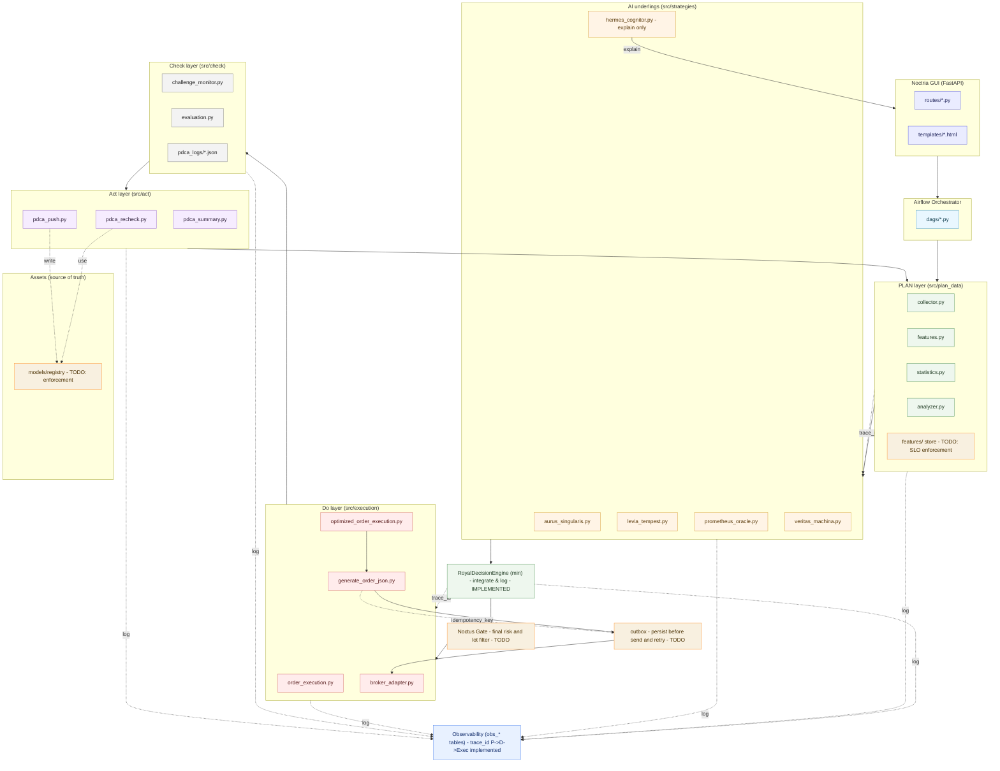

# 🏰 Noctria Kingdom アーキテクチャ概要

**Document Version:** 1.2 (Draft)  
**Status:** Draft (for review)  
**Last Updated:** 2025-08-13 (JST)

> 目的: Noctria の **統治型 PDCA** (Plan / Do / Check / Act)、中央統治 (King / GUI / Airflow)、AI 臣下群、**契約とガードレール**を一望できる形で定義する。  
> 本バージョンでは v1.1 に対し、**契約のバージョニング、相関ID (trace_id) E2E 貫通、DecisionEngine 最小版、観測テーブル拡張、Act 層の昇格/ロールバック基準、Airflow 運用 SLO** を反映。  
> 参照: `../governance/Vision-Governance.md` / `../operations/Runbooks.md` / `../operations/Airflow-DAGs.md` / `../operations/Config-Registry.md` / `../security/Security-And-Access.md` / `../observability/Observability.md` / `../apis/API.md` / `../apis/Do-Layer-Contract.md`

---

## 1. 概要
Noctria Kingdom は、AI による自動売買戦略の **生成 -> 実行 -> 評価 -> 改善** を継続運用する **統治型 PDCA システム**。  
中央統治者 **King Noctria** が最終意思決定を行い、複数の特化型 AI 臣下が助言・分析・実行を担う。  
ワークフローは **Apache Airflow** (DAG) でオーケストレーションし、**FastAPI GUI** で可視化・制御する。

---

## 2. 統治構造 (役割と権限)

### 中央統治者
- **King Noctria** — 王国の全戦略・実行・評価サイクルの最終意思決定者 (Two-Person + King 承認の最終ゲート)。

### 臣下 AI (`src/strategies/`)
| 名称 | ファイル | 役割 | 主な機能 |
|---|---|---|---|
| **Aurus Singularis** | `aurus_singularis.py` | 戦略設計 AI | 市場トレンド解析、戦術策定 |
| **Levia Tempest** | `levia_tempest.py` | スキャルピング AI | 高速取引による短期利益獲得 |
| **Noctus Sentinella** | `noctus_sentinella.py` | リスク管理 AI | リスク評価、異常検知、Lot 制限 |
| **Prometheus Oracle** | `prometheus_oracle.py` | 未来予測 AI | 中長期市場動向の予測 |
| **Veritas Machina** | `veritas_machina.py` | 戦略生成 AI (ML) | 戦略の機械学習生成 |
| **Hermes Cognitor** | `hermes_cognitor.py` | 戦略説明 AI (LLM) | 戦略の自然言語説明、要因分析 |

---

## 3. PDCA サイクル構造
- **Plan 層**: 市場データ収集 -> 特徴量生成 -> KPI 下地 -> 臣下 AI への提案入力  
- **Do 層**: Noctus による **境界ガード** -> 発注最適化 -> 実行/監査  
- **Check 層**: 実績評価 (KPI / アラート / 監査照合)  
- **Act 層**: 再評価 / 再学習 -> 段階導入 (7% -> 30% -> 100%) -> Plan へフィードバック  
  - **昇格基準例** (初期値):
    - 勝率 >= +3% (対象ベンチマーク比、90 日移動平均)
    - 最大 DD <= -5% (30 日ローリング)
    - RMSE/MAE 改善率 >= 5%
  - **ロールバック条件例**:
    - 勝率低下 >= -3% (30 日ローリング)
    - 最大 DD >= -10%
    - 重大リスクイベント発生 (Noctus 判定)

---

## 4. 中央統治基盤
- **Airflow Orchestrator**: DAG により PDCA を統括。  
  - **SLO 例**: DAG 成功率 >= 99%、スケジューラ遅延 <= 2 分 (p95)  
  - **エラーバジェット**: 月間失敗許容 1% 未満 (重大 DAG)  
  - **リトライ/冪等性**: 全タスクは再実行安全 (副作用は一意キー制御)
- **FastAPI GUI**: HUD スタイルで PDCA の状態・抑制・段階導入を可視化/操作。  
  - RBAC は将来的に導入予定 (現状は全員閲覧可)

---

## 5. アーキテクチャ全体図
> GitHub 互換のため、ラベルは **二重引用符** で囲み、特殊記号は **ASCII** を使用。



---

## 6. 層別詳細図 (別ファイル)
- [PLAN 層 詳細図](diagrams/plan_layer.mmd)  
- [DO 層 詳細図](diagrams/do_layer.mmd)  
- [CHECK 層 詳細図](diagrams/check_layer.mmd)  
- [ACT 層 詳細図](diagrams/act_layer.mmd)

---

## 7. システム境界と契約 (Interfaces & Contracts)
- **契約バージョニング**: SemVer 管理。  
  - v1.x は後方互換の追加のみ許容、非互換変更は v2.0 以降。  
  - `docs/apis/Do-Layer-Contract.md` に履歴と非推奨フラグを明記。
- **契約テスト**: Consumer-Driven Contract Test (Pact 等) を CI で実行。  
- **API**: `/api/v1` (`docs/apis/API.md`)。変更系は **Idempotency-Key 必須**、PATCH は **If-Match**。  
- **Do-Layer Contract**: `order_request` / `exec_result` / `risk_event` / `audit_order`。  
- **Schemas**: `docs/schemas/*.schema.json` を **SoT** とし、互換拡張のみ許容。  
- **タイムスタンプ**: **UTC ISO-8601** 固定 (表示は GUI 側で JST へ変換)。  
- **Decision Engine 設定**: `DecisionEngineConfig.from_yaml()` により重み・rollout・min_conf・合成方式を外部化 (`profiles.yaml` を想定)。

---

## 8. 可観測性とセキュリティ (Guardrails)
- **Observability**: 構造化ログ + メトリクス + トレース (`Observability.md`)。  
  - **Correlation-ID** (`X-Trace-Id`) を全層必須 (API -> 注文 -> 約定 -> 評価 -> アラートまで一本鎖)  
  - 実装: `obs_plan_runs` / `obs_infer_calls` / **`obs_decisions`** / **`obs_exec_events`**。  
  - 補助ビュー: **`obs_trace_timeline`**, **`obs_trace_latency`**, `obs_latency_daily` (マテビュー)。  
- **リスク境界 (Noctus)**: `risk_policy` を Do 層で **強制適用**。越境 API は存在しない。  
- **Secrets**: Vault / ENV のみ。**Git / Variables に保存禁止**。  
- **Two-Person + King**: `risk_policy` / `flags` / API / Contract の破壊変更は二人承認 + King。

---

## 9. ディレクトリマップ (抜粋)
```
src/
  plan_data/{collector.py,features.py,statistics.py,analyzer.py,decision_engine.py,trace.py,observability.py}
  strategies/{aurus_singularis.py,levia_tempest.py,noctus_sentinella.py,prometheus_oracle.py,veritas_machina.py,hermes_cognitor.py}
  execution/{order_execution.py,optimized_order_execution.py,generate_order_json.py,broker_adapter.py}
  check/{evaluation.py,challenge_monitor.py}
  act/{pdca_recheck.py,pdca_push.py,pdca_summary.py}
  decision/decision_engine.py      # デモ用の最小版 (E2E mini)
  models/registry/                 # モデルレジストリ (ver/署名/指紋/評価指標)
  features/                        # 特徴量ストア (鮮度 SLO 管理)
airflow_docker/dags/*.py
docs/{architecture,apis,operations,observability,security,qa,models,risks,adrs,howto}/**
```

---

## 10. 時刻・環境規約
- **内部処理**は **UTC 固定** / **GUI 表示**は **JST** (またはユーザ TZ)。  
- **環境構成**: `defaults.yml -> {env}.yml -> flags.yml -> secrets` をマージ。  
- **相関 ID**: `trace_id` は `src/plan_data/trace.py` のユーティリティで生成・伝搬。ヘッダは `X-Trace-Id`。

---

## 11. 変更履歴 (Changelog)
- **2025-08-13**: v1.2 草案  
  - DecisionEngine (最小版) 実装 / E2E で `obs_decisions` / `obs_exec_events` に書き込み  
  - Correlation-ID E2E 貫通を明記 (P->D->Exec)  
  - 契約の SemVer 方針・CDCT を追記  
  - Act 層の昇格/ロールバック基準を追記  
  - Airflow 運用 SLO / エラーバジェット / 冪等方針を追加  
  - 観測ビュー `obs_trace_timeline` / `obs_trace_latency` / `obs_latency_daily` を追加
- **2025-08-12**: v1.1 契約/ガードレール/可観測性/ディレクトリ/時刻規約を追記  
- **2025-08-12**: v1.0 初版
