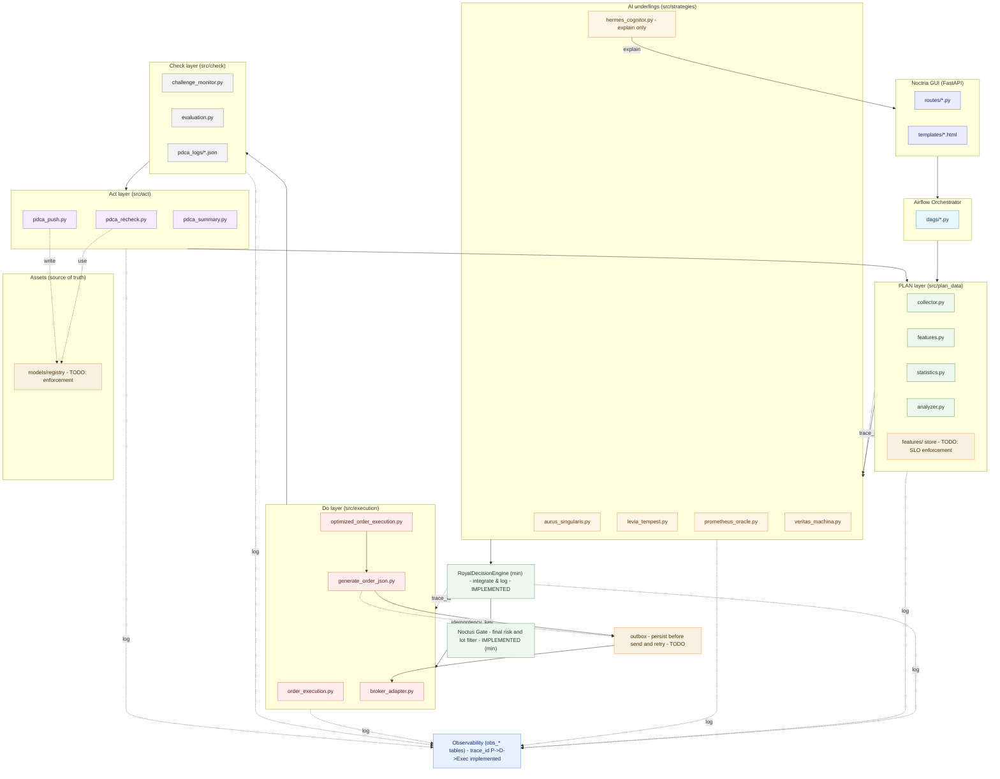
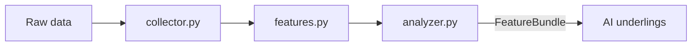
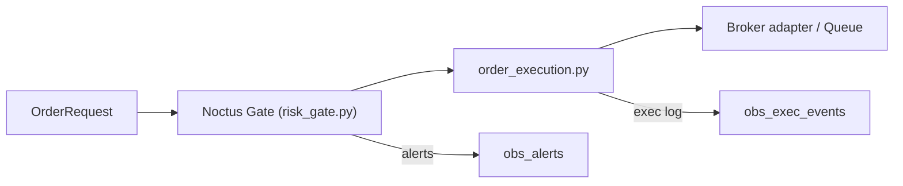
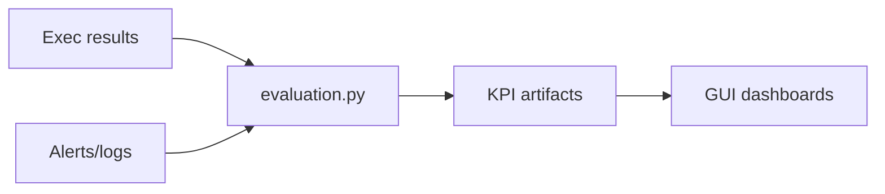
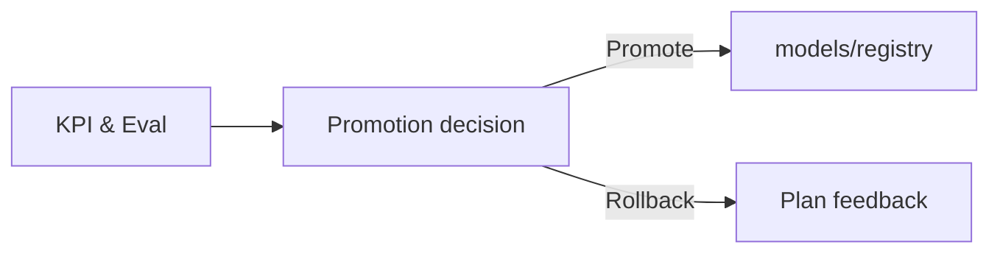

# 🏰 Noctria Kingdom アーキテクチャ概要

**Document Version:** 1.2.4 (Draft)  
**Status:** Draft (for review)  
**Last Updated:** 2025-08-13 (JST)

> 目的: Noctria の **統治型 PDCA** (Plan / Do / Check / Act)、中央統治 (King / GUI / Airflow)、AI 臣下群、**契約とガードレール**を一望できる形で定義する。  
> 本バージョンでは、**契約のバージョニング、相関ID (trace_id) E2E 貫通、最小版 DecisionEngine、観測テーブル/ビュー拡張、Act 層の昇格/ロールバック基準、Airflow 運用 SLO** を反映。  
> 本ファイルは単体で完結するように構成しており、外部ドキュメントへの参照なしで概要を把握できる。

---

## 1. 概要

Noctria Kingdom は、AI による自動売買戦略の **生成 → 実行 → 評価 → 改善** を継続運用する **統治型 PDCA システム**。  
中央統治者 **King Noctria** が最終意思決定を行い、複数の特化型 AI 臣下が助言・分析・実行を担う。  
ワークフローは **Apache Airflow** (DAG) でオーケストレーションし、**FastAPI GUI** で可視化・制御する。

---

## 2. 統治構造 (役割と権限)

### 中央統治者
- **King Noctria** — 王国の全戦略・実行・評価サイクルの最終意思決定者 (Two-Person + King 承認の最終ゲート)。

### 臣下 AI (`src/strategies/`)
| 名称 | ファイル | 役割 | 主な機能 |
|---|---|---|---|
| **Aurus Singularis** | `aurus_singularis.py` | 戦略設計 AI | 市場トレンド解析、戦術策定 |
| **Levia Tempest** | `levia_tempest.py` | スキャルピング AI | 高速取引による短期利益獲得 |
| **Noctus Sentinella** | `noctus_sentinella.py` | リスク管理 AI | リスク評価、異常検知、Lot 制限 |
| **Prometheus Oracle** | `prometheus_oracle.py` | 未来予測 AI | 中長期市場動向の予測 |
| **Veritas Machina** | `veritas_machina.py` | 戦略生成 AI (ML) | 戦略の機械学習生成 |
| **Hermes Cognitor** | `hermes_cognitor.py` | 戦略説明 AI (LLM) | 戦略の自然言語説明、要因分析 |

---

## 3. PDCA サイクル構造

- **Plan 層**: 市場データ収集 → 特徴量生成 → KPI 下地 → 臣下 AI への提案入力  
- **Do 層**: **Noctus Gate** による **境界ガード** → 発注最適化 → 実行/監査  
- **Check 層**: 実績評価 (KPI / アラート / 監査照合)  
- **Act 層**: 再評価 / 再学習 → 段階導入 (7% → 30% → 100%) → Plan へフィードバック  

**昇格基準 (初期例)**  
- 勝率 >= +3% (対象ベンチマーク比、90 日移動平均)  
- 最大 DD <= -5% (30 日ローリング)  
- RMSE/MAE 改善率 >= 5%

**ロールバック条件 (初期例)**  
- 勝率低下 >= -3% (30 日ローリング)  
- 最大 DD >= -10%  
- 重大リスクイベント発生 (Noctus 判定)

---

## 4. 中央統治基盤

- **Airflow Orchestrator**: DAG により PDCA を統括。  
  - **SLO 例**: DAG 成功率 >= 99%、スケジューラ遅延 <= 2 分 (p95)  
  - **エラーバジェット**: 月間失敗許容 1% 未満 (重大 DAG)  
  - **リトライ/冪等性**: 全タスクは再実行安全 (副作用は一意キー制御)
- **FastAPI GUI**: HUD スタイルで PDCA の状態・抑制・段階導入を可視化/操作。  
  - **Observability 画面**: `/pdca/timeline` (トレース時系列), `/pdca/latency/daily` (日次レイテンシ MV) — 実装済み  
  - RBAC は将来的に導入 (現状は全員閲覧可)

---

## 5. アーキテクチャ全体図

> GitHub 互換のため、ラベルは **二重引用符** で囲み、特殊記号は **ASCII** を使用。



---

## 6. 層別詳細図 (コンパクト解説)

> 各レイヤの構成と主責務を、図＋テキストで自足的に把握できるように記述。

### 6.1 PLAN 層 (データ→特徴量→提案入力)

- **主責務**: データ収集、特徴量生成、KPI 下地、AI への入力整形、遅延/欠損の記録  
- **可観測性**: `obs_plan_runs` (phase/span)、`obs_infer_calls` (AI 前処理/推論呼び出し)  
- **遅延 SLO**: 収集→特徴量生成 p95 < 3 分 (例)  
- **例外**: 欠損率 > 閾値で **ALERT** 発火、提案入力を **FLAT** へフォールバック



### 6.2 DO 層 (実行・最終ガード)

- **主責務**: **Noctus Gate** による境界ガード (数量/時間帯/禁止銘柄/連敗縮小 等)、注文実行、監査  
- **可観測性**: `obs_exec_events`、逸脱時は `obs_alerts`  
- **冪等性**: outbox/idempotency-key (将来強化予定)



### 6.3 CHECK 層 (評価・監査・メトリクス)

- **主責務**: 実績評価、KPI 算出、監査照合、異常検知  
- **可観測性**: 指標を `obs_*` や専用テーブルへ集約、**timeline/latency** へ反映



### 6.4 ACT 層 (昇格・ロールバック)

- **主責務**: 再評価/再学習、段階導入、ロールバック、レジストリ反映  
- **基準**: 3 章の昇格/ロールバック条件に準拠



---

## 7. システム境界と契約 (Interfaces & Contracts)

- **契約バージョニング**: SemVer 管理  
  - v1.x: 後方互換の拡張のみ許容  
  - 互換破壊は v2.0+ で実施 (明確な移行ガイドを付属)
- **契約テスト**: Consumer-Driven Contract Test (Pact 等) を CI で実行  
- **API**: `/api/v1`  
  - 変更系は **Idempotency-Key 必須**  
  - PATCH は **If-Match** (ETag/Version)  
- **Do-Layer Contract (例)**  
  - `order_request` (必要最小: `symbol`, `intent`, `qty`; optional: `limit_price`, `sl_tp`, `sources`, `trace_id`)  
  - `exec_result` (送信/受理/約定/失敗の状態とメタ)  
  - `risk_event` (policy, severity, reason, details, trace_id)  
  - `audit_order` (整合性記録)
- **Schemas**: `docs/schemas/*.schema.json` を **SoT** とし、互換拡張のみ許容  
- **タイムスタンプ**: **UTC ISO-8601** 固定 (表示は GUI 側で JST/TZ 変換)  
- **Decision Engine 設定**: `configs/profiles.yaml` により **weights / rollout_percent / min_confidence / combine** を外部化 (運用で SemVer 管理)

**OrderRequest (例, JSON)**

```json
{
  "symbol": "USDJPY",
  "intent": "LONG",
  "qty": 10000.0,
  "order_type": "MARKET",
  "limit_price": null,
  "sl_tp": {"sl": 154.50, "tp": 155.80},
  "sources": [],
  "trace_id": "20250813-060021-USDJPY-demo-fa3ef5a1",
  "idempotency_key": "demo-unique-key-001"
}
```

---

## 8. 可観測性とセキュリティ (Guardrails)

- **Observability**
  - **Correlation-ID** (`X-Trace-Id`) を全層で必須  
  - 実装テーブル: `obs_plan_runs` / `obs_infer_calls` / **`obs_decisions`** / **`obs_exec_events`** / **`obs_alerts`**  
  - ビュー: **`obs_trace_timeline`**, **`obs_trace_latency`**, `obs_latency_daily` (マテビュー)  
  - GUI: `/pdca/timeline`, `/pdca/latency/daily`, `POST /pdca/observability/refresh`
- **リスク境界 (Noctus Gate)**: Do 層で **強制適用**。越境 API は存在しない  
- **Secrets**: Vault / ENV のみ。**Git への混入禁止**  
- **Two-Person + King**: `risk_policy` / `flags` / API / Contract の破壊変更は二人承認 + King

**Timeline 行例 (クエリ結果イメージ)**

```
ts                        | kind       | action
--------------------------+------------+----------------
2025-08-13 06:00:21+00:00 | PLAN:START |
2025-08-13 06:00:28+00:00 | INFER      | DummyPredictor
2025-08-13 06:00:28+00:00 | DECISION   | scalp
2025-08-13 06:00:28+00:00 | EXEC       | FLAT
2025-08-13 06:00:28+00:00 | PLAN:END   |
2025-08-13 06:06:00+00:00 | ALERT      | risk.max_order_qty
```

---

## 9. ディレクトリマップ (抜粋)

```
src/
  plan_data/{collector.py,features.py,statistics.py,analyzer.py,trace.py,observability.py,contracts.py}
  strategies/{aurus_singularis.py,levia_tempest.py,noctus_sentinella.py,prometheus_oracle.py,veritas_machina.py,hermes_cognitor.py}
  execution/{order_execution.py,optimized_order_execution.py,generate_order_json.py,broker_adapter.py,risk_gate.py,risk_policy.py}
  decision/decision_engine.py
  check/{evaluation.py,challenge_monitor.py}
  act/{pdca_recheck.py,pdca_push.py,pdca_summary.py}
  tools/show_timeline.py
airflow_docker/dags/*.py
docs/{architecture,apis,operations,observability,security,qa,models,risks,adrs,howto}/**
noctria_gui/{main.py,routes/**,templates/**,static/**}
```

---

## 10. 時刻・環境規約

- **内部処理**は **UTC 固定** / **GUI 表示**は **JST** (またはユーザ TZ)  
- **環境構成**: `defaults.yml -> {env}.yml -> flags.yml -> secrets` をマージ  
- **相関 ID**: `trace_id` は `src/plan_data/trace.py` のユーティリティで生成・伝搬。HTTP ヘッダは `X-Trace-Id` を使用

---

## 11. 変更履歴 (Changelog)

- **2025-08-13**: v1.2.4 草案  
  - 単一コードブロックで GitHub へ即貼り付け可能な体裁に調整  
  - Noctus Gate (**risk_gate.py**) を **Implemented (min)** として反映  
  - 観測 `obs_alerts` と GUI ルート `/pdca/timeline` / `/pdca/latency/daily` を明記  
  - DecisionEngine 設定外部化 (`configs/profiles.yaml`) を明記
- **2025-08-13**: v1.2 草案  
  - DecisionEngine (最小版) 実装 / E2E で `obs_decisions` / `obs_exec_events` に書き込み  
  - Correlation-ID E2E 貫通 (P->D->Exec) を明記  
  - 契約の SemVer 方針・CDCT を追記  
  - Act 層の昇格/ロールバック基準、Airflow 運用 SLO / 冪等方針を追加  
  - 観測ビュー `obs_trace_timeline` / `obs_trace_latency` / `obs_latency_daily` を追加
- **2025-08-12**: v1.1 契約/ガードレール/可観測性/ディレクトリ/時刻規約を追記  
- **2025-08-12**: v1.0 初版
