# 🏰 Noctria Kingdom アーキテクチャ概要

**Document Version:** 1.2 (Draft)  
**Status:** Draft (for review)  
**Last Updated:** 2025-08-13 (JST)  

> 目的：Noctria の**統治型 PDCA**を構成する層（Plan/Do/Check/Act）、中央統治（King/GUI/Airflow）、AI 臣下群、そして**契約とガードレール**を、実装パスと併せて一望できる形で定義する。  
> 本バージョンでは v1.1 の内容に加え、**契約のバージョニング・相関ID導入・モデル運用強化・Act層昇格/ロールバック基準・Airflow運用SLO** などを追記。  
> 参照：`../governance/Vision-Governance.md` / `../operations/Runbooks.md` / `../operations/Airflow-DAGs.md` / `../operations/Config-Registry.md` / `../security/Security-And-Access.md` / `../observability/Observability.md` / `../apis/API.md` / `../apis/Do-Layer-Contract.md`

---

## 1. 概要
Noctria Kingdom は、AI による自動売買戦略の**生成 → 実行 → 評価 → 改善**を継続運用する **統治型 PDCA システム**。  
中央統治者 **King Noctria** が最終意思決定を行い、複数の特化型 AI 臣下が助言・分析・実行を担う。  
ワークフローは **Apache Airflow**（DAG）でオーケストレーションし、**FastAPI GUI** で可視化・制御する。

---

## 2. 統治構造（役割と権限）

### 中央統治者
- **King Noctria** — 王国の全戦略・実行・評価サイクルの最終意思決定者（Two-Person + King 承認の最終ゲート）。

### 臣下AI（`src/strategies/`）
| 名称 | ファイル | 役割 | 主な機能 |
|---|---|---|---|
| **Aurus Singularis** | `aurus_singularis.py` | 戦略設計AI | 市場トレンド解析、戦術策定 |
| **Levia Tempest** | `levia_tempest.py` | スキャルピングAI | 高速取引による短期利益獲得 |
| **Noctus Sentinella** | `noctus_sentinella.py` | リスク管理AI | リスク評価、異常検知、Lot 制限 |
| **Prometheus Oracle** | `prometheus_oracle.py` | 未来予測AI | 中長期市場動向の予測 |
| **Veritas Machina** | `veritas_machina.py` | 戦略生成AI（ML） | 戦略の機械学習生成 |
| **Hermes Cognitor** | `hermes_cognitor.py` | 戦略説明AI（LLM） | 戦略の自然言語説明、要因分析 |

---

## 3. PDCA サイクル構造
- **Plan 層**：市場データ収集 → 特徴量生成 → KPI 下地 → 臣下 AI への提案入力  
- **Do 層**：Noctus による**境界ガード** → 発注最適化 → 実行/監査  
- **Check 層**：実績評価（KPI/アラート/監査照合）  
- **Act 層**：再評価/再学習 → 段階導入（7%→30%→100%）→ Plan へフィードバック  
  - **昇格基準例**（全戦略共通初期値）:  
    - 勝率 ≥ +3%（対象ベンチマーク比、90日移動平均）  
    - 最大DD ≤ -5%（30日ローリング）  
    - RMSE/MAE 改善率 ≥ 5%  
  - **ロールバック条件例**:  
    - 勝率低下 ≥ -3%（30日ローリング）  
    - 最大DD ≥ -10%  
    - 重大リスクイベント発生（Noctus判定）

---

## 4. 中央統治基盤
- **Airflow Orchestrator**：DAG により PDCA を統括。  
  - **SLO例**: DAG成功率 ≥ 99%、スケジューラ遅延 ≤ 2分（p95）  
  - **エラーバジェット**: 月間失敗許容 1% 未満（重大DAG）  
  - **リトライ/冪等性**: 全タスクは再実行安全（副作用は一意キー制御）  
- **FastAPI GUI**：HUD スタイルで PDCA の状態・抑制・段階導入を可視化/操作。  
  - 役割別表示/RBAC は将来的に導入予定（現状は全員閲覧可）。

---

## 5. アーキテクチャ全体図
> GitHub 互換のため、ラベルは**二重引用符**で囲み、特殊記号は ASCII を使用。

```mermaid
flowchart TD

  %% --- GUI ---
  subgraph GUI["🎛️ Noctria GUI (FastAPI)"]
    ROUTES["routes/*.py<br/>戦略比較 / PDCA / AI 一覧"]
    TEMPLATES["templates/*.html<br/>HUD ダッシュボード"]
  end

  %% --- Airflow ---
  subgraph ORCH["🪄 Airflow Orchestrator"]
    DAGS["/airflow_docker/dags/*.py<br/>PDCA / 戦略生成 / 評価 DAG"]
  end

  %% --- PLAN 層 ---
  subgraph PLAN["🗺️ PLAN 層 (src/plan_data)"]
    COLLECT["collector.py<br/>市場データ収集"]
    FEATURES["features.py<br/>特徴量生成"]
    STATS["statistics.py<br/>KPI 算出"]
    ANALYZER["analyzer.py<br/>要因抽出"]
  end

  %% --- AI 臣下 ---
  subgraph AI["🤖 臣下 AI (src/strategies/)"]
    AURUS["aurus_singularis.py<br/>総合分析"]
    LEVIA["levia_tempest.py<br/>スキャルピング"]
    NOCTUS["noctus_sentinella.py<br/>リスク管理"]
    PROM["prometheus_oracle.py<br/>未来予測"]
    VERITAS["veritas_machina.py<br/>ML 戦略生成"]
    HERMES["hermes_cognitor.py<br/>LLM 戦略説明"]
  end

  %% --- DO 層 ---
  subgraph DO["⚔️ Do 層 (src/execution)"]
    ORDER["order_execution.py<br/>発注 API"]
    OPTORDER["optimized_order_execution.py<br/>最適化発注"]
    GENORDER["generate_order_json.py<br/>発注内容 JSON 化"]
  end

  %% --- CHECK 層 ---
  subgraph CHECK["🔍 Check 層 (src/check)"]
    MON["challenge_monitor.py<br/>損失監視"]
    EVAL["evaluation.py<br/>実績評価"]
    LOGS["pdca_logs/*.json<br/>結果記録"]
  end

  %% --- ACT 層 ---
  subgraph ACT["♻️ Act 層 (src/act)"]
    RECHECK["pdca_recheck.py<br/>再評価"]
    PUSH["pdca_push.py<br/>戦略採用"]
    SUMMARY["pdca_summary.py<br/>集計 / ダッシュボード"]
  end

  %% --- Connections ---
  GUI --> ORCH
  ORCH --> PLAN
  PLAN --> AI
  AI --> DO
  DO --> CHECK
  CHECK --> ACT
  ACT --> PLAN

  %% --- Internal flows ---
  COLLECT --> FEATURES --> STATS --> ANALYZER
  STATS --> AURUS
  STATS --> LEVIA
  STATS --> NOCTUS
  STATS --> PROM
  STATS --> VERITAS
  ANALYZER --> HERMES
```



---

## 6. 層別詳細図（別ファイル）
- [🗺️ PLAN 層 詳細図](diagrams/plan_layer.mmd)  
- [⚔️ DO 層 詳細図](diagrams/do_layer.mmd)  
- [🔍 CHECK 層 詳細図](diagrams/check_layer.mmd)  
- [♻️ ACT 層 詳細図](diagrams/act_layer.mmd)  

---

## 7. システム境界と契約（Interfaces & Contracts）
- **契約バージョニング**：SemVer 管理。  
  - v1.x は後方互換の追加のみ許容、非互換変更は v2.0 以降。  
  - `docs/apis/Do-Layer-Contract.md` に履歴と非推奨フラグを明記。
- **契約テスト**：Consumer-Driven Contract Test（Pact等）を CI で実行。  
- **API**：`/api/v1`（`docs/apis/API.md`）。変更系は **Idempotency-Key 必須**、PATCH は **If-Match**。  
- **Do-Layer Contract**：`order_request` / `exec_result` / `risk_event` / `audit_order`。  
- **Schemas**：`docs/schemas/*.schema.json` を**単一情報源（SoT）**とし、互換拡張のみ許容。  
- **タイムスタンプ**：**UTC ISO-8601** 固定（表示は GUI 側で JST へ変換）。

---

## 8. 可観測性とセキュリティ（Guardrails）
- **Observability**：構造化ログ + メトリクス + トレース（`Observability.md`）。  
  - **Correlation-ID**（`X-Trace-Id`）を全層必須（API→注文→約定→評価→アラートまで一本鎖）  
  - サンプリング/集約ポリシ（高トラフィック時 10%、エラー全量）を Observability.md に明記  
- **リスク境界（Noctus）**：`risk_policy` を Do 層で**強制適用**。越境 API は存在しない。  
- **Secrets**：Vault/ENV のみ。**Git/Variables に保存禁止**。  
- **Two-Person + King**：`risk_policy` / `flags` / API/Contract の破壊変更は二人承認 + King。

---

## 9. ディレクトリマップ（抜粋）
```
src/
  plan_data/{collector.py, features.py, statistics.py, analyzer.py}
  strategies/{aurus_singularis.py, levia_tempest.py, noctus_sentinella.py, prometheus_oracle.py, veritas_machina.py, hermes_cognitor.py}
  execution/{order_execution.py, optimized_order_execution.py, generate_order_json.py}
  check/{evaluation.py, challenge_monitor.py}
  act/{pdca_recheck.py, pdca_push.py, pdca_summary.py}
  models/registry/           # モデルレジストリ（ver/署名/指紋/評価指標）
  features/                  # 特徴量ストア（鮮度SLO管理）
airflow_docker/dags/*.py
docs/{architecture,apis,operations,observability,security,qa,models,risks,adrs,howto}/**
```

---

## 10. 時刻・環境規約
- **内部処理**は **UTC 固定**／**GUI 表示**は **JST**（またはユーザ TZ）。  
- **環境構成**：`defaults.yml → {env}.yml → flags.yml → secrets` をマージ。

---

## 11. 変更履歴（Changelog）
- **2025-08-13**: v1.2 草案  
  - 契約のSemVer方針・CDCTを追記  
  - Correlation-ID必須化、サンプリング基準追加  
  - Act層に昇格/ロールバック基準を追記  
  - Airflow運用SLO/エラーバジェット/冪等方針を追加  
  - モデルレジストリ/特徴量ストアのディレクトリ追加
- **2025-08-12**: v1.1 契約/ガードレール/可観測性/ディレクトリ/時刻規約を追記  
- **2025-08-12**: v1.0 初版
