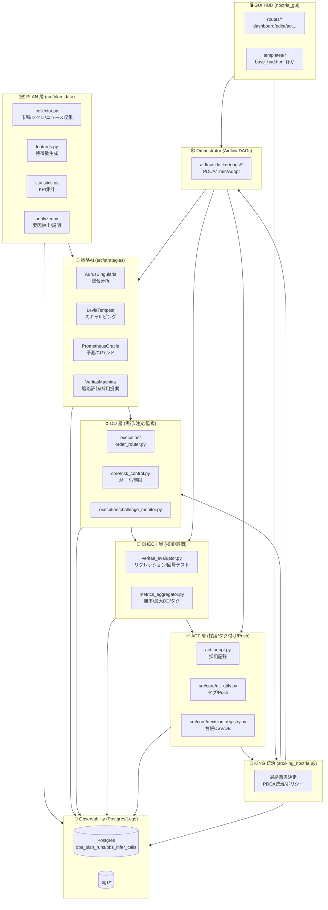
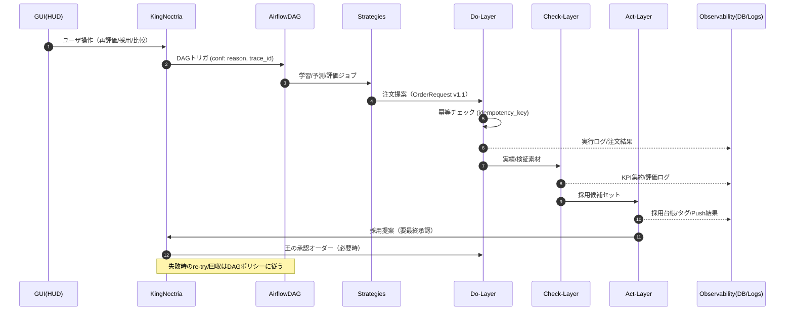

# 🏰 Noctria Kingdom — 設計統治パッケージ（2025-08-24）
**Thread:** Noctria_Docs統治_2025_08_24  
**Status:** Draft → Merge候補  
**Author:** Noctria Council  
**Last Updated:** 2025-08-24 (JST)

---

## 0. ゴール（本パッケージで達する状態）
- 設計の“土台”を1ファイルで配布：**規約 / 目次 / 図 / ひな形**が揃い、今日から増築できる。
- 直近の仕様差分（`OrderRequest v1.1: idempotency_key`）を**モデル図と契約テンプレ**に反映。
- PDCA/中央統治（King）/GUI/観測ログ/CIの**接続面の設計**を明文化（図＆IF表）。
- 「書けばCIが通る」レベルの**ドキュメント運用規約**を同梱（テンプレ・命名・バージョン規則）。

---

## 1. 目次（このファイル構成）
1. ゴール  
2. 全体像（アーキテクチャ図：最新）  
3. ドメインモデル（コア契約／OrderRequest v1.1）  
4. PDCAフロー分解（Plan/Do/Check/Act＋King）  
5. インターフェース仕様（IFテーブル）  
6. 設計命名／バージョン／ファイル配置規約  
7. ドキュメント運用規約（INDEX／AUTODOC／CI）  
8. ひな形テンプレ集（ADR／Contract／API／Runbook）  
9. 直近タスク（今日からやるToDo）

---

## 2. 全体像（アーキテクチャ図：最新）



---

## 3. ドメインモデル（コア契約／OrderRequest v1.1）
**意図:** 変更系リクエストの重複防止と再送安全性。  
**更新点:** `idempotency_key` を **必須推奨**としてヘッダ/ボディ一致を要求（Do層の注文系API・実行ルーター・外部ブローカーIFに適用）。

### 3.1 OrderRequest（要約）
- `order_id: str`（GUI/King/Orch発行の論理ID）
- `instrument: str`（例: USDJPY）
- `side: enum{BUY,SELL}`
- `qty: Decimal`（最小LOT規約に整合）
- `price: Decimal?`（成行時null）
- `time_in_force: enum{IOC,FOK,GTC}`
- `tags: List[str]`（PDCA/検証タグ）
- `idempotency_key: str`（**v1.1 追加**／必須推奨）
- `requested_at: datetime`
- `risk_constraints: {...}`（最大DD/連敗許容/スプレッド閾値 等）

### 3.2 Idempotency 規則
- ヘッダ `Idempotency-Key` とボディ `order_request.idempotency_key` を**一致必須**。
- キー重複時：**完全同一ボディ**なら200（幂等成立）／差異ありなら409 Conflict。
- 保存先：`obs_infer_calls` とは別に**idempotency ledger**（RDB or KV）を推奨。

---

## 4. PDCAフロー分解（Plan/Do/Check/Act＋King）



---

## 5. インターフェース仕様（IFテーブル）

### 5.1 GUI → King（FastAPI）
| Endpoint | Method | Body | 期待値 | 備考 |
|---|---|---|---|---|
| `/pdca/recheck` | POST | {strategy_id, window, reason} | 202/409 | Airflow DAG起動、trace_id付与 |
| `/act/adopt` | POST | {strategy_id, score, reason} | 201/409 | Decision Registry追記、Gitタグ予約 |
| `/strategies/compare` | GET | params | 200 | HUD表示、Chart.js切替 |

### 5.2 King → Airflow
| IF | Payload | 重要パラメタ |
|---|---|---|
| `airflow REST /dags/{}/dagRuns` | `conf`: {trace_id, reason, filters, ttl} | re-run guard、ttl、再入防止 |

### 5.3 Strategy → Do（Order）
| IF | Payload | 契約 |
|---|---|---|
| `POST /do/order` | `OrderRequest v1.1` | `Idempotency-Key` ヘッダ一致必須 |

### 5.4 各層 → Observability
| テーブル/ログ | 書き込み主体 | 主キー | 必須フィールド |
|---|---|---|---|
| `obs_plan_runs` | PLAN | `run_id` | started_at/ended_at/status/inputs_hash |
| `obs_infer_calls` | STRATS | `trace_id` | model_id/params_digest/latency/ms |
| `idempo_ledger` | DO | `idempotency_key` | request_digest/result_digest/expires_at |

---

## 6. 設計命名／バージョン／ファイル配置規約
- **命名**：`<サブドメイン>/<オブジェクト>.<md|py>`、図は `docs/architecture/diagrams/<topic>.mmd`
- **バージョン表記**：契約は SemVer 準拠（例：OrderRequest **v1.1**）。破壊的変更は **v2.0**。
- **配置**：
  - 契約: `docs/architecture/contracts/`
  - ADR: `docs/adrs/`
  - 運用: `docs/operations/`
  - 図: `docs/architecture/diagrams/`
  - API: `docs/apis/`

---

## 7. ドキュメント運用規約（INDEX／AUTODOC／CI）
- **INDEX**: `docs/00_index/00-INDEX.md` を**唯一の正規目次**に。
- **AUTODOCタグ**：生成ブロックは  
  `<!-- AUTODOC:BEGIN {id: <slug>} --> ... <!-- AUTODOC:END -->`  
  連続`END`は**1つに圧縮**（CIチェックで弾く）。
- **CI**: 
  - `scripts/noctria-docs.sh check`：idempotency の網羅、AUTODOC整形、壊れリンク検出。
  - `scripts/update_docs_from_index.py`：INDEX起点で再生成。

---

## 8. ひな形テンプレ集（コピペ即利用）

### 8.1 ADR テンプレ（`docs/adrs/ADR-YYYYMMDD-<slug>.md`）
```md
# ADR: <意思決定のタイトル>
**Status:** Proposed  
**Context:** <背景/制約>  
**Decision:** <選択肢と採択案>  
**Consequences:** <副作用/リスク/ロールバック>  
**References:** <関連Issue/PR/図/契約>
```

### 8.2 契約テンプレ（Order系／`docs/architecture/contracts/OrderRequest.md`）
```md
# Contract: OrderRequest (v1.1)
- **Change Log:** v1.1 で `idempotency_key` を追加（幂等要求強化）
- **Headers:** `Idempotency-Key: <same-as-body>`
- **Body:**
  ```json
  {
    "order_id": "string",
    "instrument": "USDJPY",
    "side": "BUY|SELL",
    "qty": 0.10,
    "price": null,
    "time_in_force": "IOC|FOK|GTC",
    "tags": ["pdca","recheck"],
    "idempotency_key": "uuid-...",
    "requested_at": "2025-08-24T00:00:00Z",
    "risk_constraints": {"max_dd": 0.1, "max_consecutive_loss": 3}
  }
  ```
- **Idempotency Rules:** 同一キーの差分ボディは **409**。完全一致は **200**（幂等成立）。
```

### 8.3 API リファレンス テンプレ（`docs/apis/Do-Layer-Contract.md`）
```md
# Do-Layer API — Order Execution
## POST /do/order
- **Headers:** `Idempotency-Key` (required)
- **Request:** `OrderRequest v1.1`
- **Responses:**
  - 200 OK: 幂等成立（既処理と同一）
  - 201 Created: 新規受理
  - 409 Conflict: 同一キーだがボディ差分
```

### 8.4 Runbook テンプレ（`docs/operations/Runbook-PDCA.md`）
```md
# Runbook: PDCA Recheck & Adopt
## Recheck
1) GUI → [POST] /pdca/recheck (reason, window)
2) Airflow DAG `pdca_recheck_all` 起動
3) 観測に trace_id を残す（obs_plan_runs / obs_infer_calls）

## Adopt
1) [POST] /act/adopt (strategy_id, score, reason)
2) Decision Registry 追記 → Gitタグ → HUD更新
```

---

## 9. 直近タスク（Today’s ToDo）
- [ ] **(契約)** `OrderRequest.md` を上記テンプレで **v1.1 に更新**（Change Log 明記）
- [ ] **(図)** 本ファイルの Mermaid を `docs/architecture/diagrams/overview_2025_08_24.mmd` として保存
- [ ] **(API)** `docs/apis/Do-Layer-Contract.md` に幂等ルールの**表現統一**
- [ ] **(CI)** AUTODOC連続ENDの圧縮ワンライナーを `scripts/noctria-docs.sh fix` に追加
- [ ] **(GUI)** `/pdca/recheck` ドキュメントに **trace_id/ttl** の conf 例を追加
- [ ] **(DB)** `idempo_ledger` のテーブル定義ドラフトを `docs/observability/Idempotency-Ledger.md` に作成

---
