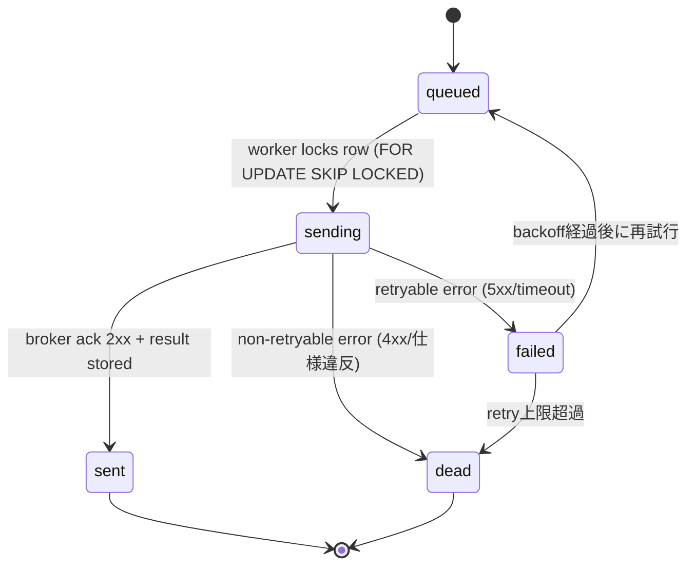

# Outbox Worker — プロトコル詳細設計
**Status:** Stable Candidate  
**Last Updated:** 2025-08-24 (JST)  
**Owner:** Do-Layer / Platform

関連:
- `docs/apis/Do-Layer-OrderAPI-Spec.md`
- `docs/architecture/contracts/OrderRequest.md`（v1.1: `idempotency_key`）
- `migrations/20250824_add_idempo_ledger.sql`（`idempo_ledger`）
- `docs/architecture/Design-Governance-2025-08-24.md`
- `docs/observability/DoLayer-Metrics.md`（別途作成予定）

---

## 0. 目的
**Outbox パターン**で “DB に入った注文を**ちょうど1回**外部ブローカーへ送る” 仕組みの詳細化。  
- Do-Layer で注文を同期受理 → **Outbox** にレコード化  
- **Worker** が Outbox をポーリング/取り出し → 送信/結果記録  
- **重複抑止**は `idempotency_key` と一意制約＋`idempo_ledger` で担保

---

## 1. スキーマ
### 1.1 `outbox_orders`
| 列 | 型 | 制約 | 説明 |
|---|---|---|---|
| `id` | BIGSERIAL | PK | 行ID |
| `idempotency_key` | TEXT | **UNIQUE NOT NULL** | `OrderRequest.idempotency_key`（v1.1） |
| `request_json` | JSONB | NOT NULL | 正規化済みリクエスト |
| `request_digest` | TEXT | NOT NULL | canonical JSON → `sha256:xxxx` |
| `status` | TEXT | NOT NULL | `queued|sending|sent|failed|dead` |
| `retry_count` | INT | NOT NULL DEFAULT 0 | 送信リトライ回数 |
| `next_attempt_at` | TIMESTAMPTZ | NOT NULL | 次回送信時刻 |
| `last_error` | TEXT | NULL | 直近の失敗理由（要約） |
| `created_at` | TIMESTAMPTZ | NOT NULL DEFAULT now() | 作成時刻 |
| `updated_at` | TIMESTAMPTZ | NOT NULL DEFAULT now() | 更新時刻 |

**インデックス**:  
- `status,next_attempt_at`（取得キュー）  
- `created_at`（保守）  

### 1.2 `idempo_ledger`（参照）
| 列 | 型 | 説明 |
|---|---|---|
| `idempotency_key` (PK) | TEXT | 一意キー |
| `request_digest` | TEXT | 正規化ダイジェスト |
| `result_digest` | TEXT | 下流結果のダイジェスト |
| `expires_at` | TIMESTAMPTZ | TTL |

> `OrderRequest.md` のポリシー：**ヘッダ `Idempotency-Key` とボディ一致必須**。

---

## 2. ライフサイクル（状態機械）


**状態遷移ルール**
- `queued` 取得は **`FOR UPDATE SKIP LOCKED`** で多並列を安全化
- `sending` は**同一ワーカー内トランザクション**で送信
- 2xx/ACK → `sent`、非2xxは `failed` or `dead` へ
- **再試行上限**: 8 回（指数バックオフ）

---

## 3. 取得クエリ（ワーカー）
```sql
BEGIN;
SELECT id, idempotency_key, request_json
FROM outbox_orders
WHERE status='queued' AND next_attempt_at <= now()
ORDER BY created_at
FOR UPDATE SKIP LOCKED
LIMIT :batch;
-- 取り出した行を status='sending', updated_at=now() に更新
UPDATE outbox_orders
SET status='sending', updated_at=now()
WHERE id = ANY(:picked_ids);
COMMIT;
```

> 送信完了 or 失敗で **別トランザクション**にて更新（遅延を短縮）。

---

## 4. 送信プロトコル（BrokerAdapter 経由）
### 4.1 リクエスト（例）
```json
{
  "idempotency_key": "01JABCXYZ-ULID-5678",
  "symbol": "USDJPY",
  "intent": "BUY",
  "qty": 10000,
  "limit_price": 145.001,
  "trace_id": "do-outbox-01JB4A...",
  "meta": {"source":"DoLayer"}
}
```
**ヘッダ**: `Idempotency-Key: <同一キー>`（ブローカー側に要求できるなら一致必須）

### 4.2 成功応答（例）
```json
{
  "broker_order_id": "brk-8842-...-01",
  "accepted_at": "2025-08-24T03:40:10Z",
  "status": "accepted",
  "fills": [],
  "idempotency_key": "01JABCXYZ-ULID-5678"
}
```

**整合要件**
- 応答に **`idempotency_key` を貫通**させ、**`exec_result`** と監査で紐づけ

---

## 5. 再試行とバックオフ
- **再試行対象**: ネットワーク例外、5xx、429（`Retry-After` に従う）  
- **非再試行**: 4xx（仕様違反/バリデーション失敗）、重複拒否（**ただし 409 が“既に処理済み”型なら `sent` に準ずる**）  
- **指数バックオフ**: `base=2s` → `2,4,8,16,32,64,128,256` 秒（±10% ジッタ）  
- `next_attempt_at = now() + backoff(retry_count)`

---

## 6. 冪等 & 整合（Exactly-once 近似）
1. **生成時**:  
   - `outbox_orders(idempotency_key)` の UNIQUE で**二重生成を遮断**  
   - `idempo_ledger` に `{key, request_digest}` を `UPSERT`（TTL 付き）
2. **送信時**:  
   - Broker へ **同一 `idempotency_key`** を常に送る  
   - 409 “already processed” を受けたら **`sent` に昇格**（安全な場合のみ）
3. **確定時**:  
   - `idempo_ledger.result_digest` を保存（`exec_result` の正規化ダイジェスト）

> **観測上の重複は起こり得る**が、**外部実行は1回**に収束する設計。

---

## 7. エラー分類（`last_error` コード）
| コード | 説明 | 扱い |
|---|---|---|
| `NETWORK_TIMEOUT` | タイムアウト | 再試行 |
| `BROKER_5XX` | ブローカー内部 | 再試行 |
| `RATE_LIMITED` | 429 | `Retry-After` 準拠で再試行 |
| `BAD_REQUEST` | 400/422 | **dead**（入力不正） |
| `UNAUTHORIZED` | 401/403 | **dead**（設定/資格情報） |
| `CONFLICT_PROCESSED` | 409（処理済み） | **sent** 扱い |
| `UNKNOWN` | パース不能など | 再試行（回数上限あり） |

---

## 8. 監査・メトリクス
### 8.1 監査ログ（追加）
- `outbox_id`, `status_from -> status_to`, `retry_count`, `last_error`  
- **相関ID**: `idempotency_key`, `trace_id`, `broker_order_id?`

### 8.2 メトリクス（Prometheus 名称案）
- `outbox.dequeue_total{result}` … dequeue 成功/枯渇  
- `outbox.send_total{outcome}` … `success|retry|dead|conflict_processed`  
- `outbox.inflight` … `sending` 行数（ゲージ）  
- `outbox.lag_seconds` … `now - created_at` の分位点  
- `outbox.retry_count` … 再試行回数の分布ヒストグラム

---

## 9. 運用パラメータ
| 設定 | 既定 | 説明 |
|---|---|---|
| `OUTBOX_BATCH_SIZE` | 32 | 一括取り出し件数 |
| `OUTBOX_PARALLELISM` | 4 | ワーカープロセス数 |
| `OUTBOX_RETRY_MAX` | 8 | 上限回数 |
| `OUTBOX_IDLE_SLEEP_MS` | 200 | キュー空時のスリープ |
| `OUTBOX_STUCK_THRESHOLD_MIN` | 10 | `sending` 長期滞留の再キュー判定 |

---

## 10. フェイルセーフ
- **スタック解消**: `sending` で `updated_at` が `> STUCK_THRESHOLD` の行は `queued` に巻き戻し  
- **Poison pill**: 同一 `BAD_REQUEST` が連続した行は **即 `dead`**  
- **バックプレッシャ**: ブローカーが 429 のとき **グローバルスロットル**を下げる

---

## 11. 疑似コード（Worker 抜粋）
```python
def work_once(db, adapter, now):
    rows = db.dequeue(batch_size=cfg.BATCH, now=now)  # SKIP LOCKED
    for r in rows:
        try:
            res = adapter.send_order(r.request_json)  # 内部でヘッダ含め送信
            if res.ok:
                db.mark_sent(r.id, result_digest=hash(res.body))
                ledger.upsert(r.idempotency_key, req=r.request_digest, res=hash(res.body))
            elif res.retryable:
                db.mark_retry(r.id, err=res.code, next_at=calc_backoff(r.retry_count))
            elif res.conflict_processed:
                db.mark_sent(r.id, result_digest="sha256:from-conflict")
            else:
                db.mark_dead(r.id, err=res.code)
        except Timeout:
            db.mark_retry(r.id, err="NETWORK_TIMEOUT", next_at=calc_backoff(r.retry_count))
```

---

## 12. モニタリングと運用手順
1. **Lag 監視**: `outbox.lag_seconds{p95}` が SLA を超えたらアラート  
2. **Dead 増加**: `outcome=dead` が急増 → 直近デプロイ/スキーマ変更を確認  
3. **Stuck 解消**: `sending` 滞留を自動巻戻し、根本原因（ネットワーク/資格情報）を別途復旧  
4. **手動再送**: `dead` 行は**原則再送しない**（入力不正）。必要なら新しい OrderRequest を生成

---

## 13. 受け入れ基準（DoR/DoD）
- **DoR**（Ready）  
  - `OrderRequest v1.1`（`idempotency_key`）で保存できる  
  - BrokerAdapter の `send_order` が 2xx/4xx/5xx/429/409 を区別可能  
- **DoD**（Done）  
  - 2 重投入試験：同一 `idempotency_key` を 10 回投入して **送信は1回**  
  - バックオフ試験：5xx で指数バックオフして最終成功  
  - Poison 試験：400 で即 `dead`  
  - 監査・メトリクスが全て出ている

---

## 14. 変更履歴
- **2025-08-24**: 初版（スキーマ、状態機械、再試行、冪等、監査、受入れ基準）
