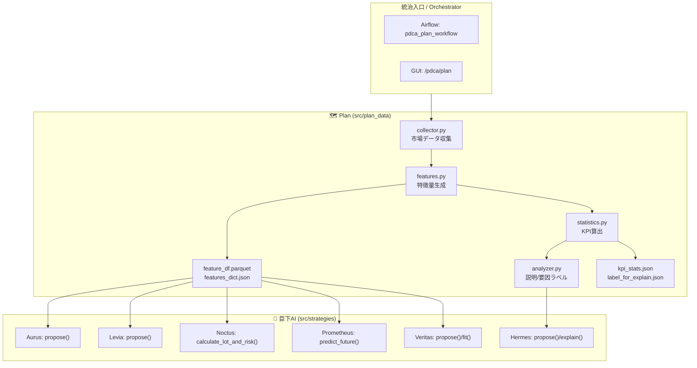

# 🗺 Plan Layer — Noctria Kingdom

**Version:** 1.0  
**Status:** Draft → Adopted (when merged)  
**Last Updated:** 2025-08-12 (JST)

> 目的：Plan 層（**収集 → 特徴量 → 統計/KPI → 説明ラベル**）の仕様を一元管理し、Do/Check/Act・AI臣下への**安定した入力**を保証する。  
> 参照：`../governance/Vision-Governance.md` / `./Architecture-Overview.md` / `../operations/Airflow-DAGs.md` / `../operations/Config-Registry.md` / `../operations/Runbooks.md` / `../observability/Observability.md`

---

## 1. 範囲（Scope）
- 対象モジュール：`src/plan_data/{collector.py, features.py, statistics.py, analyzer.py}`
- 出力アーティファクト：
  - `feature_df.parquet`（学習/推論向けの行列データ）
  - `features_dict.json`（シグナル/派生特徴の辞書＋メタ）
  - `kpi_stats.json`（市場状態KPI、AI臣下へのヒント）
  - `label_for_explain.json`（Hermes 用の説明補助ラベル）

> **タイムゾーン**：内部処理および Airflow は **UTC**、GUI 表示は **JST** 補正（`Observability.md` 準拠）。

---

## 2. 全体フロー（Plan 内部）


---

## 3. コンポーネント仕様

### 3.1 `collector.py`（市場データ収集）
- **役割**：銘柄・時間足レンジに対する **OHLCV + 市場イベント** の時系列取得と整形。
- **入力**：`symbols`、`timeframe`、`from_ts`、`to_ts`、接続設定（`Config-Registry.md`）。
- **出力**：標準化済み DataFrame（UTC index, columns: `open, high, low, close, volume, ...`）
- **振る舞い**：
  - 欠損は forward-fill / back-fill（最大 `max_fill_gap`）→超過は **欠損フラグ**付与。
  - ソース混在を許容（例：REST + CSV キャッシュ）。  
- **CLI（例）**：
  ```bash
  python -m src.plan_data.collector --symbols BTCUSDT,ETHUSDT --tf 5m --from 2025-07-01 --to 2025-08-01 --out /data/plan/raw.parquet
  ```

### 3.2 `features.py`（特徴量生成）
- **役割**：収集済みデータから **テクニカル/ボラ/流動性/イベント** 特徴を生成し、**リーク防止**の上で標準化。
- **入力**：`raw.parquet` or Collector の DataFrame。
- **出力**：`feature_df.parquet`（2Dマトリクス）、`features_dict.json`（主要シグナル辞書）
- **要件**：
  - 未来参照禁止（rolling 適用順序を厳守）
  - `feature_spec.json` で **再現性**（窓長/式/欠損処理）を固定  
- **CLI**：
  ```bash
  python -m src.plan_data.features --in /data/plan/raw.parquet --out_df /data/plan/feature_df.parquet --out_dict /data/plan/features_dict.json --spec configs/feature_spec.json
  ```

### 3.3 `statistics.py`（市場KPI算出）
- **役割**：市場状態の KPI（ボラ/トレンド強度/流動性/イベント近傍）を計算し、戦略の **制御変数** を提供。
- **出力**：`kpi_stats.json`（`docs/schemas/` に準拠）
- **例**：`volatility_hv20`, `trend_zscore_50`, `rolling_spread`, `event_risk_level`

### 3.4 `analyzer.py`（要因抽出/ラベリング）
- **役割**：Hermes の説明に使う **要因スコア** や **フェーズ判定** をラベリング（`label_for_explain.json`）。
- **主なラベル**：`regime:{ranging, trending}`, `vol_bucket:{low, mid, high}`, `liquidity:{thin, normal, thick}`, `event:{none, pre, post}`

---

## 4. 入出力 & スキーマ

### 4.1 主要アーティファクト
| ファイル | 用途 | 下流利用 |
|---|---|---|
| `/data/plan/feature_df.parquet` | 学習/推論の入力行列 | Veritas/Prometheus |
| `/data/plan/features_dict.json` | 重要シグナルの辞書＋メタ | Aurus/Levia/Noctus |
| `/data/plan/kpi_stats.json` | 市場状態の KPI 集約 | 全AI/GUI |
| `/data/plan/label_for_explain.json` | 説明用ラベル | Hermes |

### 4.2 `features_dict.json`（抜粋サンプル）
```json
{
  "meta": {"symbols": ["BTCUSDT"], "tf": "5m", "tz": "UTC", "spec": "configs/feature_spec.json"},
  "latest_ts": "2025-08-12T06:55:00Z",
  "signals": {
    "rsi_14": 38.2,
    "macd": {"line": -12.3, "signal": -10.1, "hist": -2.2},
    "atr_14": 84.1,
    "hv_20": 0.32,
    "trend_z_50": -1.05
  }
}
```

### 4.3 `kpi_stats.json`（例）
```json
{
  "period": {"from": "2025-08-11", "to": "2025-08-12"},
  "market": {
    "volatility_hv20": 0.31,
    "trend_strength_z": -0.8,
    "liquidity_score": 0.62,
    "event_risk_level": "LOW"
  }
}
```

---

## 5. ベース特徴量セット（Baseline）
- **価格・収益**：`ret_1, ret_5, ret_20`, `roll_mean/var`, `zscore_20/50`
- **テクニカル**：`RSI(14)`, `MACD(12,26,9)`, `Stoch(14,3)`, `ATR(14)`, `Donchian(20)`  
- **ボラ/リスク**：`HV(20,60)`, `ATR/price`, `drawdown_lookback`
- **流動性**：`vol_chg_rate`, `approx_spread`, `roll_vwap`
- **イベント**：`is_pre_event`, `is_post_event`, `session_flag`（JST セッション）
- **派生**：`crossovers`, `divergences`, `phase_encoding`

> 実仕様は `configs/feature_spec.json` を正とし、PRで変更（`ADRs/` 対応）。

---

## 6. 欠損・外れ値・時間整合（Data Quality）
- **欠損**：`max_fill_gap` 以内は FFill/BFill、超過は `nan_flag=1` を付ける  
- **外れ値**：Winsorize（パーセンタイル）→ ログ/監査へ記録  
- **時間整合**：UTC インデックスに正規化（重複/欠落バーはログ出力）  
- **休日**：Crypto=常時 / 現物/FX/株=祝日カレンダーでマーク（`session_flag`）

---

## 7. インターフェイス（AI 臣下）
| 消費者 | 入力 | 用途 |
|---|---|---|
| Aurus / Levia | `features_dict.json` | 統合/スキャル提案の素材 |
| Noctus | `features_dict.json` + `kpi_stats.json` | ロット・リスク境界の調整 |
| Prometheus | `feature_df.parquet` | 予測（連続 action） |
| Veritas | `feature_df.parquet` | 学習・戦略生成 |
| Hermes | `label_for_explain.json` | 説明・要因可視化 |

---

## 8. Airflow 連携（`pdca_plan_workflow`）
```python
# airflow_docker/dags/pdca_plan_workflow.py（骨子）
t_collect = PythonOperator(task_id="collect_market_data", python_callable=collect)
t_feat    = PythonOperator(task_id="generate_features",   python_callable=generate_features)
t_stats   = PythonOperator(task_id="compute_statistics",  python_callable=compute_statistics)
t_label   = PythonOperator(task_id="label_for_explain",   python_callable=label_for_explain)
t_collect >> t_feat >> t_stats >> t_label
```
- **スケジュール（UTC）**：`0 5 * * 1-5`（例）  
- **Variables**：`env, flags, risk_policy, dag_defaults`（`Config-Registry.md`）  
- **SLA**：30m（失敗は Slack/PagerDuty → `Runbooks.md` の手順）

---

## 9. コンフィグ（抜粋）
```yaml
plan:
  symbols: ["BTCUSDT","ETHUSDT"]
  timeframe: "5m"
  max_fill_gap: "15m"
  feature_spec: "configs/feature_spec.json"
  outputs:
    dir: "/data/plan"
    df: "feature_df.parquet"
    dict: "features_dict.json"
    kpi: "kpi_stats.json"
    explain: "label_for_explain.json"
```
> 実値は `../operations/Config-Registry.md` の `{env}.yml` を正とする。Secrets は **Vault/ENV**。

---

## 10. テスト & 品質保証（QA）
- **単体テスト**：各指標/特徴関数を固定入力で検証（ゴールデン値）  
- **統合テスト**：小区間（1–3日）を **再現実行** → 出力ハッシュ比較  
- **回帰**：特徴量/欠損処理を変更した場合、**WFO の代表ロール**で差分検証  
- **CI**：PR で `features.py` を最小区間に対し実行→出力を `jsonschema` & 値域チェック

---

## 11. パフォーマンス（Perf）
- **窓長キャッシュ**：rolling 計算は **重複ウィンドウ**をキャッシュ  
- **列指向**：可能な限りベクトル化、遅いループは Numba/PyArrow で置換  
- **I/O**：Parquet 圧縮（`zstd`）＋ 列フィルタで読み出し  
- **スループット目安**：5m 足 × 2銘柄 × 3年 ≒ 数百万ポイント → 1〜3 分

---

## 12. セキュリティ & 監査
- **Secrets**：API キーは **Variables 禁止**、Secrets Backend/ENV 経由  
- **監査**：`/data/plan/*.parquet/json` の生成ログに **実行者/バージョン/引数** を記録  
- **再現性**：`feature_spec.json` と `git commit` をメタに同梱

---

## 13. 変更管理（Docs as Code）
- 仕様変更は **同一PR** で以下を更新：  
  - `Plan-Layer.md`（本書）  
  - `Config-Registry.md`（新キー/既存キーの差分）  
  - `Airflow-DAGs.md`（DAG 変更/スケジュール/依存）  
  - 必要に応じて `ADRs/`（重要判断）

---

## 14. 付録：`feature_spec.json` の例（抜粋）
```json
{
  "timeframe": "5m",
  "features": [
    {"name": "rsi_14", "type": "ta.rsi", "window": 14, "norm": "zscore_252"},
    {"name": "macd",   "type": "ta.macd", "fast": 12, "slow": 26, "signal": 9},
    {"name": "atr_14", "type": "ta.atr", "window": 14, "norm": "minmax_1y"},
    {"name": "hv_20",  "type": "risk.hv", "window": 20},
    {"name": "trend_z_50", "type": "stats.zscore", "window": 50}
  ],
  "nan_policy": {"max_fill_gap": "15m", "winsorize_pct": 0.005},
  "outputs": {"df": true, "dict": true}
}
```

---

## 15. 変更履歴（Changelog）
- **2025-08-12**: 初版作成（収集/特徴量/統計/説明・I/F・Airflow・品質・Perf・セキュリティ）

