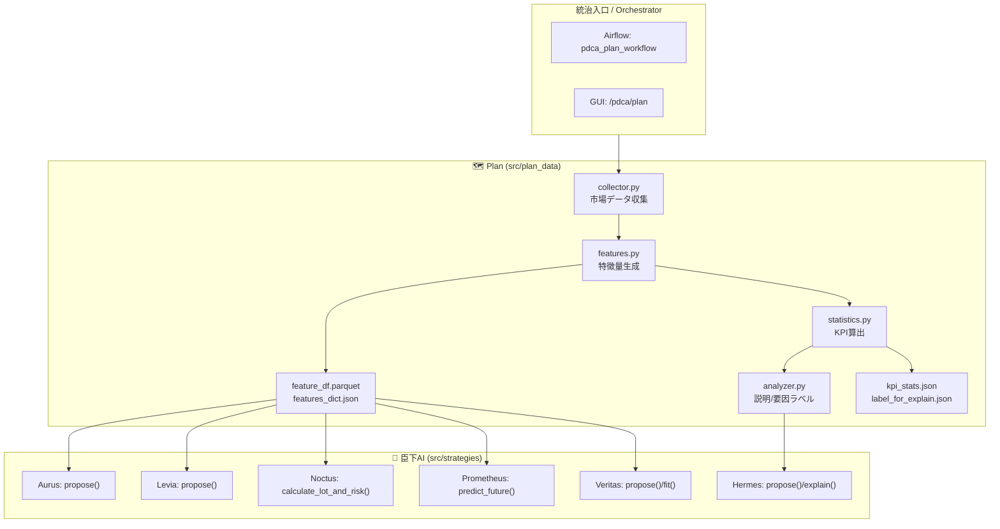

# 🗺 Plan Layer — Noctria Kingdom
<!-- AUTODOC:BEGIN mode=file_content path_globs="docs/architecture/diagrams/plan_layer.mmd;docs/architecture/diagrams/plan_layer_*.mmd" title="PLAN層 図（最新）" fence=mermaid -->
### PLAN層 図（最新）

```mermaid
flowchart TD

%% ====== styles (GitHub-safe) ======
classDef plan fill:#262e44,stroke:#47617a,color:#d8e0f7;
classDef ai fill:#2f3136,stroke:#a97e2c,color:#ffe476;
classDef do fill:#3d2d2d,stroke:#cc9999,color:#ffcccc;
classDef todo fill:#323232,stroke:#ff9f43,color:#ffd8a8;
classDef obs fill:#1e2a36,stroke:#5dade2,color:#d6eaf8;
classDef demo fill:#202020,stroke:#8a8a8a,color:#eaeaea;

%% ====== PLAN layer ======
subgraph PLAN ["PLAN layer (src/plan_data)"]
  COLLECT["collector.py<br/>market data collection"]:::plan
  FEATURES["features.py<br/>feature engineering"]:::plan
  FEATDF["FeatureBundle output<br/>(df + context)<br/>v1.0"]:::plan
  ANALYZER["analyzer.py<br/>factor extraction"]:::plan
  STATS["statistics.py<br/>KPI aggregation"]:::plan
  ADAPTER["strategy_adapter.py<br/>propose_with_logging<br/>logs obs_infer_calls"]:::plan
end

%% ====== AI underlings ======
subgraph AI_UNDERLINGS ["AI underlings (src/strategies)"]
  AURUS["Aurus<br/>propose()"]:::ai
  LEVIA["Levia<br/>propose()"]:::ai
  PROM["Prometheus<br/>predict_future()"]:::ai
  VERITAS["Veritas<br/>propose()"]:::ai
  HERMES["Hermes<br/>LLM explain (non-exec)"]:::ai
end

%% ====== Decision & Risk ======
DECISION["DecisionEngine (min)<br/>integrate & log<br/>(IMPLEMENTED)"]:::plan
NOCTUSGATE["Noctus Gate<br/>mandatory risk & lot filter<br/>(TODO)"]:::todo
QUALITY["DataQualityGate<br/>missing_ratio / data_lag → SCALE/FLAT<br/>(TODO)"]:::todo
PROFILES["profiles.yaml<br/>weights & rollout 7->30->100%<br/>(TODO)"]:::todo

%% ====== Contracts ======
CONTRACTS["Contracts<br/>FeatureBundle & StrategyProposal v1.0<br/>OrderRequest (TBD)"]:::todo
TRACEID["Correlation ID trace_id<br/>PLAN/AI/Decision/Exec implemented"]:::plan

%% ====== Do layer (handoff) ======
subgraph DO_LAYER ["Do layer (handoff)"]
  ORDER["order_execution.py<br/>execution API (dummy ok)"]:::do
end

%% ====== Demo & tests ======
subgraph DEMO ["Demo and tests"]
  DECISION_MINI["e2e/decision_minidemo.py<br/>E2E (IMPLEMENTED)"]:::demo
  TEST_E2E["tests/test_trace_decision_e2e.py<br/>integration (IMPLEMENTED)"]:::demo
end

%% ====== Observability taps ======
subgraph OBS ["Observability taps (tables)"]
  OBS_PLAN["obs_plan_runs<br/>collector/features/statistics/analyzer<br/>trace_id present"]:::obs
  OBS_INFER["obs_infer_calls<br/>AI propose/predict latency<br/>trace_id present"]:::obs
  OBS_DEC["obs_decisions<br/>decision metrics & reasons<br/>trace_id present (NEW)"]:::obs
  OBS_EXEC["obs_exec_events<br/>send status / provider response<br/>trace_id present (NEW)"]:::obs
  OBS_ALT["obs_alerts<br/>quality or risk alerts<br/>(TODO)"]:::obs
end

%% ====== PLAN flow ======
COLLECT --> FEATURES --> STATS
FEATURES --> FEATDF
FEATDF --> ANALYZER
ANALYZER --> HERMES
FEATDF --> ADAPTER
ADAPTER --> AURUS
ADAPTER --> LEVIA
ADAPTER --> PROM
ADAPTER --> VERITAS

%% ====== Contracts wiring ======
FEATDF -. "uses" .-> CONTRACTS
ADAPTER -. "uses" .-> CONTRACTS
AURUS -. "returns" .-> CONTRACTS
LEVIA -. "returns" .-> CONTRACTS
PROM  -. "returns" .-> CONTRACTS
VERITAS -. "returns" .-> CONTRACTS

%% ====== Decision integration path ======
FEATDF --> QUALITY
QUALITY --> DECISION
AURUS --> DECISION
LEVIA --> DECISION
PROM  --> DECISION
VERITAS --> DECISION
PROFILES -. "config" .-> DECISION
DECISION --> NOCTUSGATE
NOCTUSGATE --> ORDER

%% ====== Demo edges ======
DECISION_MINI --> FEATDF
DECISION_MINI --> DECISION
DECISION_MINI --> ORDER
TEST_E2E -. "psql counts by trace_id" .-> OBS_PLAN
TEST_E2E -.-> OBS_INFER
TEST_E2E -.-> OBS_DEC
TEST_E2E -.-> OBS_EXEC

%% ====== Observability wiring ======
COLLECT  -->|log| OBS_PLAN
FEATURES -->|log| OBS_PLAN
STATS    -->|log| OBS_PLAN
ANALYZER -->|log| OBS_PLAN
AURUS    -->|log| OBS_INFER
LEVIA    -->|log| OBS_INFER
PROM     -->|log| OBS_INFER
VERITAS  -->|log| OBS_INFER
DECISION -->|log| OBS_DEC
ORDER    -->|log| OBS_EXEC
NOCTUSGATE -->|alert| OBS_ALT

%% ====== trace_id notes ======
FEATDF -. "trace_id (PLAN & AI implemented)" .-> AURUS
FEATDF -. "trace_id (PLAN & AI implemented)" .-> LEVIA
FEATDF -. "trace_id (PLAN & AI implemented)" .-> PROM
FEATDF -. "trace_id (PLAN & AI implemented)" .-> VERITAS
DECISION -. "trace_id (P->D->Exec implemented)" .-> ORDER

%% ====== class bindings ======
class COLLECT,FEATURES,FEATDF,ANALYZER,STATS,ADAPTER plan;
class AURUS,LEVIA,PROM,VERITAS,HERMES ai;
class ORDER do;
class DECISION plan;
class NOCTUSGATE,QUALITY,PROFILES,CONTRACTS todo;
class TRACEID plan;
class OBS_PLAN,OBS_INFER,OBS_DEC,OBS_EXEC,OBS_ALT obs;
class DECISION_MINI,TEST_E2E demo;
```


<!-- AUTODOC:END -->

<!-- AUTODOC:BEGIN mode=git_log path_globs="src/plan_data/*.py;src/plan_data/**/*.py" title="PLAN層 変更履歴（最近30）" limit=30 since=2025-08-01 -->
### PLAN層 変更履歴（最近30）

- **6a2294c** 2025-08-20T02:31:07+09:00 — Update pdca_summary_service.py (by Noctoria)
  - `src/plan_data/pdca_summary_service.py`
- **0a246cf** 2025-08-19T02:37:10+09:00 — Update pdca_summary_service.py (by Noctoria)
  - `src/plan_data/pdca_summary_service.py`
- **73b1b0d** 2025-08-18T03:37:41+09:00 — Update pdca_summary_service.py (by Noctoria)
  - `src/plan_data/pdca_summary_service.py`
- **a39c7db** 2025-08-15T04:14:15+09:00 — Update observability.py (by Noctoria)
  - `src/plan_data/observability.py`
- **00fc537** 2025-08-15T01:44:12+09:00 — Create kpi_minidemo.py (by Noctoria)
  - `src/plan_data/kpi_minidemo.py`
- **e0b9eaa** 2025-08-14T21:53:00+09:00 — Update pdca_summary_service.py (by Noctoria)
  - `src/plan_data/pdca_summary_service.py`
- **2b51ef9** 2025-08-14T04:27:11+09:00 — Create pdca_summary_service.py (by Noctoria)
  - `src/plan_data/pdca_summary_service.py`
- **206dac2** 2025-08-14T00:21:25+09:00 — Update observability.py (by Noctoria)
  - `src/plan_data/observability.py`
- **435b19e** 2025-08-13T21:57:54+09:00 — Update observability.py (by Noctoria)
  - `src/plan_data/observability.py`
- **b112ce9** 2025-08-13T15:30:22+09:00 — Update contracts.py (by Noctoria)
  - `src/plan_data/contracts.py`
- **a33f63e** 2025-08-13T14:17:31+09:00 — Update observability.py (by Noctoria)
  - `src/plan_data/observability.py`
- **3fe7a25** 2025-08-13T13:42:41+09:00 — Update observability.py (by Noctoria)
  - `src/plan_data/observability.py`
- **7913390** 2025-08-13T12:55:44+09:00 — Create profile_loader.py (by Noctoria)
  - `src/plan_data/profile_loader.py`
- **5c617c4** 2025-08-13T12:43:52+09:00 — Update observability.py (by Noctoria)
  - `src/plan_data/observability.py`
- **e4a9e83** 2025-08-13T10:58:32+09:00 — Update observability.py (by Noctoria)
  - `src/plan_data/observability.py`
- **c7c65fb** 2025-08-13T04:55:43+09:00 — Update plan_to_all_minidemo.py (by Noctoria)
  - `src/plan_data/plan_to_all_minidemo.py`
- **9738c0b** 2025-08-13T04:18:54+09:00 — Update observability.py (by Noctoria)
  - `src/plan_data/observability.py`
- **668d424** 2025-08-13T04:07:33+09:00 — Update observability.py (by Noctoria)
  - `src/plan_data/observability.py`
- **f06ae54** 2025-08-13T03:05:40+09:00 — Update plan_to_all_minidemo.py (by Noctoria)
  - `src/plan_data/plan_to_all_minidemo.py`
- **831ff6c** 2025-08-13T02:53:37+09:00 — Create strategy_adapter.py (by Noctoria)
  - `src/plan_data/strategy_adapter.py`
- **fc92ef5** 2025-08-13T02:50:18+09:00 — Update analyzer.py (by Noctoria)
  - `src/plan_data/analyzer.py`
- **76795bf** 2025-08-13T02:47:28+09:00 — Update statistics.py (by Noctoria)
  - `src/plan_data/statistics.py`
- **af4106e** 2025-08-13T02:44:27+09:00 — Update features.py (by Noctoria)
  - `src/plan_data/features.py`
- **34e7328** 2025-08-13T02:40:33+09:00 — Update collector.py (by Noctoria)
  - `src/plan_data/collector.py`
- **b80bcf2** 2025-08-13T02:24:16+09:00 — Update observability.py (by Noctoria)
  - `src/plan_data/observability.py`
- **386097b** 2025-08-13T01:53:40+09:00 — Create ai_adapter.py (by Noctoria)
  - `src/plan_data/ai_adapter.py`
- **881c42c** 2025-08-13T01:52:58+09:00 — Create observability.py (by Noctoria)
  - `src/plan_data/observability.py`
- **e40ac8c** 2025-08-13T01:50:14+09:00 — Create quality_gate.py (by Noctoria)
  - `src/plan_data/quality_gate.py`
- **1de46ad** 2025-08-13T01:49:35+09:00 — Create contracts.py (by Noctoria)
  - `src/plan_data/contracts.py`
- **e7251f7** 2025-08-11T15:20:16+09:00 — Update observation_adapter.py (by Noctoria)
  - `src/plan_data/observation_adapter.py`
<!-- AUTODOC:END -->

**Version:** 1.0  
**Status:** Draft → Adopted (when merged)  
**Last Updated:** 2025-08-12 (JST)

> 目的：Plan 層（**収集 → 特徴量 → 統計/KPI → 説明ラベル**）の仕様を一元管理し、Do/Check/Act・AI臣下への**安定した入力**を保証する。  
> 参照：`../governance/Vision-Governance.md` / `./Architecture-Overview.md` / `../operations/Airflow-DAGs.md` / `../operations/Config-Registry.md` / `../operations/Runbooks.md` / `../observability/Observability.md`

---

## 1. 範囲（Scope）
- 対象モジュール：`src/plan_data/{collector.py, features.py, statistics.py, analyzer.py}`
- 出力アーティファクト：
  - `feature_df.parquet`（学習/推論向けの行列データ）
  - `features_dict.json`（シグナル/派生特徴の辞書＋メタ）
  - `kpi_stats.json`（市場状態KPI、AI臣下へのヒント）
  - `label_for_explain.json`（Hermes 用の説明補助ラベル）

> **タイムゾーン**：内部処理および Airflow は **UTC**、GUI 表示は **JST** 補正（`Observability.md` 準拠）。

---

## 2. 全体フロー（Plan 内部）


---

## 3. コンポーネント仕様

### 3.1 `collector.py`（市場データ収集）
- **役割**：銘柄・時間足レンジに対する **OHLCV + 市場イベント** の時系列取得と整形。
- **入力**：`symbols`、`timeframe`、`from_ts`、`to_ts`、接続設定（`Config-Registry.md`）。
- **出力**：標準化済み DataFrame（UTC index, columns: `open, high, low, close, volume, ...`）
- **振る舞い**：
  - 欠損は forward-fill / back-fill（最大 `max_fill_gap`）→超過は **欠損フラグ**付与。
  - ソース混在を許容（例：REST + CSV キャッシュ）。  
- **CLI（例）**：
  ```bash
  python -m src.plan_data.collector --symbols BTCUSDT,ETHUSDT --tf 5m --from 2025-07-01 --to 2025-08-01 --out /data/plan/raw.parquet
  ```

### 3.2 `features.py`（特徴量生成）
- **役割**：収集済みデータから **テクニカル/ボラ/流動性/イベント** 特徴を生成し、**リーク防止**の上で標準化。
- **入力**：`raw.parquet` or Collector の DataFrame。
- **出力**：`feature_df.parquet`（2Dマトリクス）、`features_dict.json`（主要シグナル辞書）
- **要件**：
  - 未来参照禁止（rolling 適用順序を厳守）
  - `feature_spec.json` で **再現性**（窓長/式/欠損処理）を固定  
- **CLI**：
  ```bash
  python -m src.plan_data.features --in /data/plan/raw.parquet --out_df /data/plan/feature_df.parquet --out_dict /data/plan/features_dict.json --spec configs/feature_spec.json
  ```

### 3.3 `statistics.py`（市場KPI算出）
- **役割**：市場状態の KPI（ボラ/トレンド強度/流動性/イベント近傍）を計算し、戦略の **制御変数** を提供。
- **出力**：`kpi_stats.json`（`docs/schemas/` に準拠）
- **例**：`volatility_hv20`, `trend_zscore_50`, `rolling_spread`, `event_risk_level`

### 3.4 `analyzer.py`（要因抽出/ラベリング）
- **役割**：Hermes の説明に使う **要因スコア** や **フェーズ判定** をラベリング（`label_for_explain.json`）。
- **主なラベル**：`regime:{ranging, trending}`, `vol_bucket:{low, mid, high}`, `liquidity:{thin, normal, thick}`, `event:{none, pre, post}`

---

## 4. 入出力 & スキーマ

### 4.1 主要アーティファクト
| ファイル | 用途 | 下流利用 |
|---|---|---|
| `/data/plan/feature_df.parquet` | 学習/推論の入力行列 | Veritas/Prometheus |
| `/data/plan/features_dict.json` | 重要シグナルの辞書＋メタ | Aurus/Levia/Noctus |
| `/data/plan/kpi_stats.json` | 市場状態の KPI 集約 | 全AI/GUI |
| `/data/plan/label_for_explain.json` | 説明用ラベル | Hermes |

### 4.2 `features_dict.json`（抜粋サンプル）
```json
{
  "meta": {"symbols": ["BTCUSDT"], "tf": "5m", "tz": "UTC", "spec": "configs/feature_spec.json"},
  "latest_ts": "2025-08-12T06:55:00Z",
  "signals": {
    "rsi_14": 38.2,
    "macd": {"line": -12.3, "signal": -10.1, "hist": -2.2},
    "atr_14": 84.1,
    "hv_20": 0.32,
    "trend_z_50": -1.05
  }
}
```

### 4.3 `kpi_stats.json`（例）
```json
{
  "period": {"from": "2025-08-11", "to": "2025-08-12"},
  "market": {
    "volatility_hv20": 0.31,
    "trend_strength_z": -0.8,
    "liquidity_score": 0.62,
    "event_risk_level": "LOW"
  }
}
```

---

## 5. ベース特徴量セット（Baseline）
- **価格・収益**：`ret_1, ret_5, ret_20`, `roll_mean/var`, `zscore_20/50`
- **テクニカル**：`RSI(14)`, `MACD(12,26,9)`, `Stoch(14,3)`, `ATR(14)`, `Donchian(20)`  
- **ボラ/リスク**：`HV(20,60)`, `ATR/price`, `drawdown_lookback`
- **流動性**：`vol_chg_rate`, `approx_spread`, `roll_vwap`
- **イベント**：`is_pre_event`, `is_post_event`, `session_flag`（JST セッション）
- **派生**：`crossovers`, `divergences`, `phase_encoding`

> 実仕様は `configs/feature_spec.json` を正とし、PRで変更（`ADRs/` 対応）。

---

## 6. 欠損・外れ値・時間整合（Data Quality）
- **欠損**：`max_fill_gap` 以内は FFill/BFill、超過は `nan_flag=1` を付ける  
- **外れ値**：Winsorize（パーセンタイル）→ ログ/監査へ記録  
- **時間整合**：UTC インデックスに正規化（重複/欠落バーはログ出力）  
- **休日**：Crypto=常時 / 現物/FX/株=祝日カレンダーでマーク（`session_flag`）

---

## 7. インターフェイス（AI 臣下）
| 消費者 | 入力 | 用途 |
|---|---|---|
| Aurus / Levia | `features_dict.json` | 統合/スキャル提案の素材 |
| Noctus | `features_dict.json` + `kpi_stats.json` | ロット・リスク境界の調整 |
| Prometheus | `feature_df.parquet` | 予測（連続 action） |
| Veritas | `feature_df.parquet` | 学習・戦略生成 |
| Hermes | `label_for_explain.json` | 説明・要因可視化 |

---

## 8. Airflow 連携（`pdca_plan_workflow`）
```python
# airflow_docker/dags/pdca_plan_workflow.py（骨子）

> NOTE: この文書で言う **OrderRequest** は **v1.1（idempotency_key 追加）** を前提とします。詳細は `docs/architecture/contracts/OrderRequest.md` を参照。

t_collect = PythonOperator(task_id="collect_market_data", python_callable=collect)
t_feat    = PythonOperator(task_id="generate_features",   python_callable=generate_features)
t_stats   = PythonOperator(task_id="compute_statistics",  python_callable=compute_statistics)
t_label   = PythonOperator(task_id="label_for_explain",   python_callable=label_for_explain)
t_collect >> t_feat >> t_stats >> t_label
```
- **スケジュール（UTC）**：`0 5 * * 1-5`（例）  
- **Variables**：`env, flags, risk_policy, dag_defaults`（`Config-Registry.md`）  
- **SLA**：30m（失敗は Slack/PagerDuty → `Runbooks.md` の手順）

---

## 9. コンフィグ（抜粋）
```yaml
plan:
  symbols: ["BTCUSDT","ETHUSDT"]
  timeframe: "5m"
  max_fill_gap: "15m"
  feature_spec: "configs/feature_spec.json"
  outputs:
    dir: "/data/plan"
    df: "feature_df.parquet"
    dict: "features_dict.json"
    kpi: "kpi_stats.json"
    explain: "label_for_explain.json"
```
> 実値は `../operations/Config-Registry.md` の `{env}.yml` を正とする。Secrets は **Vault/ENV**。

---

## 10. テスト & 品質保証（QA）
- **単体テスト**：各指標/特徴関数を固定入力で検証（ゴールデン値）  
- **統合テスト**：小区間（1–3日）を **再現実行** → 出力ハッシュ比較  
- **回帰**：特徴量/欠損処理を変更した場合、**WFO の代表ロール**で差分検証  
- **CI**：PR で `features.py` を最小区間に対し実行→出力を `jsonschema` & 値域チェック

---

## 11. パフォーマンス（Perf）
- **窓長キャッシュ**：rolling 計算は **重複ウィンドウ**をキャッシュ  
- **列指向**：可能な限りベクトル化、遅いループは Numba/PyArrow で置換  
- **I/O**：Parquet 圧縮（`zstd`）＋ 列フィルタで読み出し  
- **スループット目安**：5m 足 × 2銘柄 × 3年 ≒ 数百万ポイント → 1〜3 分

---

## 12. セキュリティ & 監査
- **Secrets**：API キーは **Variables 禁止**、Secrets Backend/ENV 経由  
- **監査**：`/data/plan/*.parquet/json` の生成ログに **実行者/バージョン/引数** を記録  
- **再現性**：`feature_spec.json` と `git commit` をメタに同梱

---

## 13. 変更管理（Docs as Code）
- 仕様変更は **同一PR** で以下を更新：  
  - `Plan-Layer.md`（本書）  
  - `Config-Registry.md`（新キー/既存キーの差分）  
  - `Airflow-DAGs.md`（DAG 変更/スケジュール/依存）  
  - 必要に応じて `ADRs/`（重要判断）

---

## 14. 付録：`feature_spec.json` の例（抜粋）
```json
{
  "timeframe": "5m",
  "features": [
    {"name": "rsi_14", "type": "ta.rsi", "window": 14, "norm": "zscore_252"},
    {"name": "macd",   "type": "ta.macd", "fast": 12, "slow": 26, "signal": 9},
    {"name": "atr_14", "type": "ta.atr", "window": 14, "norm": "minmax_1y"},
    {"name": "hv_20",  "type": "risk.hv", "window": 20},
    {"name": "trend_z_50", "type": "stats.zscore", "window": 50}
  ],
  "nan_policy": {"max_fill_gap": "15m", "winsorize_pct": 0.005},
  "outputs": {"df": true, "dict": true}
}
```

---

## 15. 変更履歴（Changelog）
- **2025-08-12**: 初版作成（収集/特徴量/統計/説明・I/F・Airflow・品質・Perf・セキュリティ）


<!-- AUTOGEN:CHANGELOG START -->

### 🛠 Updates since: `2025-08-12 02:11 UTC`

- `4715c7b` 2025-08-15T05:12:32+09:00 — **Update update_docs_from_index.py** _(by Noctoria)_
  - `scripts/update_docs_from_index.py`
- `c20a9bd` 2025-08-15T04:58:31+09:00 — **Create update_docs_from_index.py** _(by Noctoria)_
  - `scripts/update_docs_from_index.py`
- `969f987` 2025-08-15T04:36:32+09:00 — **Update pdca_summary.py** _(by Noctoria)_
  - `noctria_gui/routes/pdca_summary.py`
- `a39c7db` 2025-08-15T04:14:15+09:00 — **Update observability.py** _(by Noctoria)_
  - `src/plan_data/observability.py`
- `09a3e13` 2025-08-15T03:51:14+09:00 — **Update Aurus_Singularis.py** _(by Noctoria)_
  - `src/strategies/veritas_generated/Aurus_Singularis.py`
- `aea152c` 2025-08-15T03:34:12+09:00 — **Update strategy_detail.py** _(by Noctoria)_
  - `noctria_gui/routes/strategy_detail.py`
- `3bc997c` 2025-08-15T03:23:40+09:00 — **Update strategy_detail.py** _(by Noctoria)_
  - `noctria_gui/routes/strategy_detail.py`
- `482da8a` 2025-08-15T03:02:26+09:00 — **Update pdca_recheck.py** _(by Noctoria)_
  - `noctria_gui/routes/pdca_recheck.py`
- `feef06f` 2025-08-15T02:33:44+09:00 — **Update docker-compose.yaml** _(by Noctoria)_
  - `airflow_docker/docker-compose.yaml`
- `e4e3005` 2025-08-15T02:15:13+09:00 — **Update __init__.py** _(by Noctoria)_
  - `noctria_gui/__init__.py`
- `4b38d3b` 2025-08-15T01:48:52+09:00 — **Update path_config.py** _(by Noctoria)_
  - `src/core/path_config.py`
- `00fc537` 2025-08-15T01:44:12+09:00 — **Create kpi_minidemo.py** _(by Noctoria)_
  - `src/plan_data/kpi_minidemo.py`
- `daa5865` 2025-08-15T01:37:54+09:00 — **Update Aurus_Singularis.py** _(by Noctoria)_
  - `src/strategies/veritas_generated/Aurus_Singularis.py`
- `5e52eca` 2025-08-15T01:35:28+09:00 — **Update Aurus_Singularis.py** _(by Noctoria)_
  - `src/strategies/veritas_generated/Aurus_Singularis.py`
- `e320246` 2025-08-15T01:34:39+09:00 — **Update Aurus_Singularis.py** _(by Noctoria)_
  - `src/strategies/veritas_generated/Aurus_Singularis.py`
- `de39f94` 2025-08-15T01:33:29+09:00 — **Create Aurus_Singularis.py** _(by Noctoria)_
  - `src/strategies/veritas_generated/Aurus_Singularis.py`
- `e4c82d5` 2025-08-15T01:16:27+09:00 — **Update pdca_recheck.py** _(by Noctoria)_
  - `noctria_gui/routes/pdca_recheck.py`
- `47a5847` 2025-08-15T01:06:11+09:00 — **Update main.py** _(by Noctoria)_
  - `noctria_gui/main.py`
- `15188ea` 2025-08-15T00:59:08+09:00 — **Update __init__.py** _(by Noctoria)_
  - `noctria_gui/__init__.py`
- `1b4c2ec` 2025-08-15T00:41:34+09:00 — **Create statistics_routes.py** _(by Noctoria)_
  - `noctria_gui/routes/statistics_routes.py`
- `49795a6` 2025-08-15T00:34:44+09:00 — **Update pdca_recheck.py** _(by Noctoria)_
  - `noctria_gui/routes/pdca_recheck.py`
- `4d7dd70` 2025-08-15T00:28:18+09:00 — **Update act_service.py** _(by Noctoria)_
  - `src/core/act_service.py`
- `1d38c3c` 2025-08-14T22:21:33+09:00 — **Create policy_engine.py** _(by Noctoria)_
  - `src/core/policy_engine.py`
- `dcdd7f4` 2025-08-14T22:15:59+09:00 — **Update airflow_client.py** _(by Noctoria)_
  - `src/core/airflow_client.py`
- `e66ac97` 2025-08-14T22:08:25+09:00 — **Update pdca_recheck.py** _(by Noctoria)_
  - `noctria_gui/routes/pdca_recheck.py`
- `6c49b8e` 2025-08-14T21:58:17+09:00 — **Update pdca_summary.py** _(by Noctoria)_
  - `noctria_gui/routes/pdca_summary.py`
- `e0b9eaa` 2025-08-14T21:53:00+09:00 — **Update pdca_summary_service.py** _(by Noctoria)_
  - `src/plan_data/pdca_summary_service.py`
- `368203e` 2025-08-14T21:44:48+09:00 — **Update pdca_summary.py** _(by Noctoria)_
  - `noctria_gui/routes/pdca_summary.py`
- `cc9da23` 2025-08-14T21:32:42+09:00 — **Update pdca_routes.py** _(by Noctoria)_
  - `noctria_gui/routes/pdca_routes.py`
- `434d2e2` 2025-08-14T21:23:55+09:00 — **Update pdca_routes.py** _(by Noctoria)_
  - `noctria_gui/routes/pdca_routes.py`
- `d0df823` 2025-08-14T21:18:54+09:00 — **Update decision_registry.py** _(by Noctoria)_
  - `src/core/decision_registry.py`
- `1eaed26` 2025-08-14T21:08:01+09:00 — **Update pdca_routes.py** _(by Noctoria)_
  - `noctria_gui/routes/pdca_routes.py`
- `b557920` 2025-08-14T21:03:59+09:00 — **Update strategy_evaluator.py** _(by Noctoria)_
  - `src/core/strategy_evaluator.py`
- `0c7a12f` 2025-08-14T21:00:00+09:00 — **Create decision_registry.py** _(by Noctoria)_
  - `src/core/decision_registry.py`
- `2f034a5` 2025-08-14T20:58:16+09:00 — **Update pdca_summary.html** _(by Noctoria)_
  - `noctria_gui/templates/pdca_summary.html`
- `28bb890` 2025-08-14T20:51:37+09:00 — **Update pdca_routes.py** _(by Noctoria)_
  - `noctria_gui/routes/pdca_routes.py`
- `307da2d` 2025-08-14T20:49:15+09:00 — **Create act_service.py** _(by Noctoria)_
  - `src/core/act_service.py`
- `bf993f3` 2025-08-14T20:41:12+09:00 — **Update pdca_summary.html** _(by Noctoria)_
  - `noctria_gui/templates/pdca_summary.html`
- `4b7ca22` 2025-08-14T20:35:18+09:00 — **Update pdca_routes.py** _(by Noctoria)_
  - `noctria_gui/routes/pdca_routes.py`
- `3880c7b` 2025-08-14T20:32:42+09:00 — **Update pdca_summary.html** _(by Noctoria)_
  - `noctria_gui/templates/pdca_summary.html`
- `074b6cf` 2025-08-14T20:24:03+09:00 — **Update pdca_routes.py** _(by Noctoria)_
  - `noctria_gui/routes/pdca_routes.py`
- `46d639d` 2025-08-14T20:17:49+09:00 — **Update strategy_evaluator.py** _(by Noctoria)_
  - `src/core/strategy_evaluator.py`
- `f63e897` 2025-08-14T20:12:50+09:00 — **Update veritas_recheck_dag.py** _(by Noctoria)_
  - `airflow_docker/dags/veritas_recheck_dag.py`
- `7c3785e` 2025-08-14T20:08:26+09:00 — **Create veritas_recheck_all_dag.py** _(by Noctoria)_
  - `airflow_docker/dags/veritas_recheck_all_dag.py`
- `49fe520` 2025-08-14T15:41:00+09:00 — **main.py を更新** _(by Noctoria)_
  - `noctria_gui/main.py`
- `3648612` 2025-08-14T15:35:27+09:00 — **pdca_routes.py を更新** _(by Noctoria)_
  - `noctria_gui/routes/pdca_routes.py`
- `f7f1972` 2025-08-14T06:32:19+09:00 — **Update base_hud.html** _(by Noctoria)_
  - `noctria_gui/templates/base_hud.html`
- `eae18c6` 2025-08-14T06:21:35+09:00 — **Update pdca_summary.html** _(by Noctoria)_
  - `noctria_gui/templates/pdca_summary.html`
- `1d6047c` 2025-08-14T06:10:33+09:00 — **Update pdca_summary.html** _(by Noctoria)_
  - `noctria_gui/templates/pdca_summary.html`
- `3c55ed0` 2025-08-14T06:04:20+09:00 — **Create dammy** _(by Noctoria)_
  - `noctria_gui/static/vendor/dammy`
- `7b4624d` 2025-08-14T05:45:03+09:00 — **Update pdca_summary.html** _(by Noctoria)_
  - `noctria_gui/templates/pdca_summary.html`
- `35e4c50` 2025-08-14T04:49:16+09:00 — **Update main.py** _(by Noctoria)_
  - `noctria_gui/main.py`
- `6c88b9f` 2025-08-14T04:31:58+09:00 — **Update pdca_summary.html** _(by Noctoria)_
  - `noctria_gui/templates/pdca_summary.html`
- `1a0b00e` 2025-08-14T04:29:17+09:00 — **Update pdca_summary.py** _(by Noctoria)_
  - `noctria_gui/routes/pdca_summary.py`
- `2b51ef9` 2025-08-14T04:27:11+09:00 — **Create pdca_summary_service.py** _(by Noctoria)_
  - `src/plan_data/pdca_summary_service.py`
- `6ff093a` 2025-08-14T04:24:34+09:00 — **Update main.py** _(by Noctoria)_
  - `noctria_gui/main.py`
- `7e2e056` 2025-08-14T04:20:51+09:00 — **Create pdca_control.html** _(by Noctoria)_
  - `noctria_gui/templates/pdca_control.html`
- `cf248ee` 2025-08-14T04:15:18+09:00 — **Update pdca_recheck.py** _(by Noctoria)_
  - `noctria_gui/routes/pdca_recheck.py`
- `d8e0d6e` 2025-08-14T04:12:02+09:00 — **Create airflow_client.py** _(by Noctoria)_
  - `src/core/airflow_client.py`
- `b2aa77a` 2025-08-14T01:09:50+09:00 — **Update pdca_latency_daily.html** _(by Noctoria)_
  - `noctria_gui/templates/pdca_latency_daily.html`
- `38a01da` 2025-08-14T01:06:15+09:00 — **Update pdca_timeline.html** _(by Noctoria)_
  - `noctria_gui/templates/pdca_timeline.html`
- `303f8d2` 2025-08-14T01:02:09+09:00 — **Update observability.py** _(by Noctoria)_
  - `noctria_gui/routes/observability.py`
- `206dac2` 2025-08-14T00:21:25+09:00 — **Update observability.py** _(by Noctoria)_
  - `src/plan_data/observability.py`
- `c08e345` 2025-08-13T23:37:10+09:00 — **Update init_obs_schema.sql** _(by Noctoria)_
  - `scripts/init_obs_schema.sql`
- `00df80a` 2025-08-13T23:18:49+09:00 — **Update main.py** _(by Noctoria)_
  - `noctria_gui/main.py`
- `f08d9c2` 2025-08-13T23:12:35+09:00 — **Create init_obs_schema.sql** _(by Noctoria)_
  - `scripts/init_obs_schema.sql`
- `a021461` 2025-08-13T22:07:03+09:00 — **Update pdca_summary.html** _(by Noctoria)_
  - `noctria_gui/templates/pdca_summary.html`
- `d1e0cd2` 2025-08-13T22:01:43+09:00 — **Update pdca_summary.py** _(by Noctoria)_
  - `noctria_gui/routes/pdca_summary.py`
- `435b19e` 2025-08-13T21:57:54+09:00 — **Update observability.py** _(by Noctoria)_
  - `src/plan_data/observability.py`
- `82cc0ad` 2025-08-13T16:33:01+09:00 — **Update main.py** _(by Noctoria)_
  - `noctria_gui/main.py`
- `c42088c` 2025-08-13T16:29:45+09:00 — **Update observability.py** _(by Noctoria)_
  - `noctria_gui/routes/observability.py`
- `5cfbeff` 2025-08-13T16:15:55+09:00 — **Update main.py** _(by Noctoria)_
  - `noctria_gui/main.py`
- `8c5b055` 2025-08-13T16:11:34+09:00 — **Create pdca_latency_daily.html** _(by Noctoria)_
  - `noctria_gui/templates/pdca_latency_daily.html`
- `f8c1e9a` 2025-08-13T16:10:52+09:00 — **Create pdca_timeline.html** _(by Noctoria)_
  - `noctria_gui/templates/pdca_timeline.html`
- `3bc104a` 2025-08-13T16:07:38+09:00 — **Create observability.py** _(by Noctoria)_
  - `noctria_gui/routes/observability.py`
- `b1453a0` 2025-08-13T16:03:47+09:00 — **Update order_execution.py** _(by Noctoria)_
  - `src/execution/order_execution.py`
- `9ed85b3` 2025-08-13T15:53:16+09:00 — **Update risk_policy.py** _(by Noctoria)_
  - `src/execution/risk_policy.py`
- `b112ce9` 2025-08-13T15:30:22+09:00 — **Update contracts.py** _(by Noctoria)_
  - `src/plan_data/contracts.py`
- `fba6dda` 2025-08-13T15:24:26+09:00 — **Update risk_gate.py** _(by Noctoria)_
  - `src/execution/risk_gate.py`
- `112e173` 2025-08-13T15:18:00+09:00 — **Create risk_policy.py** _(by Noctoria)_
  - `src/execution/risk_policy.py`
- `99a3122` 2025-08-13T14:53:14+09:00 — **Update decision_minidemo.py** _(by Noctoria)_
  - `src/e2e/decision_minidemo.py`
- `9786e16` 2025-08-13T14:49:18+09:00 — **Update decision_minidemo.py** _(by Noctoria)_
  - `src/e2e/decision_minidemo.py`
- `3696066` 2025-08-13T14:45:26+09:00 — **Create show_timeline.py** _(by Noctoria)_
  - `src/tools/show_timeline.py`
- `dee8185` 2025-08-13T14:38:49+09:00 — **Update decision_minidemo.py** _(by Noctoria)_
  - `src/e2e/decision_minidemo.py`
- `a33f63e` 2025-08-13T14:17:31+09:00 — **Update observability.py** _(by Noctoria)_
  - `src/plan_data/observability.py`
- `3fe7a25` 2025-08-13T13:42:41+09:00 — **Update observability.py** _(by Noctoria)_
  - `src/plan_data/observability.py`
- `aa30bc6` 2025-08-13T13:33:25+09:00 — **Update decision_minidemo.py** _(by Noctoria)_
  - `src/e2e/decision_minidemo.py`
- `7b71201` 2025-08-13T13:30:05+09:00 — **Update path_config.py** _(by Noctoria)_
  - `src/core/path_config.py`
- `8305919` 2025-08-13T13:22:29+09:00 — **Update decision_minidemo.py** _(by Noctoria)_
  - `src/e2e/decision_minidemo.py`
- `be7bfa6` 2025-08-13T13:16:51+09:00 — **Create __init__.py** _(by Noctoria)_
  - `src/strategies/__init__.py`
- `7aa58ce` 2025-08-13T13:16:23+09:00 — **Create __init__.py** _(by Noctoria)_
  - `src/e2e/__init__.py`
- `70d8587` 2025-08-13T13:16:11+09:00 — **Create __init__.py** _(by Noctoria)_
  - `src/decision/__init__.py`
- `14a5297` 2025-08-13T13:14:58+09:00 — **Update __init__.py** _(by Noctoria)_
  - `src/__init__.py`
- `e331d07` 2025-08-13T13:12:08+09:00 — **Update decision_minidemo.py** _(by Noctoria)_
  - `src/e2e/decision_minidemo.py`
- `4567802` 2025-08-13T13:09:30+09:00 — **Update __init__.py** _(by Noctoria)_
  - `src/__init__.py`
- `4a02589` 2025-08-13T13:06:52+09:00 — **Update decision_minidemo.py** _(by Noctoria)_
  - `src/e2e/decision_minidemo.py`
- `b9c0561` 2025-08-13T12:58:07+09:00 — **Update decision_engine.py** _(by Noctoria)_
  - `src/decision/decision_engine.py`
- `7913390` 2025-08-13T12:55:44+09:00 — **Create profile_loader.py** _(by Noctoria)_
  - `src/plan_data/profile_loader.py`
- `e29e4bb` 2025-08-13T12:50:28+09:00 — **Create risk_gate.py** _(by Noctoria)_
  - `src/execution/risk_gate.py`
- `5c617c4` 2025-08-13T12:43:52+09:00 — **Update observability.py** _(by Noctoria)_
  - `src/plan_data/observability.py`
- `44bc542` 2025-08-13T11:26:05+09:00 — **Update decision_engine.py** _(by Noctoria)_
  - `src/decision/decision_engine.py`
- `8b7bc76` 2025-08-13T11:24:48+09:00 — **Rename decision_engine.py to decision_engine.py** _(by Noctoria)_
  - `src/decision/decision_engine.py`
- `e70244e` 2025-08-13T11:23:29+09:00 — **Rename trace.py to trace.py** _(by Noctoria)_
  - `src/core/trace.py`
- `7dfab9c` 2025-08-13T11:17:32+09:00 — **Update trace.py** _(by Noctoria)_
  - `src/plan_data/trace.py`
- `735a519` 2025-08-13T11:02:21+09:00 — **Create decision_minidemo.py** _(by Noctoria)_
  - `src/e2e/decision_minidemo.py`
- `e4a9e83` 2025-08-13T10:58:32+09:00 — **Update observability.py** _(by Noctoria)_
  - `src/plan_data/observability.py`
- `9c1c5d0` 2025-08-13T10:50:29+09:00 — **Update decision_engine.py** _(by Noctoria)_
  - `src/plan_data/decision_engine.py`
- `31a28ae` 2025-08-13T10:47:02+09:00 — **Update trace.py** _(by Noctoria)_
  - `src/plan_data/trace.py`
- `c7c65fb` 2025-08-13T04:55:43+09:00 — **Update plan_to_all_minidemo.py** _(by Noctoria)_
  - `src/plan_data/plan_to_all_minidemo.py`
- `4ee7b2c` 2025-08-13T04:33:54+09:00 — **Update utils.py** _(by Noctoria)_
  - `src/core/utils.py`
- `7a72c02` 2025-08-13T04:26:01+09:00 — **Update aurus_singularis.py** _(by Noctoria)_
  - `src/strategies/aurus_singularis.py`
- `9738c0b` 2025-08-13T04:18:54+09:00 — **Update observability.py** _(by Noctoria)_
  - `src/plan_data/observability.py`
- `668d424` 2025-08-13T04:07:33+09:00 — **Update observability.py** _(by Noctoria)_
  - `src/plan_data/observability.py`
- `f06ae54` 2025-08-13T03:05:40+09:00 — **Update plan_to_all_minidemo.py** _(by Noctoria)_
  - `src/plan_data/plan_to_all_minidemo.py`
- `831ff6c` 2025-08-13T02:53:37+09:00 — **Create strategy_adapter.py** _(by Noctoria)_
  - `src/plan_data/strategy_adapter.py`
- `43c5d7a` 2025-08-13T02:53:07+09:00 — **Update trace.py** _(by Noctoria)_
  - `src/plan_data/trace.py`
- `fc92ef5` 2025-08-13T02:50:18+09:00 — **Update analyzer.py** _(by Noctoria)_
  - `src/plan_data/analyzer.py`
- `76795bf` 2025-08-13T02:47:28+09:00 — **Update statistics.py** _(by Noctoria)_
  - `src/plan_data/statistics.py`
- `af4106e` 2025-08-13T02:44:27+09:00 — **Update features.py** _(by Noctoria)_
  - `src/plan_data/features.py`
- `34e7328` 2025-08-13T02:40:33+09:00 — **Update collector.py** _(by Noctoria)_
  - `src/plan_data/collector.py`
- `b80bcf2` 2025-08-13T02:24:16+09:00 — **Update observability.py** _(by Noctoria)_
  - `src/plan_data/observability.py`
- `386097b` 2025-08-13T01:53:40+09:00 — **Create ai_adapter.py** _(by Noctoria)_
  - `src/plan_data/ai_adapter.py`
- `881c42c` 2025-08-13T01:52:58+09:00 — **Create observability.py** _(by Noctoria)_
  - `src/plan_data/observability.py`
- `04080ca` 2025-08-13T01:52:28+09:00 — **Create trace.py** _(by Noctoria)_
  - `src/plan_data/trace.py`
- `2f52073` 2025-08-13T01:52:00+09:00 — **Create decision_engine.py** _(by Noctoria)_
  - `src/plan_data/decision_engine.py`
- `e40ac8c` 2025-08-13T01:50:14+09:00 — **Create quality_gate.py** _(by Noctoria)_
  - `src/plan_data/quality_gate.py`
- `1de46ad` 2025-08-13T01:49:35+09:00 — **Create contracts.py** _(by Noctoria)_
  - `src/plan_data/contracts.py`

<!-- AUTOGEN:CHANGELOG END -->
