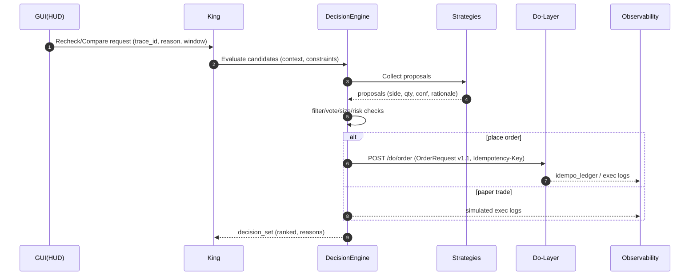

# Component: DecisionEngine
**Status:** Draft → Stable candidate  
**Last Updated:** 2025-08-24 (JST)  
**Owner:** King / Strategies 共通

---

## 0. 概要
DecisionEngine は、Plan 層で生成された特徴量・統計をもとに複数戦略（Aurus/Levia/Prometheus/Veritas）の判断を集約し、**「採用候補の意思決定」**と**「注文提案（OrderRequest）」**を作るコンポーネント。  
King（統治）および Airflow Orchestrator と連携し、PDCA の **Plan→Do** を橋渡しする。

---

## 1. 責務（Responsibilities）
- 複数戦略のスコア・根拠・信頼区間の**アグリゲーション**
- リスク制約（max_dd / max_consecutive_loss / spread 等）の**事前評価**
- **OrderRequest v1.1** の生成（幂等キーを含む）
- テスト注文（ペーパートレード）と実注文の**ルーティング方針**決定（Kingのポリシー準拠）
- 可観測性（trace_id / metrics）と監査ログの**一貫記録**

---

## 2. 入出力（I/O）
### 2.1 Input
- `features.bucket`: 市場状態の特徴量セット（Plan 層）
- `strategies/{id}/proposal`: 各戦略の提案（side, qty, confidence, rationale）
- `risk_profile`: 許容ドローダウン/連敗/最大スプレッド 等
- `context`: `trace_id`, `window`, `reason`, `ttl_hours`

### 2.2 Output
- `decision_set`: 採用候補（ランキング、信頼区間、却下理由含む）
- `order_request`: `OrderRequest v1.1`（必要時）
- `audit_log`: 判断経緯（inputs_hash, selected_rules, thresholds）

---

## 3. 連携（Interfaces）
- **GUI → King → DecisionEngine**: 再評価/比較要求 (`/pdca/recheck`)
- **DecisionEngine → Do-Layer**: `POST /do/order`（必要時、OrderRequest v1.1）
- **DecisionEngine → Observability**: `obs_infer_calls`, `obs_plan_runs` への書き込み

---

## 4. Idempotency（前提・必須）
本コンポーネントで生成する **OrderRequest は v1.1** を前提とします。  
- `Idempotency-Key`（ヘッダ）と **`body.idempotency_key` は一致必須**。  
- 同一キーの再送は **完全一致→200**、**差分あり→409**。  
- Do 層は `idempo_ledger` に `idempotency_key` と `request_digest/result_digest` を保存（TTL）。  
詳細は `docs/architecture/contracts/OrderRequest.md` および `docs/apis/Do-Layer-Contract.md` を参照。

---

## 5. 生成仕様（OrderRequest v1.1）
- `order_id`: `deceng-<trace_id>-<short-ulid>`
- `instrument`: strategy proposal の多数決 or King 指定
- `side`: 合意サイド（閾値/信頼区間/ドリフト制約を満たす場合のみ）
- `qty`: リスクプロファイル・スプレッド・流動性から決定
- `time_in_force`: 既定 `IOC`
- `tags`: `["pdca","recheck","deceng"]` など
- `idempotency_key`: **以下のハッシュを ULID/HEX で生成**
  - 例）`hmac_sha256(f"{instrument}|{side}|{qty}|{ts_floor_minute}|{trace_id}", SECRET)`
- `requested_at`: ISO8601 UTC
- `risk_constraints`: `{max_dd, max_consecutive_loss, max_spread}`

### 5.1 サンプル（JSON）
```json
{
  "order_id": "deceng-trace20250824-01H9AAA",
  "instrument": "USDJPY",
  "side": "BUY",
  "qty": 0.10,
  "price": null,
  "time_in_force": "IOC",
  "tags": ["pdca","recheck","deceng"],
  "idempotency_key": "01JABCDEFULIDXYZ1",
  "requested_at": "2025-08-24T00:00:00Z",
  "risk_constraints": {
    "max_dd": 0.1,
    "max_consecutive_loss": 3,
    "max_spread": 0.002
  }
}
```

---

## 6. アルゴリズム概要
1. **集約**: 各戦略の提案 `side, qty, conf` を収集  
2. **フィルタ**: `conf >= min_conf`、`spread <= max_spread`、禁則銘柄除外  
3. **投票**: 重み付き多数決（重み=過去勝率・最近性能・相関ペナルティ）  
4. **サイズ決定**: VAR 上限、DD 制約、連敗上限で縮小  
5. **最終判定**: `score >= adopt_threshold` なら注文生成  
6. **幂等キー生成** → `OrderRequest v1.1` を構築  
7. **Do-Layer に送信**（必要時）/ ペーパートレード時はシミュレーションに流す

---

## 7. シーケンス（Mermaid）


---

## 8. エラーとリカバリ
| 事象 | 原因 | ハンドリング |
|---|---|---|
| `409 Conflict` | 同一キーでボディ差分 | 最新の `decision_set` を優先し、キー再生成 or リトライ抑止 |
| `422 Unprocessable Entity` | バリデーション不一致 | 提案を棄却し、改善ヒントを `rationale` に追加 |
| ネットワーク失敗 | 一時障害 | 指数バックオフ（最大3回）、それでも失敗なら `failed` 記録のみ |

---

## 9. 可観測性（Observability）
- `obs_infer_calls`: `trace_id`, `model_id`, `latency_ms`, `inputs_hash`
- `obs_plan_runs`: Recheck 実行のステータス
- `idempo_ledger`: 幂等キーの `status/http_status/response_payload_json`
- メトリクス: `decision_set.count`, `ordered.count`, `conflict.count`, `rejected.count`

---

## 10. 設定（Config）
```yaml
decision_engine:
  min_conf: 0.55
  adopt_threshold: 0.60
  max_spread: 0.002
  sizing:
    base_qty: 0.10
    var_cap: 0.15
  idempotency:
    secret_env: IDEMPO_SECRET
    key_ttl_hours: 48
  mode: "paper"  # "live" にすると Do-Layer 発注
```

---

## 11. セキュリティ
- `IDEMPO_SECRET` は KMS/Secrets Manager で管理、ログ出力禁止
- `order_request` ログは **PII/秘密情報を含めない要約**のみ保存
- 署名/HMAC の実装は共通ライブラリを利用（重複実装禁止）

---

## 12. 変更履歴
- **2025-08-24**: 初版作成。OrderRequest v1.1（`idempotency_key`）準拠、幂等ルール明記。
