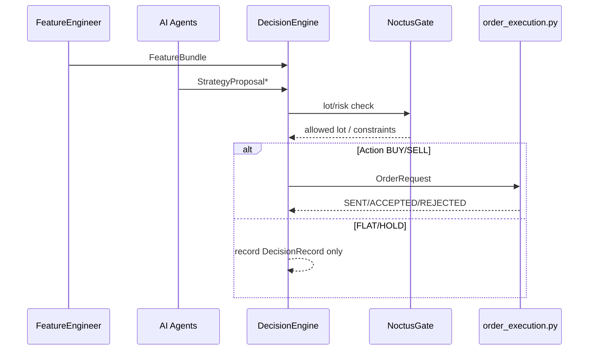

# DecisionEngine — Component Design (v0)

## 0. Summary / Context
FeatureBundle と各 AI の StrategyProposal を受け、最終判断（DecisionRecord）と OrderRequest を生成。

**Upstream**: FeatureEngineer → AI群（Aurus/Levia/Prometheus/Veritas/Hermes）  
**Downstream**: Risk/NoctusGate → order_execution.py（Do層） → Observability

## 1. Public Interface
**Inputs**
- FeatureBundle v1.0（→ `docs/architecture/contracts/FeatureBundle.md`）
- StrategyProposal v1.0（複数、→ `docs/architecture/contracts/StrategyProposal.md`）

**Outputs**
- DecisionRecord v1.0（→ `docs/architecture/contracts/DecisionRecord.md`）
- OrderRequest v1.0（必要時、→ `docs/architecture/contracts/OrderRequest.md`）

## 2. Behavior（要点）
- proposals を収集 → 信頼度・プロファイル・品質ゲートでスコアリング
- 最終 `final_action` と `lot` を決定（NoctusGate 済み）
- 取引が必要なら `OrderRequest` 作成

## 3. Observability
- `obs_decisions`: 決定イベント（`action`, `payload.lot`, `reasons[]`）
- `trace_id` 貫通。主要レイテンシは `obs_trace_latency` に現れる

## 4. Failure & Recovery
- AI未着/遅延: タイムアウトで FLAT/スキップ
- 再実行: `decision_id` で冪等（同一trace再発行を防止）

## 5. Security & Access
- 認可: Do層への送信は署名付きクライアントのみ
- 監査: DecisionRecord を所定期間保持

## 6. Diagram

> NOTE: この文書で言う **OrderRequest** は **v1.1（idempotency_key 追加）** を前提とします。詳細は `docs/architecture/contracts/OrderRequest.md` を参照。

