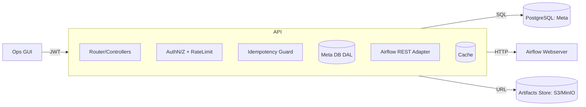
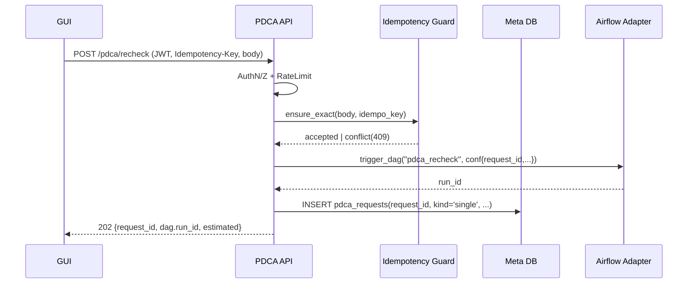

# Component: PDCA API Service — GUI/PDCAゲートウェイ
**Status:** Draft → Stable candidate  
**Last Updated:** 2025-08-24 (JST)  
**Owner:** Platform / PDCA

関連文書:
- `docs/apis/PDCA-Recheck-API-Spec.md`
- `docs/apis/PDCA-GUI-API-Spec.md`
- `docs/airflow/DAG-PDCA-Recheck.md`
- `docs/architecture/schema/PDCA-MetaSchema.md`
- `docs/integration/Airflow-RestAdapter-Design.md`
- `docs/security/AuthN-AuthZ-DoLayer.md`
- `docs/platform/RateLimit-Quota-DoLayer.md`
- `docs/observability/DoLayer-Metrics.md`

---

## 0. 目的
GUI からの **読み取り/再チェック**要求を一手に受け、**Airflow** 連携と **Meta DB** 読み書きを安全に仲介する API サービスの設計を定義する。  
- 非同期実行（Airflow DAG）を **202 Accepted + request_id** で返す。  
- メタデータ（戦略/結果/成果物）を GUI 用に最適化して提供。  
- AuthN/AuthZ、RateLimit、Idempotency を統一実装。

---

## 1. スコープと責務
### 1.1 提供機能
- **GUI 読み取り系**: 一覧/詳細/結果履歴/成果物URL（`PDCA-GUI-API-Spec`）  
- **再チェック系**: 単体/一括の受理と進捗参照（`PDCA-Recheck-API-Spec`）  
- **Airflow 連携**: REST Adapter 経由で DAG トリガ/ステータス取得

### 1.2 非スコープ
- 学習・特徴量計算の実処理（DAG 側）  
- 戦略ロジックの定義/更新（別コンポーネント）

---

## 2. アーキテクチャ


- **Router/Controllers**: エンドポイント定義（FastAPI想定）  
- **AuthN/Z + RateLimit**: JWT 検証と scope/レート制御  
- **Idempotency Guard**: `Idempotency-Key` と `pdca_requests` による重複防止  
- **DAL**: `strategies / pdca_results / artifacts` への型安全アクセス  
- **Airflow REST Adapter**: `trigger_dag / get_dag_run / list_dag_runs`  
- **Cache**: 一覧/詳細の短期キャッシュ（LRU/Redis）  

---

## 3. リクエスト・フロー（再チェック）


- 再送（同一キー完全一致）は **同じ `request_id`** を返す（仕様通り）  
- 差分時は **409**（`IDEMPOTENCY_CONFLICT`）

---

## 4. エンドポイント実装メモ（抜粋）
### 4.1 `/pdca/recheck` & `/pdca/recheck_all`
- **入力検証**: `strategies[]` / `window` ルール（Specに準拠）  
- **Idempotency**: `pdca_requests(request_id, client_id, params_json)` にハッシュ保存  
- **Airflow**: `conf` に `request_id, client_id, trace_id, params` を含める  
- **応答**: `202 accepted` + 推定件数（dry_run は Airflow未呼び出し）

### 4.2 `/gui/strategies`（一覧）
- SQL 参考: `vw_strategy_latest_health` + `strategy_tags`  
- **検索**: `ILIKE` + サニタイズ（ワイルドカード注入防止）  
- **キャッシュ**: 30〜60秒（ページ/フィルタキーで分離）

### 4.3 `/gui/strategies/:id`（詳細）
- サマリ: `mv_pdca_recent_summary`（存在すれば優先）  
- 履歴: `pdca_results` の `LIMIT` を守る  
- 成果物: `artifacts` 直近 N 件

### 4.4 `/gui/artifacts/:artifact_id/url`
- 署名付き URL を発行（期限 300s 既定）  
- `kind` と `content_type` を応答に含める（GUIのプレビュー判断）

---

## 5. データアクセス（DAL）
- **方針**: 生 SQL をラップした **小さな関数群**（型定義）  
  - `get_strategies(filter, paging) -> List[StrategyRow]`  
  - `get_strategy_detail(id) -> StrategyDetail`  
  - `list_results(id, from, to, limit) -> List[ResultRow]`  
  - `insert_pdca_request(req) -> None`  
  - `list_artifacts(req_id|strat_id, limit)`  
- **トランザクション**: `pdca_requests` 挿入は DAG 起動後に**確実化**  
- **インデックス**: スキーマ定義に準拠（不足時は計画を提示）

---

## 6. Idempotency Guard
- **Key**: ヘッダ `Idempotency-Key`（ULID/UUID）  
- **Body Digest**: 正規化 JSON → SHA-256  
- **格納**: `pdca_requests (request_id, client_id, kind, reason, params_json, submitted_at)`  
- **再送**:  
  - 同一 digest → 既存 `request_id` を再提示（202）  
  - 異なる digest → **409** `IDEMPOTENCY_CONFLICT`  

> digest は GUI 入力の**順序差**を吸収する正規化で計算すること。

---

## 7. レート制御 & クォータ
- コントローラ前段で **トークンバケット**（`RateLimit-Quota-DoLayer.md` 準拠）  
- **一括系**は厳しめ（例: 10 rpm）  
- 429 応答に `Retry-After` と残量ヘッダ

---

## 8. セキュリティ
- **AuthN/Z**: JWT（`aud=pdca.gui|pdca`、scope 準拠）  
- **入力サニタイズ**: `q`（検索語）、ID/タグは正規表現でバリデート  
- **ログマスク**: トークン/機微情報は保存しない  
- **CORS**: GUI ドメインのみに限定（Origin/Headers/Methods）

---

## 9. コンフィグ（抜粋）
| Key | 既定 | 説明 |
|---|---|---|
| `PDCA_PORT` | `8001` | リッスンポート |
| `PDCA_LOG_LEVEL` | `info` | ログレベル |
| `PDCA_CACHE_TTL_SEC` | `60` | 一覧の短期キャッシュ |
| `AF_BASE_URL` | `http://airflow-webserver:8080` | Airflow |
| `AF_TOKEN` | なし | TokenAuth |
| `DB_*` | - | Meta DB 接続（`Config-Reference-DoLayer.md`参照） |

---

## 10. 可観測性
- **Metrics**
  - `pdca.api.requests_total{endpoint,outcome}`  
  - `pdca.api.latency_ms{endpoint}` (histogram)  
  - `pdca.api.rate_limited_total`  
  - `pdca.api.idempotency_conflicts_total`
- **Logs（JSON）**
  - `trace_id, client_id, endpoint, http_status, latency_ms, rows, request_id?`
- **Tracing**
  - 入口 span: `pdca.api.<endpoint>` → 子 span: `airflow.trigger/get`, `db.query`

---

## 11. ロールアウト計画
1. **dev**: Airflow 接続の疎通 / ダミー 10戦略で dry-run  
2. **stg**: リミット値を本番想定に上げ、GUI 接続 E2E  
3. **prod**: 一覧系を先行、再チェック系を段階開放（特定 client_id のみ）  
4. 監視しきい値の調整（429 率、Airflow 5xx）

---

## 12. エラー/HTTP マッピング（要約）
`Errors-ReasonCodes.md` に準拠。  
- 400: `BAD_REQUEST`  
- 401/403: `UNAUTHORIZED/ FORBIDDEN`  
- 409: `IDEMPOTENCY_CONFLICT`  
- 429: `RATE_LIMITED`  
- 502/503: `AIRFLOW_DOWN/TIMEOUT`  
- 500: `INTERNAL_ERROR`

---

## 13. 疑似コード（FastAPI 骨子）
```python
from fastapi import FastAPI, Header, HTTPException, Depends
app = FastAPI()

@app.post("/pdca/recheck", status_code=202)
def post_recheck(payload: RecheckBody,
                 idem_key: str = Header(..., alias="Idempotency-Key"),
                 jwt: JwtClaims = Depends(require_scope("pdca:recheck"))):
    # 1) validate + rate limit
    # 2) idempotency guard → request_id
    # 3) if payload.dry_run: estimate and return
    # 4) airflow.trigger_dag("pdca_recheck", conf={...}, request_id=request_id)
    # 5) insert pdca_requests(request_id, ...)
    # 6) return {"status":"accepted","request_id": request_id, "dag": {...}}
    ...

@app.get("/gui/strategies")
def list_strategies(q: str | None = None, ...,
                    jwt: JwtClaims = Depends(require_scope("pdca:read"))):
    # cache → DAL.query → shape for GUI
    ...
```

---

## 14. リスクと対策
- **Airflow ダウン**: 502/503 応答 + レート/再試行は Adapter に委譲  
- **大規模バルク**: `batch_size` を強制上限、サーバ側で自動分割  
- **DB 負荷**: マテビュー/インデックス追加、キャッシュ TTL を調整

---

## 15. 変更履歴
- **2025-08-24**: 初版。責務、データフロー、Idempotency/Rate、DAL、監視、骨子コードを定義。
