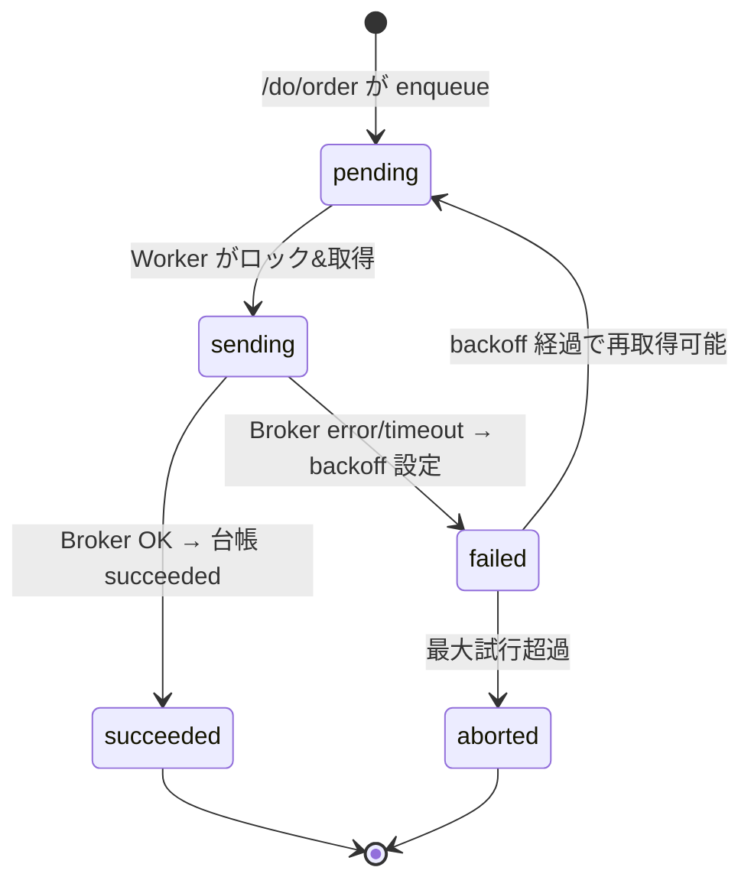

# Outbox Worker Protocol — 送信確実化プロセス詳細
**Status:** Draft → Stable candidate  
**Last Updated:** 2025-08-24 (JST)  
**Owner:** Do-Layer / Execution Team

関連文書:
- `docs/architecture/patterns/Outbox.md`（全体設計）
- `docs/apis/Do-Layer-OrderAPI-Spec.md`（/do/order 仕様）
- `docs/architecture/contracts/OrderRequest.md`（リクエスト契約）
- `docs/architecture/contracts/ExecResult.md`（結果契約）
- `docs/observability/Idempotency-Ledger.md`（監査/台帳）

---

## 0. 目的と非機能
**目的:** `/do/order` で受け付けた発注を **DB 経由の Outbox** から安全に送信し、**結果を台帳（idempo_ledger）に確定**させる。  
**設計原則:**
- **At-least-once 送信**（外部ブローカーに対して）× **アプリ内では exactly-once 相当**（幂等キーで吸収）
- **クラッシュ安全**（ロックのリー ス TTL / 再取得）
- **バックオフ再送**（指数 or テーブル駆動）
- **観測可能性**（メトリクス / ログ / トレース）

---

## 1. データモデル（前提と追加提案）
既存テーブル（抜粋）: `outbox_orders`  
- `id` BIGSERIAL PK  
- `idempotency_key` TEXT UNIQUE  
- `order_request_json` JSONB  
- `request_digest` TEXT  
- `status ∈ {pending, sending, succeeded, failed, aborted}`  
- `attempts` INT, `last_error_code`, `last_error_msg`  
- `locked_by` TEXT, `locked_at` TIMESTAMPTZ  
- `created_at`, `updated_at`, `expires_at` TIMESTAMPTZ

**提案（最適化）:** スキャン削減のため `next_run_at TIMESTAMPTZ` を導入（任意）。  
- 失敗時にバックオフ後の再実行時刻を格納。  
- インデックス: `(status, next_run_at)`。

> ※ 導入は任意。現状は `attempts` と `locked_at` の計算でも実装可。

---

## 2. ステートマシン


**不変条件 (Invariants):**
- `idempotency_key` は Outbox で **一意**  
- `status='sending'` の行は **lease TTL** を超えると「失効」して再取得可  
- 成功/失敗確定時、**idempo_ledger を先に更新** → Outbox 更新、の順で整合性を保つ（ダブルライトの順序固定）

---

## 3. ロック/取得プロトコル
**狙い:** 「同一ジョブの二重送信」を避け、クラッシュ後は再取得できるようにする。

### 3.1 クエリ（`SELECT ... FOR UPDATE SKIP LOCKED` with CTE）
`next_run_at` を導入した場合の例（未導入なら `next_run_at <= now()` 条件を外す）:

```sql
WITH cte AS (
  SELECT id
    FROM outbox_orders
   WHERE status = 'pending'
     AND (next_run_at IS NULL OR next_run_at <= now())
   ORDER BY created_at
   FOR UPDATE SKIP LOCKED
   LIMIT $1
)
UPDATE outbox_orders o
   SET status = 'sending',
       locked_by = $2,
       locked_at = now(),
       updated_at = now()
  FROM cte
 WHERE o.id = cte.id
RETURNING o.*;
```

- `$1`: バッチ件数（例: 32）
- `$2`: ワーカー名（`hostname:pid` など）

### 3.2 リース（Lease）とハートビート
- `OUTBOX_LOCK_LEASE_SEC`（例: 120s）を超えた `sending` は**失効**扱い。
- ワーカーは `sending` 処理中、**60s 間隔で心拍**:
  ```sql
  UPDATE outbox_orders
     SET locked_at = now(), updated_at = now()
   WHERE id = $id AND status = 'sending' AND locked_by = $worker;
  ```
- 心拍が止まった（ワークプロセス落ち）場合、他のワーカーが **リー ス失効後に再取得**。

---

## 4. 処理フロー（擬似コード）
```python
ASYNC_CONCURRENCY = env.int("OUTBOX_CONCURRENCY", 4)
BATCH = env.int("OUTBOX_BATCH", 32)
LEASE_SEC = env.int("OUTBOX_LOCK_LEASE_SEC", 120)
MAX_ATTEMPTS = env.int("OUTBOX_MAX_ATTEMPTS", 6)
BACKOFF = env.list_int("OUTBOX_BACKOFF_SEC", [5,10,20,40,80,160])

async def poll_loop():
    while True:
        rows = claim_batch(BATCH)  # 3.1 の CTE UPDATE ... RETURNING
        if not rows:
            await sleep(env.float("OUTBOX_POLL_INTERVAL_SEC", 0.5))
            continue
        await gather(*(process(row) for row in rows))  # ≤ ASYNC_CONCURRENCY

async def process(row):
    try:
        # 1. ブローカー送信
        result = await adapter.send(row.order_request_json)  # ExecResult 正準 or error

        if result["status"] == "ok":
            await upsert_idempo_succeeded(row.idempotency_key, row.request_digest, result)
            await mark_succeeded(row.id)
        else:
            raise AdapterError(result.get("reason_code", "INTERNAL_ERROR"))

    except Exception as e:
        reason = reason_code_from(e)
        attempts = await mark_failed(row.id, reason, str(e))  # attempts++
        if attempts >= MAX_ATTEMPTS:
            await upsert_idempo_failed(row.idempotency_key, row.request_digest, reason)
            await mark_aborted(row.id, reason)
        else:
            delay = BACKOFF[min(attempts-1, len(BACKOFF)-1)]
            await requeue_with_backoff(row.id, delay)
```

### 4.1 台帳更新の順序（重要）
- 成功時:  
  1) `idempo_ledger` → `status='succeeded'`, `http_status=200`, `response_payload_json` 保存  
  2) `outbox_orders` → `status='succeeded'`  
- 失敗時（最大試行超過）:  
  1) `idempo_ledger` → `status='failed'`, `http_status` はマップ済みコード  
  2) `outbox_orders` → `status='aborted'`

> 同一 `idempotency_key` に対する **重複確定**を避けるため、台帳を単一の「真実の所在（SoT）」とする。

---

## 5. バックオフと再取得
### 5.1 `next_run_at` あり（推奨）
```sql
UPDATE outbox_orders
   SET status='failed',
       attempts = attempts + 1,
       last_error_code = $1,
       last_error_msg  = left($2, 512),
       next_run_at = now() + make_interval(secs => $delay),
       updated_at = now(),
       locked_by = NULL,
       locked_at = NULL
 WHERE id = $id AND status='sending';
```

### 5.2 `next_run_at` なし（現行）
- 「今すぐ `failed` に戻し」、**ポーリング側**で `attempts` と `locked_at` に応じて間引き（実装が複雑）。  
- 可能なら `next_run_at` 導入を推奨。

---

## 6. 競合・幂等衝突
通常、`/do/order` 側で **同一キー差分は 409** で弾くため Outbox へは入りません。  
もし何らかのレースで Outbox 行があり、台帳に既に `request_digest` が異なる「別内容」が確定している場合:
- **規則:** Outbox ワーカーは該当行を **`aborted` + `last_error_code='IDEMPOTENCY_CONFLICT'`** にする。  
- 台帳は既に SoT のため **更新しない**。

---

## 7. 障害シナリオと回復
| 事象 | 症状 | 自動回復 | 手動オペ |
|---|---|---|---|
| ワーカークラッシュ | `sending` が残る | lease 失効で他ワーカー再取得 | 失効時間を短縮（設定変更） |
| ブローカー断 | timeout/down 増加 | backoff 再送 | 一時的に `OUTBOX_CONCURRENCY` を下げる |
| JSON壊れ | 送信前に例外 | 即 `aborted` | 元要求の修正/再投入 |
| 最大試行超過 | `aborted` 滞留 | 自動なし | 手動で再キュー（`pending` + attempts=0） |
| 台帳更新失敗 | 送信後に DB エラー | 再試行で回復 | DB を復旧後、再送 or 手動確定 |

**手動コマンド例:**
```sql
-- ステータス別件数
SELECT status, count(*) FROM outbox_orders GROUP BY 1;

-- 失効ロックの再開放（保守用）
UPDATE outbox_orders
   SET status='pending', locked_by=NULL, locked_at=NULL
 WHERE status='sending' AND locked_at < now() - interval '120 seconds';

-- aborted を再キュー
UPDATE outbox_orders
   SET status='pending', attempts=0, last_error_code=NULL, last_error_msg=NULL,
       next_run_at=NULL, updated_at=now()
 WHERE id = $id;
```

---

## 8. 可観測性（Worker視点）
- Metrics:
  - `outbox.claimed_total` / `outbox.processed_total{outcome}`  
  - `outbox.retry_total{attempt}`  
  - `outbox.lock_lease_expired_total`  
  - `outbox.latency_ms{phase=claim|send|commit}`
- Logs（構造化）:
  - `idempotency_key(hash), outbox_id, status, attempts, reason_code, adapter, latency_ms`
- Tracing:
  - ルート: `outbox.process`  
  - 子: `broker.send`（adapter 名、RTT）

---

## 9. 設定（参考：`Config-Reference-DoLayer.md` と整合）
| Key | 既定 | 説明 |
|---|---|---|
| `OUTBOX_ENABLED` | `false` | フラグ |
| `OUTBOX_CONCURRENCY` | `4` | 同時処理数 |
| `OUTBOX_BATCH` | `32` | 一括取得件数 |
| `OUTBOX_POLL_INTERVAL_SEC` | `0.5` | 空時の待機 |
| `OUTBOX_LOCK_LEASE_SEC` | `120` | リースTTL |
| `OUTBOX_MAX_ATTEMPTS` | `6` | 最大試行 |
| `OUTBOX_BACKOFF_SEC` | `[5,10,20,40,80,160]` | 指数バックオフ |
| `BROKER_TIMEOUT_MS` | `2500` | 送信タイムアウト |

---

## 10. セキュリティ
- Adapter 資格情報は **Secrets Manager** から注入。  
- ログに機微データを残さない（`order_request_json` のマスク方針を適用）。

---

## 11. テスト計画（E2E 抜粋）
- **W-101:** `pending → sending → succeeded` の基本遷移  
- **W-102:** timeout で `failed → pending`、2回目で成功  
- **W-103:** ワーカークラッシュ（心拍停止）→ lease 失効後に別ワーカーが取得し成功  
- **W-104:** 最大試行超過で `aborted`、手動再キューで成功  
- **W-105:** 台帳が既に `succeeded` のキーに対して Outbox が残存 → Outbox を `succeeded` に同期（遅延確定）

---

## 12. 付録A: 追加DDL（任意 `next_run_at`）
```sql
-- migrations/2025xxxx_add_outbox_next_run_at.sql
BEGIN;
ALTER TABLE outbox_orders
  ADD COLUMN IF NOT EXISTS next_run_at TIMESTAMPTZ;
CREATE INDEX IF NOT EXISTS idx_outbox_status_next_run
  ON outbox_orders (status, next_run_at);
COMMIT;
```

---

## 13. 変更履歴
- **2025-08-24:** 初版。ロック/リース/バックオフ/台帳確定順・手動オペを定義。
