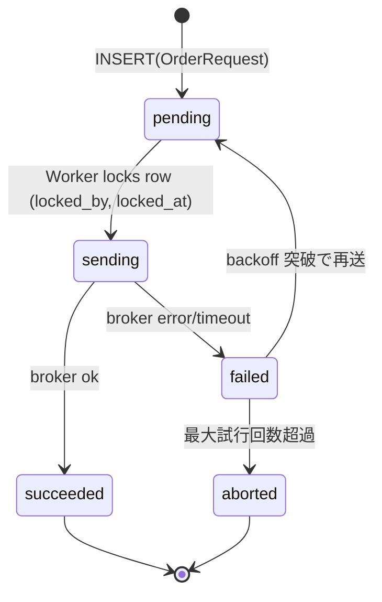

# Pattern: Outbox for Reliable Broker Send
**Status:** Draft  
**Last Updated:** 2025-08-24 (JST)  
**Owner:** Do-Layer / Execution Team

---

## 0. 目的
発注送信を**確実化**するため、アプリ処理とブローカー送信を分離し、DB を介した **Outbox（送信待ち箱）**で再送耐性を持たせる。  
幂等性（`idempotency_key`）と併用することで、「**同一要求の多重送信を防ぎつつ、失敗時は安全に再送**」を実現。

- 参照: `docs/apis/Do-Layer-OrderAPI-Spec.md`  
- 参照: `docs/architecture/contracts/OrderRequest.md`  
- 参照: `docs/observability/Idempotency-Ledger.md`

---

## 1. テーブル設計（DDL案）
```sql
CREATE TABLE IF NOT EXISTS outbox_orders (
  id                BIGSERIAL PRIMARY KEY,
  created_at        TIMESTAMPTZ NOT NULL DEFAULT now(),
  updated_at        TIMESTAMPTZ NOT NULL DEFAULT now(),

  -- 冪等識別
  idempotency_key   TEXT NOT NULL UNIQUE,

  -- 送信対象
  order_request_json JSONB NOT NULL,  -- OrderRequest v1.1 (正規化済み推奨)
  request_digest     TEXT NOT NULL,   -- 送信同一性の検証用（SHA-256）

  -- ステータス
  status            TEXT NOT NULL CHECK (status IN ('pending','sending','succeeded','failed','aborted')),
  attempts          INT NOT NULL DEFAULT 0,
  last_error_code   TEXT,
  last_error_msg    TEXT,

  -- ワーカー取得管理
  locked_by         TEXT,             -- ワーカ名/ホスト名
  locked_at         TIMESTAMPTZ,

  -- TTL/可観測
  expires_at        TIMESTAMPTZ,      -- 任意
  CONSTRAINT uq_outbox_idempo UNIQUE (idempotency_key)
);

CREATE INDEX IF NOT EXISTS idx_outbox_status ON outbox_orders (status);
CREATE INDEX IF NOT EXISTS idx_outbox_locked_at ON outbox_orders (locked_at);
```

---

## 2. フロー概要（ステート）


### 2.1 典型シーケンス
1. `/do/order` 初回受理 → `idempo_ledger(accepted)` 記録  
2. 同時に `outbox_orders(pending)` を INSERT（`idempotency_key` 与件）  
3. ワーカーが `pending` をロックして `sending` へ更新  
4. Adapter 送信  
   - 成功 → `succeeded`、`idempo_ledger(succeeded)` 更新  
   - 失敗 → `failed`（`last_error_code`/`msg` 記録）  
5. バックオフ後、`failed`→`pending` へ戻し再送（最大試行回数まで）

---

## 3. ワーカー設計（擬似）
```python
ASYNC_CONCURRENCY = 4
MAX_ATTEMPTS = 6
BACKOFF = [5, 10, 20, 40, 80, 160]  # 秒

async def poll_loop():
  while True:
    rows = lock_batch(limit=ASYNC_CONCURRENCY)  # status=pending, locked_by is null → UPDATE ... RETURNING
    for row in rows:
      await process(row)
    await asyncio.sleep(1)

async def process(row):
  try:
    set_status(row.id, "sending")
    result = await adapter.send(row.order_request_json)
    if result["status"] == "ok":
      set_success(row.id)
      upsert_idempo_succeeded(row.idempotency_key, row.request_digest, result)
    else:
      raise AdapterError(result.get("reason_code","INTERNAL_ERROR"))
  except Exception as e:
    attempts = inc_attempts(row.id, last_error=str(e))
    if attempts >= MAX_ATTEMPTS:
      set_aborted(row.id, last_error=str(e))
      upsert_idempo_failed(row.idempotency_key, row.request_digest, reason=reason_code_from(e))
    else:
      # backoff 管理: failed に落として次回以降に再取得
      set_failed(row.id, last_error=str(e))
```

> 重要: **送信結果の確定は idempo_ledger にも反映**（`succeeded/failed`）。

---

## 4. 競合・同時実行の扱い
- **行ロック**: `UPDATE ... WHERE status='pending' AND locked_by IS NULL ORDER BY created_at LIMIT N FOR UPDATE SKIP LOCKED`（Postgres）  
- **重複防止**: `idempotency_key UNIQUE` により「同一要求の多重登録」を禁止  
- **/do/order 再送**:  
  - 元の `idempotency_key` と `request_digest` が一致なら **200** で過去結果  
  - 不一致なら **409**（幂等衝突）

---

## 5. 再送ポリシー（バックオフ）
- `attempts` に応じた指数バックオフ（例: `BACKOFF[attempts-1]`秒後に再取得対象へ）  
- 送信窓口（ブローカー側）に配慮して **同時送信の上限**（`ASYNC_CONCURRENCY`）を設定

---

## 6. 可観測性
- Metrics:
  - `outbox.enqueued_total`
  - `outbox.sent_total`, `outbox.failed_total`, `outbox.aborted_total`
  - `outbox.age_seconds`（pending の滞留時間、95パーセンタイル監視）
- Logs:
  - `idempotency_key, status, attempts, last_error_code, adapter`
- DAG（任意）:
  - 滞留が閾値超過でアラート、クリーニング（`expires_at`）ジョブ

---

## 7. Do 層との役割分担
- **Do 層 API (`/do/order`)**:
  - 初回 → `idempo_ledger(accepted)` と **Outbox に enqueue**  
  - 同一キー再送（完全一致）→ **200**（過去結果）  
  - 差分 → **409**  
- **Outbox ワーカー**:
  - 送信責務・結果の確定  
  - `idempo_ledger` を `succeeded/failed` に更新

---

## 8. 付録：DDL 変更例（マイグレーション案）
```sql
-- migrations/2025xxxx_add_outbox_orders.sql
BEGIN;
CREATE TABLE IF NOT EXISTS outbox_orders (
  id BIGSERIAL PRIMARY KEY,
  created_at TIMESTAMPTZ NOT NULL DEFAULT now(),
  updated_at TIMESTAMPTZ NOT NULL DEFAULT now(),
  idempotency_key TEXT NOT NULL UNIQUE,
  order_request_json JSONB NOT NULL,
  request_digest TEXT NOT NULL,
  status TEXT NOT NULL CHECK (status IN ('pending','sending','succeeded','failed','aborted')),
  attempts INT NOT NULL DEFAULT 0,
  last_error_code TEXT,
  last_error_msg TEXT,
  locked_by TEXT,
  locked_at TIMESTAMPTZ,
  expires_at TIMESTAMPTZ
);
CREATE INDEX IF NOT EXISTS idx_outbox_status ON outbox_orders (status);
CREATE INDEX IF NOT EXISTS idx_outbox_locked_at ON outbox_orders (locked_at);
COMMIT;
```

---

## 9. 変更履歴
- **2025-08-24**: 初版。DDL案・ワーカー擬似コード・再送/競合ポリシーを定義。
