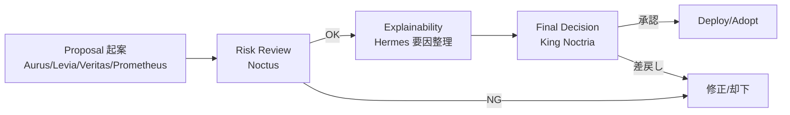

## 1. Vision（我々の到達点）
- **自律的なPDCA最適化国家**：市場の構造変化に応じて、戦略の生成・実行・評価・改善を自動で回す。
- **王（King Noctria）による最終統治**：異なる専門性を持つ AI 臣下の提案を束ね、全体最適を志向。
- **安全性 > 収益性**：制度的・技術的な**第一原理は破らない**（リスク許容境界、コンプライアンス、監査可能性）。
- **説明可能な意思決定**：Hermes による自然言語説明を標準化、すべての重要判断は**根拠を言語化**。

## 2. 基本原則（Principles）
1. **Single Point of Finality**：最終意思決定は常に *King Noctria*。  
2. **Specialization & Checks**：Aurus/Levia/Noctus/Prometheus/Veritas の**分業**と**相互けん制**。  
3. **Measured Risk**：Noctus のリスク境界を**越えてはならない**（Non-Negotiable）。  
4. **Auditability by Design**：すべての実行と意思決定に**再現性**と**ログ**を付与。  
5. **ADR First**：重要な技術選択は必ず ADR（../adrs/）に記録。  
6. **Docs as Code**：設計・手順・API・スキーマはすべて `docs/` にあり、PR で更新。  
7. **Small, Reversible Steps**：変更は小さく、**ロールバック可能**に。  

## 3. 統治モデル（Governance Model）

### 3.1 役割
- **King Noctria（最終統治者）**：最終意思決定、ガードレール設定、重大インシデント裁定。  
- **Council of Ministers（五臣）**  
  - **Aurus**（総合分析） / **Levia**（スキャルピング） / **Noctus**（リスク管理） / **Prometheus**（予測） / **Veritas**（戦略生成/学習）  
- **Hermes（顧問）**：非投票の**説明責任補助**（自然言語説明・要因分析）。

### 3.2 権限境界（Delegations）
| 領域 | 一次提案 | レビュー | 最終承認 |
|---|---|---|---|
| 新規戦略の採用 | Veritas/Aurus | Noctus/Prometheus/Hermes | King |
| リスクパラメータ変更 | Noctus | King/Hermes | King |
| モデル再学習実行 | Veritas/Prometheus | Runbooks/Operations | King（閾値超過時のみ） |
| 本番デプロイ | Operations | Noctus/Hermes | King |

> 定量境界（例：**1日あたりの最大リスク予算、最大DD、連敗許容**）の具体値は `operations/Config-Registry.md` に一元管理。

### 3.3 意思決定フロー（Decision Flow）


### 3.4 RACI（要約）
| タスク | R（実行） | A（最終責任） | C（相談） | I（通知） |
|---|---|---|---|---|
| 戦略生成 | Veritas | King | Aurus/Prometheus/Noctus/Hermes | Ops |
| リスク境界設定 | Noctus | King | Hermes | 全員 |
| 本番リリース | Ops | King | Noctus/Hermes | 全員 |
| 学習DAG運用 | Ops | King | Veritas/Prometheus | 全員 |

## 4. PDCA と統治（Operating Model）
- **Plan**：データ→特徴量→要因分析→**提案**（Aurus/Levia/Veritas/Prometheus）  
- **Do**：発注・最適化・監査（Operations＋Do層）  
- **Check**：評価・監視・集計（Noctus 主導、Hermes 説明）  
- **Act**：再評価・採用・学習・**フィードバック**（King 最終承認）  
参照 → `architecture/Architecture-Overview.md` / `architecture/Plan-Layer.md`

## 5. ガードレール（Non-Negotiables）
1. **リスク越境禁止**：Noctus の境界（`max_drawdown_pct`、`stop_loss_pct` 他）を越える実行は不可  
2. **発注監査ログ必須**：Do層は**監査 JSON** を**全件**残す（再現可能性）  
3. **重要変更は ADR**：アルゴ/アーキ/データ管理の重要変更は ADR を作成し合意  
4. **運用は Runbooks 準拠**：障害対応・再起動・ロールバックは Runbooks に統一  
5. **セキュリティ基本則**：秘密情報は Vault/環境変数で管理。最小権限・監査有効化  

## 6. 証跡と説明責任（Audit & Explainability）
- **Explainable by Hermes**：重要判断には Hermes による**要因説明**を添付  
- **可観測性**：ログ/メトリクス/トレースは `observability/Observability.md` に従い収集  
- **評価の再現性**：Check 層 KPI はスキーマ化（`kpi_summary.json`）  
- **リリースノート**：外部へ説明可能な形で `roadmap/Release-Notes.md` を更新  

## 7. 変更管理（Change Management）
1. **提案**：Issue/PR に**目的・影響・ロールバック**を明記（テンプレ参照）  
2. **レビュー**：RACI に従い C（相談）メンバーが**技術/リスク/説明**の観点でレビュー  
3. **ADR 作成**：重要判断は ADR に Decision/Context/Consequences を記録（`adrs/`）  
4. **承認・適用**：King が承認 → Ops が適用 → 監視強化期間で**早期検知**  
5. **ドキュメント更新**：関連文書（Architecture/API/Runbooks/Config）を**同一PRで更新**  

## 8. リスク統治（Risk Governance）
- **リスク登録簿**：想定リスク・緩和策・オーナー・SLA を `risks/Risk-Register.md` に記載  
- **インシデント統治**：重大障害は `incidents/Incident-Postmortems.md` に**根本原因と再発防止**  
- **品質統治**：`qa/Testing-And-QA.md` に沿ってテスト・自動化を実施  
- **アクセス統治**：`security/Security-And-Access.md` に沿って権限・監査設定  

## 9. メトリクス & OKR（Success Measures）
- **アウトカム**：安定利益、最大 DD の抑制、ダウンタイム短縮  
- **プロセス**：PDCA 周回速度、リリース MTTR、失敗検知 TTD  
- **品質**：テスト成功率、回帰不具合率、説明カバレッジ  
→ 目標と測定方法は `roadmap/Roadmap-OKRs.md` に明記

## 10. コミュニケーション（Cadence）
- **Daily（運用）**：短時間スタンドアップ（昨日/今日/ブロッカー）  
- **Weekly（統治）**：Council レビュー（提案・リスク・学習状況）  
- **Monthly（戦略）**：King 主催の振り返り（OKR 進捗/方針修正）  
- **As Needed（インシデント）**：即時ワーキング＋ 24h 内ポストモーテム草案  

## 11. 付録A：提案テンプレ（Proposal Template）
```md
# 提案タイトル
- 起案者/日付/関連Issue: #
- 目的（なぜ）:
- 変更内容（何を）:
- 影響範囲（どこに）:
- リスク/代替案:
- ロールバック手順:
- 実装/運用計画（Runbooks 更新要否）:
- 設計根拠（ADR 要否/リンク）:
- Hermes 説明（要因/前提）:
```

## 12. 付録B：意思決定テンプレ（Decision Log）
```md
# 意思決定タイトル
- 決定者: King Noctria
- 参画: Aurus / Levia / Noctus / Prometheus / Veritas / Hermes / Ops
- 決定内容:
- 根拠（データ/検証リンク）:
- リスク評価（Noctus）:
- Hermes 説明:
- 実施日/リリース窓:
- 監視/成功判定/ロールバック条件:
- ADR: ../adrs/ADR-YYYYMMDD-xxxx.md
```

## 13. 参照（Cross-References）
- Architecture: `architecture/Architecture-Overview.md`, `architecture/Plan-Layer.md`  
- Operations: `operations/Runbooks.md`, `operations/Airflow-DAGs.md`, `operations/Config-Registry.md`  
- APIs: `apis/API.md`, `apis/Do-Layer-Contract.md`  
- Models: `models/ModelCard-Prometheus-PPO.md`, `models/Strategy-Lifecycle.md`  
- Safety: `security/Security-And-Access.md`, `observability/Observability.md`, `qa/Testing-And-QA.md`  
- Planning: `roadmap/Roadmap-OKRs.md`, `roadmap/Release-Notes.md`  
- Risk: `risks/Risk-Register.md`, `incidents/Incident-Postmortems.md`, `adrs/`

## 14. 定義（Glossary 抜粋）
- **Non-Negotiable**：絶対に破れないガードレール  
- **ADR**：Architecture Decision Record（設計判断の記録）  
- **MTTR / TTD**：平均復旧時間 / 失敗検知までの時間  

## 15. 変更履歴（Changelog）
- **2025-08-12**: 初版作成（Vision・原則・統治モデル・RACI・PDCA・ガードレール・運用連携）

