# 👑 Vision & Governance — Noctria Kingdom

**Document Version:** 1.1  
**Status:** Adopted  
**Last Updated:** 2025-08-14 (JST)

> 目的：Noctria の**統治モデル**（Vision / 原則 / 役割と権限 / ガードレール / 変更管理）を明文化し、 
> 戦略や担当が変わっても**安全性・一貫性・再現性**を維持する。

---

## 1. Vision（我々の到達点）
- **自律的な PDCA 最適化国家**：市場の構造変化に応じて、戦略の生成・実行・評価・改善を自動で回す。  
- **王（King Noctria）による最終統治**：異なる専門性を持つ AI 臣下の提案を束ね、全体最適を志向。  
- **安全性 > 収益性**：制度的・技術的な**第一原理は破らない**（リスク許容境界、コンプライアンス、監査可能性）。  
- **説明可能な意思決定**：Hermes による自然言語説明を標準化、すべての重要判断は**根拠を言語化**。

---

## 2. 基本原則（Principles）
1. **Single Point of Finality**：最終意思決定は常に *King Noctria*。  
2. **Specialization & Checks**：Aurus / Levia / Noctus / Prometheus / Veritas の**分業**と**相互けん制**。  
3. **Measured Risk**：Noctus のリスク境界を**越えてはならない**（Non-Negotiable）。  
4. **Auditability by Design**：すべての実行と意思決定に**再現性**と**監査ログ**を付与。  
5. **ADR First**：重要な技術選択は必ず ADR（`../adrs/`）に記録。  
6. **Docs-as-Code**：設計・手順・API・スキーマは `docs/` を SoT とし、**同一 PR**で更新。  
7. **Small, Reversible Steps**：変更は小さく、**ロールバック可能**に。  
8. **Two-Person Gate**：`risk_policy / flags / API / Do-Layer Contract / Schemas` の重大変更は**二人承認 + King**。  
9. **Contracts & SemVer**：契約は後方互換を基本とし、破壊変更は `/v2`（`Release-Notes.md` と ADR で明示）。

---

## 3. 統治モデル（Governance Model）

### 3.1 役割
- **King Noctria（最終統治者）**：最終意思決定、ガードレール設定、重大インシデント裁定。  
- **Council of Ministers（五臣）**  
  - **Aurus**（総合分析・戦略設計）  
  - **Levia**（高速スキャルピング）  
  - **Noctus**（リスク管理・境界）  
  - **Prometheus**（中長期予測・方針）  
  - **Veritas**（ML 戦略生成・最適化）  
- **Hermes（顧問）**：**説明責任補助**（自然言語説明・要因分析）。  
- **Ops（運用）**：Airflow / GUI / 実行インフラの運用と変更適用。

### 3.2 権限境界（Delegations）
| 領域 | 一次提案 | レビュー | 最終承認 |
|---|---|---|---|
| 新規戦略の採用 | Veritas / Aurus | Noctus / Prometheus / Hermes | King |
| リスクパラメータ変更 | Noctus | Hermes / Ops | King |
| モデル再学習の実行 | Veritas / Prometheus | **Ops / Noctus** | King（閾値超過時のみ） |
| 本番デプロイ | Ops | Noctus / Hermes | King |
| 契約・スキーマ変更 | Arch / API Owning Team | Noctus / Hermes | King |

> 定量境界（例：**最大 DD、連敗許容、1 日あたりの最大リスク予算**）の具体値は `../operations/Config-Registry.md` を正とする。

### 3.3 意思決定フロー（Decision Flow）
> GitHub の Mermaid 互換性を高めるため、**ノード定義とエッジを行ごとに分離**しています。

```mermaid
flowchart LR
  P["Proposal"]
  R["Risk Review – Noctus"]
  E["Explainability – Hermes"]
  K["Final Decision – King"]
  DEP["Deploy / Adopt"]
  C["Revise / Reject"]

  P --> R
  R -->|OK| E
  R -->|NG| C
  E --> K
  K -->|Approve| DEP
  K -->|Return| C
```



### 3.4 Emergency Stop（E-Stop）
- **誰が押せるか**：Ops または Noctus が即時に `global_trading_pause` を **ON** 可（運用停止）。  
- **事後統治**：King へ **15 分以内**に報告し、**事後承認**と復帰計画を提示（`Runbooks.md §6`）。  
- **再開原則**：Safemode（境界 0.5x）＋低ロットから段階復帰（7%→30%→100%）。

---

## 4. PDCA と統治（Operating Model）
- **Plan**：データ→特徴量→要因分析→**提案**（Aurus / Levia / Veritas / Prometheus）  
- **Do**：Noctus Gate（境界）→ 発注最適化 → **監査**（Ops + Do 層）  
- **Check**：評価・監視・KPI 集計（Noctus 主導、Hermes 説明）  
- **Act**：再評価・学習・**採用/ロールバック**（King 最終承認）  
参照：`../architecture/Architecture-Overview.md` / `../architecture/Plan-Layer.md`

---

## 5. ガードレール（Non-Negotiables）
1. **リスク越境禁止**：Noctus の境界（`max_drawdown_pct` 等）を越える実行は不可。  
2. **発注監査ログ必須**：Do 層は **全件** `audit_order` を記録（再現可能性）。  
3. **Two-Person Gate**：`risk_policy / flags / API / Do-Contract / Schemas` の破壊的変更は**二人承認 + King**。  
4. **Secrets in Repo = 0**：秘密は Vault / ENV、リポジトリへの混入禁止（CI で検査）。  
5. **運用は Runbooks 準拠**：再起動・バックフィル・ロールバックは手順に統一。  
6. **観測の義務**：Correlation-ID（`trace_id`）を P→D→Exec へ貫通、`obs_*` に記録。

---

## 6. 証跡と説明責任（Audit & Explainability）
- **Hermes 説明**：重要判断には要因説明（前提・根拠・代替案）を添付。  
- **可観測性**：ログ/メトリクス/トレースは `../observability/Observability.md` に準拠。  
- **評価の再現性**：Check 層 KPI はスキーマ化（`kpi_summary.schema.json`）し、生成プロセスを固定。  
- **公開記録**：`../roadmap/Release-Notes.md` を更新（外部説明と同期）。

---

## 7. 変更管理（Change Management）
1. **提案**：Issue/PR に**目的・影響・ロールバック**を明記（テンプレ §11）。  
2. **レビュー**：RACI に従い C（相談）メンバーが**技術/リスク/説明**の観点でレビュー。  
3. **ADR 作成**：重要判断は ADR に Decision / Context / Consequences を記録（`../adrs/`）。  
4. **承認・適用**：King が承認 → Ops が適用 → 監視強化期間で**早期検知**。  
5. **Docs 同期**：`Architecture / API / Runbooks / Config-Registry / Observability` を**同一 PR**で更新。  
6. **SemVer 運用**：契約/API 変更は `/v1` を基本、Breaking は `/v2` を併存・移行ガイド付与。

---

## 8. リスク統治（Risk Governance）
- **リスク登録簿**：想定リスク・緩和策・オーナー・SLA を `../risks/Risk-Register.md` に記録。  
- **インシデント統治**：重大障害は `../incidents/Incident-Postmortems.md` に**根本原因と再発防止**。  
- **品質統治**：`../qa/Testing-And-QA.md` 準拠（ゲート・再現性・契約テスト）。  
- **アクセス統治**：`../security/Security-And-Access.md` に沿って最小権限・監査を適用。

---

## 9. メトリクス & OKR（Success Measures）
- **アウトカム**：安定利益、最大 DD 抑制、ダウンタイム短縮。  
- **プロセス**：PDCA 周回速度、リリース MTTR、失敗検知 TTD。  
- **品質**：テスト成功率、回帰不具合率、説明カバレッジ。  
→ 目標と測定方法は `../roadmap/Roadmap-OKRs.md` に明記。

---

## 10. コミュニケーション（Cadence）
- **Daily（運用）**：短時間スタンドアップ（昨日/今日/ブロッカー）。  
- **Weekly（統治）**：Council レビュー（提案・リスク・学習状況）。  
- **Monthly（戦略）**：King 主催の振り返り（OKR 進捗/方針修正）。  
- **As Needed（インシデント）**：即時ワーキング＋ 24h 内ポストモーテム草案。

---

## 11. 付録A：提案テンプレ（Proposal Template）
```md
# 提案タイトル
- 起案者 / 日付 / 関連 Issue: #
- 目的（なぜ）:
- 変更内容（何を）:
- 影響範囲（どこに）:
- リスク / 代替案:
- ロールバック手順:
- 実装 / 運用計画（Runbooks 更新要否）:
- 設計根拠（ADR 要否 / リンク）:
- Hermes 説明（要因 / 前提）:
```

---

## 12. 付録B：意思決定テンプレ（Decision Log）
```md
# 意思決定タイトル
- 決定者: King Noctria
- 参画: Aurus / Levia / Noctus / Prometheus / Veritas / Hermes / Ops
- 決定内容:
- 根拠（データ / 検証リンク）:
- リスク評価（Noctus）:
- Hermes 説明:
- 実施日 / リリース窓:
- 監視 / 成功判定 / ロールバック条件:
- ADR: ../adrs/ADR-YYYYMMDD-xxxx.md
```

---

## 13. 参照（Cross-References）
- Architecture: `../architecture/Architecture-Overview.md`, `../architecture/Plan-Layer.md`  
- Operations: `../operations/Runbooks.md`, `../operations/Airflow-DAGs.md`, `../operations/Config-Registry.md`  
- APIs & Contracts: `../apis/API.md`, `../apis/Do-Layer-Contract.md`  
- Models: `../models/ModelCard-Prometheus-PPO.md`, `../models/Strategy-Lifecycle.md`  
- Safety & QA: `../security/Security-And-Access.md`, `../observability/Observability.md`, `../qa/Testing-And-QA.md`  
- Planning: `../roadmap/Roadmap-OKRs.md`, `../roadmap/Release-Notes.md`  
- Risk & Incidents: `../risks/Risk-Register.md`, `../incidents/Incident-Postmortems.md`, `../adrs/`

---

## 14. 定義（Glossary 抜粋）
- **Non-Negotiable**：絶対に破れないガードレール。  
- **ADR**：Architecture Decision Record（設計判断の記録）。  
- **Two-Person Gate**：二人承認（R + C）＋ King の最終承認が必要な変更群。  
- **MTTR / TTD**：平均復旧時間 / 失敗検知までの時間。  
- **E-Stop**：緊急停止（`global_trading_pause`）。

---

## 15. 変更履歴（Changelog）
- **2025-08-14**: v1.1  
  - Two-Person Gate の**適用範囲を明確化**（`risk_policy / flags / API / Do-Contract / Schemas`）。  
  - **Emergency Stop（E-Stop）** の権限と事後統治を追記。  
  - Delegations の「モデル再学習」レビューを **Ops / Noctus** に訂正。  
  - 用語・参照の統一、Decision Flow の Mermaid を GitHub 互換へ微修正。  
- **2025-08-12**: v1.0 初版（Vision・原則・統治モデル・RACI・PDCA・ガードレール・変更管理）

<!-- AUTOGEN:CHANGELOG START -->

### 🛠 Updates since: `2025-08-13 18:30 UTC`

- `4715c7b` 2025-08-15T05:12:32+09:00 — **Update update_docs_from_index.py** _(by Noctoria)_
  - `scripts/update_docs_from_index.py`
- `c20a9bd` 2025-08-15T04:58:31+09:00 — **Create update_docs_from_index.py** _(by Noctoria)_
  - `scripts/update_docs_from_index.py`
- `969f987` 2025-08-15T04:36:32+09:00 — **Update pdca_summary.py** _(by Noctoria)_
  - `noctria_gui/routes/pdca_summary.py`
- `a39c7db` 2025-08-15T04:14:15+09:00 — **Update observability.py** _(by Noctoria)_
  - `src/plan_data/observability.py`
- `09a3e13` 2025-08-15T03:51:14+09:00 — **Update Aurus_Singularis.py** _(by Noctoria)_
  - `src/strategies/veritas_generated/Aurus_Singularis.py`
- `aea152c` 2025-08-15T03:34:12+09:00 — **Update strategy_detail.py** _(by Noctoria)_
  - `noctria_gui/routes/strategy_detail.py`
- `3bc997c` 2025-08-15T03:23:40+09:00 — **Update strategy_detail.py** _(by Noctoria)_
  - `noctria_gui/routes/strategy_detail.py`
- `482da8a` 2025-08-15T03:02:26+09:00 — **Update pdca_recheck.py** _(by Noctoria)_
  - `noctria_gui/routes/pdca_recheck.py`
- `feef06f` 2025-08-15T02:33:44+09:00 — **Update docker-compose.yaml** _(by Noctoria)_
  - `airflow_docker/docker-compose.yaml`
- `e4e3005` 2025-08-15T02:15:13+09:00 — **Update __init__.py** _(by Noctoria)_
  - `noctria_gui/__init__.py`
- `4b38d3b` 2025-08-15T01:48:52+09:00 — **Update path_config.py** _(by Noctoria)_
  - `src/core/path_config.py`
- `00fc537` 2025-08-15T01:44:12+09:00 — **Create kpi_minidemo.py** _(by Noctoria)_
  - `src/plan_data/kpi_minidemo.py`
- `daa5865` 2025-08-15T01:37:54+09:00 — **Update Aurus_Singularis.py** _(by Noctoria)_
  - `src/strategies/veritas_generated/Aurus_Singularis.py`
- `5e52eca` 2025-08-15T01:35:28+09:00 — **Update Aurus_Singularis.py** _(by Noctoria)_
  - `src/strategies/veritas_generated/Aurus_Singularis.py`
- `e320246` 2025-08-15T01:34:39+09:00 — **Update Aurus_Singularis.py** _(by Noctoria)_
  - `src/strategies/veritas_generated/Aurus_Singularis.py`
- `de39f94` 2025-08-15T01:33:29+09:00 — **Create Aurus_Singularis.py** _(by Noctoria)_
  - `src/strategies/veritas_generated/Aurus_Singularis.py`
- `e4c82d5` 2025-08-15T01:16:27+09:00 — **Update pdca_recheck.py** _(by Noctoria)_
  - `noctria_gui/routes/pdca_recheck.py`
- `47a5847` 2025-08-15T01:06:11+09:00 — **Update main.py** _(by Noctoria)_
  - `noctria_gui/main.py`
- `15188ea` 2025-08-15T00:59:08+09:00 — **Update __init__.py** _(by Noctoria)_
  - `noctria_gui/__init__.py`
- `1b4c2ec` 2025-08-15T00:41:34+09:00 — **Create statistics_routes.py** _(by Noctoria)_
  - `noctria_gui/routes/statistics_routes.py`
- `49795a6` 2025-08-15T00:34:44+09:00 — **Update pdca_recheck.py** _(by Noctoria)_
  - `noctria_gui/routes/pdca_recheck.py`
- `4d7dd70` 2025-08-15T00:28:18+09:00 — **Update act_service.py** _(by Noctoria)_
  - `src/core/act_service.py`
- `1d38c3c` 2025-08-14T22:21:33+09:00 — **Create policy_engine.py** _(by Noctoria)_
  - `src/core/policy_engine.py`
- `dcdd7f4` 2025-08-14T22:15:59+09:00 — **Update airflow_client.py** _(by Noctoria)_
  - `src/core/airflow_client.py`
- `e66ac97` 2025-08-14T22:08:25+09:00 — **Update pdca_recheck.py** _(by Noctoria)_
  - `noctria_gui/routes/pdca_recheck.py`
- `6c49b8e` 2025-08-14T21:58:17+09:00 — **Update pdca_summary.py** _(by Noctoria)_
  - `noctria_gui/routes/pdca_summary.py`
- `e0b9eaa` 2025-08-14T21:53:00+09:00 — **Update pdca_summary_service.py** _(by Noctoria)_
  - `src/plan_data/pdca_summary_service.py`
- `368203e` 2025-08-14T21:44:48+09:00 — **Update pdca_summary.py** _(by Noctoria)_
  - `noctria_gui/routes/pdca_summary.py`
- `cc9da23` 2025-08-14T21:32:42+09:00 — **Update pdca_routes.py** _(by Noctoria)_
  - `noctria_gui/routes/pdca_routes.py`
- `434d2e2` 2025-08-14T21:23:55+09:00 — **Update pdca_routes.py** _(by Noctoria)_
  - `noctria_gui/routes/pdca_routes.py`
- `d0df823` 2025-08-14T21:18:54+09:00 — **Update decision_registry.py** _(by Noctoria)_
  - `src/core/decision_registry.py`
- `1eaed26` 2025-08-14T21:08:01+09:00 — **Update pdca_routes.py** _(by Noctoria)_
  - `noctria_gui/routes/pdca_routes.py`
- `b557920` 2025-08-14T21:03:59+09:00 — **Update strategy_evaluator.py** _(by Noctoria)_
  - `src/core/strategy_evaluator.py`
- `0c7a12f` 2025-08-14T21:00:00+09:00 — **Create decision_registry.py** _(by Noctoria)_
  - `src/core/decision_registry.py`
- `2f034a5` 2025-08-14T20:58:16+09:00 — **Update pdca_summary.html** _(by Noctoria)_
  - `noctria_gui/templates/pdca_summary.html`
- `28bb890` 2025-08-14T20:51:37+09:00 — **Update pdca_routes.py** _(by Noctoria)_
  - `noctria_gui/routes/pdca_routes.py`
- `307da2d` 2025-08-14T20:49:15+09:00 — **Create act_service.py** _(by Noctoria)_
  - `src/core/act_service.py`
- `bf993f3` 2025-08-14T20:41:12+09:00 — **Update pdca_summary.html** _(by Noctoria)_
  - `noctria_gui/templates/pdca_summary.html`
- `4b7ca22` 2025-08-14T20:35:18+09:00 — **Update pdca_routes.py** _(by Noctoria)_
  - `noctria_gui/routes/pdca_routes.py`
- `3880c7b` 2025-08-14T20:32:42+09:00 — **Update pdca_summary.html** _(by Noctoria)_
  - `noctria_gui/templates/pdca_summary.html`
- `074b6cf` 2025-08-14T20:24:03+09:00 — **Update pdca_routes.py** _(by Noctoria)_
  - `noctria_gui/routes/pdca_routes.py`
- `46d639d` 2025-08-14T20:17:49+09:00 — **Update strategy_evaluator.py** _(by Noctoria)_
  - `src/core/strategy_evaluator.py`
- `f63e897` 2025-08-14T20:12:50+09:00 — **Update veritas_recheck_dag.py** _(by Noctoria)_
  - `airflow_docker/dags/veritas_recheck_dag.py`
- `7c3785e` 2025-08-14T20:08:26+09:00 — **Create veritas_recheck_all_dag.py** _(by Noctoria)_
  - `airflow_docker/dags/veritas_recheck_all_dag.py`
- `49fe520` 2025-08-14T15:41:00+09:00 — **main.py を更新** _(by Noctoria)_
  - `noctria_gui/main.py`
- `3648612` 2025-08-14T15:35:27+09:00 — **pdca_routes.py を更新** _(by Noctoria)_
  - `noctria_gui/routes/pdca_routes.py`
- `f7f1972` 2025-08-14T06:32:19+09:00 — **Update base_hud.html** _(by Noctoria)_
  - `noctria_gui/templates/base_hud.html`
- `eae18c6` 2025-08-14T06:21:35+09:00 — **Update pdca_summary.html** _(by Noctoria)_
  - `noctria_gui/templates/pdca_summary.html`
- `1d6047c` 2025-08-14T06:10:33+09:00 — **Update pdca_summary.html** _(by Noctoria)_
  - `noctria_gui/templates/pdca_summary.html`
- `3c55ed0` 2025-08-14T06:04:20+09:00 — **Create dammy** _(by Noctoria)_
  - `noctria_gui/static/vendor/dammy`
- `7b4624d` 2025-08-14T05:45:03+09:00 — **Update pdca_summary.html** _(by Noctoria)_
  - `noctria_gui/templates/pdca_summary.html`
- `35e4c50` 2025-08-14T04:49:16+09:00 — **Update main.py** _(by Noctoria)_
  - `noctria_gui/main.py`
- `6c88b9f` 2025-08-14T04:31:58+09:00 — **Update pdca_summary.html** _(by Noctoria)_
  - `noctria_gui/templates/pdca_summary.html`
- `1a0b00e` 2025-08-14T04:29:17+09:00 — **Update pdca_summary.py** _(by Noctoria)_
  - `noctria_gui/routes/pdca_summary.py`
- `2b51ef9` 2025-08-14T04:27:11+09:00 — **Create pdca_summary_service.py** _(by Noctoria)_
  - `src/plan_data/pdca_summary_service.py`
- `6ff093a` 2025-08-14T04:24:34+09:00 — **Update main.py** _(by Noctoria)_
  - `noctria_gui/main.py`
- `7e2e056` 2025-08-14T04:20:51+09:00 — **Create pdca_control.html** _(by Noctoria)_
  - `noctria_gui/templates/pdca_control.html`
- `cf248ee` 2025-08-14T04:15:18+09:00 — **Update pdca_recheck.py** _(by Noctoria)_
  - `noctria_gui/routes/pdca_recheck.py`
- `d8e0d6e` 2025-08-14T04:12:02+09:00 — **Create airflow_client.py** _(by Noctoria)_
  - `src/core/airflow_client.py`

<!-- AUTOGEN:CHANGELOG END -->
<!-- AUTODOC:BEGIN mode=git_log path_globs=docs/governance/*.md title="ビジョン/統治 文書更新履歴（最近30）" limit=30 since=2025-08-01 -->
### ビジョン/統治 文書更新履歴（最近30）

- **d09c7ae** 2025-08-15T05:31:20+09:00 — docs: update from 00-INDEX.md sync (by Veritas Machina)
  - `docs/00_index/00-INDEX.md`
  - `docs/_generated/update_docs.log`
  - `docs/adrs/ADRs.md`
  - `docs/apis/API.md`
  - `docs/apis/Do-Layer-Contract.md`
  - `docs/apis/observability/Observability.md`
  - `docs/architecture/Architecture-Overview.md`
  - `docs/architecture/Plan-Layer.md`
  - `docs/governance/Coding-Standards.md`
  - `docs/governance/Vision-Governance.md`
  - `docs/incidents/Incident-Postmortems.md`
  - `docs/models/ModelCard-Prometheus-PPO.md`
  - `docs/models/Strategy-Lifecycle.md`
  - `docs/observability/Observability.md`
  - `docs/operations/Airflow-DAGs.md`
  - `docs/operations/Config-Registry.md`
  - `docs/operations/Runbooks.md`
  - `docs/qa/Testing-And-QA.md`
  - `docs/risks/Risk-Register.md`
  - `docs/roadmap/Release-Notes.md`
- **d141a4c** 2025-08-14T03:30:22+09:00 — Update Vision-Governance.md (by Noctoria)
  - `docs/governance/Vision-Governance.md`
- **dc7a660** 2025-08-14T03:26:59+09:00 — Update Vision-Governance.md (by Noctoria)
  - `docs/governance/Vision-Governance.md`
- **f04bab9** 2025-08-12T16:12:50+09:00 — Coding-Standards.md を更新 (by Noctoria)
  - `docs/governance/Coding-Standards.md`
- **fb5463e** 2025-08-12T04:32:41+09:00 — Update Vision-Governance.md (by Noctoria)
  - `docs/governance/Vision-Governance.md`
- **5d39f52** 2025-08-12T03:05:01+09:00 — Create Coding-Standards.md (by Noctoria)
  - `docs/governance/Coding-Standards.md`
- **e5f163e** 2025-08-12T02:59:35+09:00 — Create Vision-Governance.md (by Noctoria)
  - `docs/governance/Vision-Governance.md`
<!-- AUTODOC:END -->
