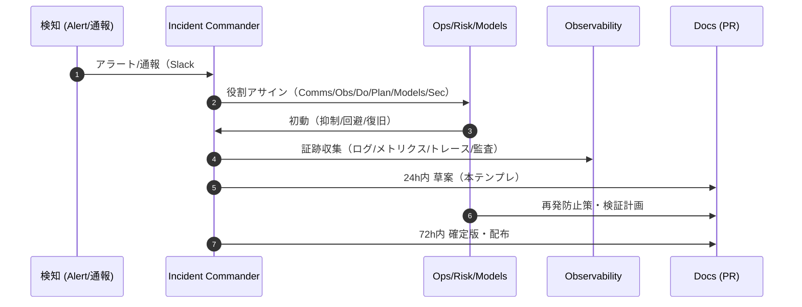

# 🚨 Incident Postmortems — Noctria Kingdom

**Version:** 1.0  
**Status:** Draft → Adopted (when merged)  
**Last Updated:** 2025-08-12 (JST)

> 目的：インシデントの**原因を特定**し、**再発防止**を確実に実装するための**ブレームレス（非難しない）**・**データ駆動**のポストモーテム標準を定義する。  
> 参照：`../governance/Vision-Governance.md` / `../operations/Runbooks.md` / `../operations/Config-Registry.md` / `../observability/Observability.md` / `../security/Security-And-Access.md` / `../apis/Do-Layer-Contract.md` / `../risks/Risk-Register.md` / `../adrs/`

---

## 1. スコープ & 原則
- スコープ：**PDCA 全域**（Plan/Do/Check/Act）、API/GUI、Airflow、ブローカー接続、データ/モデル、セキュリティ/アクセス。  
- 原則：
  1) **Blameless** — 個人でなく**システム/プロセス**の欠陥に焦点。  
  2) **Data-Driven** — ログ/メトリクス/トレース/監査を**一次情報**として使用。  
  3) **Actionable** — 再発防止策は**担当・期限・検証方法**まで決める。  
  4) **Time-Boxed** — **発生から24h内に草案**、**72h内に確定版**。  
  5) **Docs-as-Code** — 本書テンプレで**PR**、関連文書/設定/ルールを同PRで更新。

---

## 2. 定義・分類（Severity / Type）
| Sev | 定義 | 例 | レポート期限 |
|---|---|---|---|
| **SEV-1** | 安全/財務に重大、Do 層全停止や連続発注 | `global_trading_pause` 発火、重大損失 | 草案 12h / 確定 48h |
| **SEV-2** | 本番影響大、KPI 劣化、重要DAG停止 | `do_order_latency p95 > 2s` 持続 | 草案 24h / 確定 72h |
| **SEV-3** | 限定影響、単一銘柄/戦略の劣化 | 個別戦略の MaxDD 超過 | 草案 48h / 確定 5日 |
| **SEV-4** | 未然/ニアミス、stg 限定 | バックフィル暴走を前に検知 | 週次レビュー |

**Type（複数可）**：`execution`, `data`, `model`, `orchestration`, `security`, `api`, `observability`, `governance`

---

## 3. プロセス（流れ）


**役割（最低）**
- **Incident Commander (IC)**：進行・意思決定・記録の責任者（交代可）  
- **Comms**：対外/対内連絡（Slack / ステータス更新）  
- **Observer**：証跡収集（ログ・メトリクス・トレース・監査）  
- **Domain Leads**：Plan/Do/Check/Act、Sec/Models 各担当

---

## 4. メトリクス（MTTx）
| 指標 | 定義 | 目標 |
|---|---|---|
| **MTTD** | 検知までの時間 | ≤ 5分（p95） |
| **MTTA** | 初動（アサイン/抑制）までの時間 | ≤ 10分（p95） |
| **MTTR** | 復旧完了までの時間 | Sev-1 ≤ 2h / Sev-2 ≤ 6h |
| **PM Lead Time** | 発生→草案→確定 | 24h / 72h |

> 計測ソース：`Observability.md` のダッシュボード（Alert/Annotation/Timeline）。

---

## 5. 証跡収集 & タイムライン
**必須ソース**
- **Logs**：構造化 JSON（`component, correlation_id, order_id, dag_id, task_id, strategy`）  
- **Metrics**：Prometheus クエリのスクショ/CSV（p95 レイテンシ等）  
- **Traces**：OTel のスパンツリー（関与サービス）  
- **監査**：`/data/audit/{date}/{order_id}.json`、`exec_result.json`  
- **コンフィグ**：`{env}.yml`, `flags.yml`, `risk_policy` の当時値（ハッシュ/差分）  
- **変更履歴**：直近のデプロイ/PR/フラグ変更/リリースノート

**タイムラインの粒度**
- **UTC/JST 併記**（UTC を正）  
- 重要イベント（検知、抑制、復旧、再発防止タスク起票）を**時刻順**に記述

---

## 6. ポストモーテム テンプレ（コピー用）
> 新規ファイル：`docs/incidents/PM-YYYYMMDD-<slug>.md` として作成。下記をコピペして記入。

```md
# Postmortem — {短い件名} (Sev-X)

**Status:** Draft | Final  
**Date/Window:** {UTC/JST}  
**Commander:** {name/role}  
**Comms:** {name/role}  
**Domains:** {Plan/Do/Check/Act/Sec/Models}  
**Type:** {execution|data|model|...}  

## 1. 概要（Summary）
- 何が起きたか（1〜3行）。  
- 影響範囲（期間/取引/金額/KPI/ユーザ）。  
- 現在の状態（復旧済/抑制中/監視強化中）。

## 2. タイムライン（UTC/JST）
- T0 検知: ...  
- T+5m 抑制: `global_trading_pause=true`  
- T+30m 原因仮説: ...  
- T+90m 復旧: ...  
- T+18h 草案: ...  
- T+70h 確定: ...

## 3. 影響評価（Impact）
- KPI: win_rate / max_dd / latency / slippage（数値）  
- 財務影響（許せば範囲で）  
- ユーザ/ステークホルダ影響

## 4. 根本原因（RCA）
- **技術**: 5 Whys / 因果（構成/コード/データ/外部依存）  
- **運用/人**: 手順/レビュー/権限/ゲート  
- **環境**: ブローカー/ネットワーク/時刻

> 参考：スパンツリー/ログ抜粋/構成図・設定差分を貼付

## 5. 検出と対応（Detection & Response）
- 検知方法（Alert 名/クエリ/しきい値/誰が）  
- 初動（抑制/連絡/切替）とその所要  
- 何が有効だったか / 改善すべき点

## 6. 再発防止策（Actions）
| ID | 対策 | Owner | Due | 種別 | 検証/完了条件 |
|---|---|---|---|---|---|
| A-01 | ルール: SlippageSpike のしきい値を動的化 | Obs | 2025-08-20 | Observability | 10日連続で誤検知ゼロ |
| A-02 | Do: 分割発注のキャンセル条件強化 | Do | 2025-08-22 | Code | 契約テスト/Perf 満たす |
| A-03 | Config: `risk_policy` 境界を再設定 | Risk | 2025-08-21 | Config | KPI 7日で安定 |

> 完了後、`Release-Notes.md` と `Risk-Register.md` を更新し、必要なら ADR を起案。

## 7. 付随事項（Follow-ups）
- Runbooks 更新箇所: §x.x  
- Observability 追加ダッシュ/注釈: ...  
- コミュニケーション（外部/内部）: 共有先/ログ

## 8. 添付（Evidence）
- ダッシュボードリンク / スクショ  
- 代表ログ（構造化 JSON 抜粋、Secrets/PII 伏字）  
- 監査ログ（order_id 列挙）  
- コンフィグ差分（before/after）

## 9. 学び（Lessons Learned）
- うまく機能したこと  
- 改善すべきプロセス  
- 文化/設計への示唆
```

---

## 7. コミュニケーション（テンプレ）
**Slack（初報・更新）**
```md
[SEV-2] Incident detected — Do-layer latency p95 > 2s
Window: 2025-08-12 06:50Z–now
Actions: global_trading_pause=false (monitoring), reroute broker
Commander: @ic-name  Updates every 30m
Postmortem: will be drafted within 24h
```

**ステータス更新（終報）**
```md
[RESOLVED] Do-layer latency back to normal (p95 0.35s).
Window: 06:50Z–08:10Z. Root cause under investigation. PM due in 24h.
```

---

## 8. 品質基準（完了の定義, DoD）
- **草案 24h/確定 72h** を満たす（Sev-1 は 12h/48h）。  
- **Evidence** が十分（ログ/メトリクス/トレース/監査/差分）。  
- **Actions** が **Owner/Due/検証**つきで登録、**Issue 作成**済み。  
- `Release-Notes.md`・`Risk-Register.md`・`Runbooks.md` を**同一PRで更新**。  
- 重大な設計変更は **ADR** を起票。

---

## 9. 自動化（任意）
- **Grafana 注釈**：インシデント期間と重要アクションを自動投稿（API）。  
- **Evidence バンドル**：`/tools/collect_evidence.py` で指定期間のログ/メトリクス/監査を ZIP 化。  
- **Postmortem チェック**：CI でテンプレ準拠（章の有無/表のフォーマット）を lint。

---

## 10. よくある質問（FAQ）
- **Q:** 誰かのミスが原因でも Blameless？  
  **A:** はい。**ミスを許容する設計/プロセス**へ改善するのが目的です。  
- **Q:** 金額など秘匿情報は？  
  **A:** 公開範囲で**レンジ化/伏字**。Secrets/PII は**禁止**。  
- **Q:** インシデントか迷う場合？  
  **A:** Sev-3/4 でも**起票**。後でクローズ可（学びの蓄積が目的）。

---

## 11. 変更履歴（Changelog）
- **2025-08-12**: 初版作成（分類/プロセス/MTTx/証跡/テンプレ/DoD/自動化）

