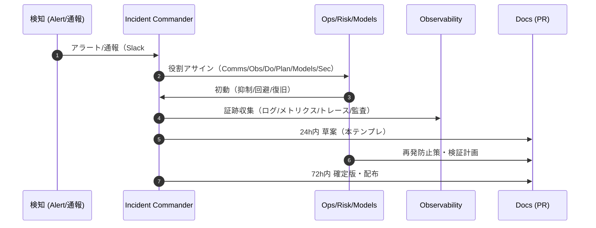

# 🚨 Incident Postmortems — Noctria Kingdom

**Version:** 1.0  
**Status:** Draft → Adopted (when merged)  
**Last Updated:** 2025-08-12 (JST)

> 目的：インシデントの**原因を特定**し、**再発防止**を確実に実装するための**ブレームレス（非難しない）**・**データ駆動**のポストモーテム標準を定義する。  
> 参照：`../governance/Vision-Governance.md` / `../operations/Runbooks.md` / `../operations/Config-Registry.md` / `../observability/Observability.md` / `../security/Security-And-Access.md` / `../apis/Do-Layer-Contract.md` / `../risks/Risk-Register.md` / `../adrs/`

---

## 1. スコープ & 原則
- スコープ：**PDCA 全域**（Plan/Do/Check/Act）、API/GUI、Airflow、ブローカー接続、データ/モデル、セキュリティ/アクセス。  
- 原則：
  1) **Blameless** — 個人でなく**システム/プロセス**の欠陥に焦点。  
  2) **Data-Driven** — ログ/メトリクス/トレース/監査を**一次情報**として使用。  
  3) **Actionable** — 再発防止策は**担当・期限・検証方法**まで決める。  
  4) **Time-Boxed** — **発生から24h内に草案**、**72h内に確定版**。  
  5) **Docs-as-Code** — 本書テンプレで**PR**、関連文書/設定/ルールを同PRで更新。

---

## 2. 定義・分類（Severity / Type）
| Sev | 定義 | 例 | レポート期限 |
|---|---|---|---|
| **SEV-1** | 安全/財務に重大、Do 層全停止や連続発注 | `global_trading_pause` 発火、重大損失 | 草案 12h / 確定 48h |
| **SEV-2** | 本番影響大、KPI 劣化、重要DAG停止 | `do_order_latency p95 > 2s` 持続 | 草案 24h / 確定 72h |
| **SEV-3** | 限定影響、単一銘柄/戦略の劣化 | 個別戦略の MaxDD 超過 | 草案 48h / 確定 5日 |
| **SEV-4** | 未然/ニアミス、stg 限定 | バックフィル暴走を前に検知 | 週次レビュー |

**Type（複数可）**：`execution`, `data`, `model`, `orchestration`, `security`, `api`, `observability`, `governance`

---

## 3. プロセス（流れ）


**役割（最低）**
- **Incident Commander (IC)**：進行・意思決定・記録の責任者（交代可）  
- **Comms**：対外/対内連絡（Slack / ステータス更新）  
- **Observer**：証跡収集（ログ・メトリクス・トレース・監査）  
- **Domain Leads**：Plan/Do/Check/Act、Sec/Models 各担当

---

## 4. メトリクス（MTTx）
| 指標 | 定義 | 目標 |
|---|---|---|
| **MTTD** | 検知までの時間 | ≤ 5分（p95） |
| **MTTA** | 初動（アサイン/抑制）までの時間 | ≤ 10分（p95） |
| **MTTR** | 復旧完了までの時間 | Sev-1 ≤ 2h / Sev-2 ≤ 6h |
| **PM Lead Time** | 発生→草案→確定 | 24h / 72h |

> 計測ソース：`Observability.md` のダッシュボード（Alert/Annotation/Timeline）。

---

## 5. 証跡収集 & タイムライン
**必須ソース**
- **Logs**：構造化 JSON（`component, correlation_id, order_id, dag_id, task_id, strategy`）  
- **Metrics**：Prometheus クエリのスクショ/CSV（p95 レイテンシ等）  
- **Traces**：OTel のスパンツリー（関与サービス）  
- **監査**：`/data/audit/{date}/{order_id}.json`、`exec_result.json`  
- **コンフィグ**：`{env}.yml`, `flags.yml`, `risk_policy` の当時値（ハッシュ/差分）  
- **変更履歴**：直近のデプロイ/PR/フラグ変更/リリースノート

**タイムラインの粒度**
- **UTC/JST 併記**（UTC を正）  
- 重要イベント（検知、抑制、復旧、再発防止タスク起票）を**時刻順**に記述

---

## 6. ポストモーテム テンプレ（コピー用）
> 新規ファイル：`docs/incidents/PM-YYYYMMDD-<slug>.md` として作成。下記をコピペして記入。

```md
# Postmortem — {短い件名} (Sev-X)

**Status:** Draft | Final  
**Date/Window:** {UTC/JST}  
**Commander:** {name/role}  
**Comms:** {name/role}  
**Domains:** {Plan/Do/Check/Act/Sec/Models}  
**Type:** {execution|data|model|...}  

## 1. 概要（Summary）
- 何が起きたか（1〜3行）。  
- 影響範囲（期間/取引/金額/KPI/ユーザ）。  
- 現在の状態（復旧済/抑制中/監視強化中）。

## 2. タイムライン（UTC/JST）
- T0 検知: ...  
- T+5m 抑制: `global_trading_pause=true`  
- T+30m 原因仮説: ...  
- T+90m 復旧: ...  
- T+18h 草案: ...  
- T+70h 確定: ...

## 3. 影響評価（Impact）
- KPI: win_rate / max_dd / latency / slippage（数値）  
- 財務影響（許せば範囲で）  
- ユーザ/ステークホルダ影響

## 4. 根本原因（RCA）
- **技術**: 5 Whys / 因果（構成/コード/データ/外部依存）  
- **運用/人**: 手順/レビュー/権限/ゲート  
- **環境**: ブローカー/ネットワーク/時刻

> 参考：スパンツリー/ログ抜粋/構成図・設定差分を貼付

## 5. 検出と対応（Detection & Response）
- 検知方法（Alert 名/クエリ/しきい値/誰が）  
- 初動（抑制/連絡/切替）とその所要  
- 何が有効だったか / 改善すべき点

## 6. 再発防止策（Actions）
| ID | 対策 | Owner | Due | 種別 | 検証/完了条件 |
|---|---|---|---|---|---|
| A-01 | ルール: SlippageSpike のしきい値を動的化 | Obs | 2025-08-20 | Observability | 10日連続で誤検知ゼロ |
| A-02 | Do: 分割発注のキャンセル条件強化 | Do | 2025-08-22 | Code | 契約テスト/Perf 満たす |
| A-03 | Config: `risk_policy` 境界を再設定 | Risk | 2025-08-21 | Config | KPI 7日で安定 |

> 完了後、`Release-Notes.md` と `Risk-Register.md` を更新し、必要なら ADR を起案。

## 7. 付随事項（Follow-ups）
- Runbooks 更新箇所: §x.x  
- Observability 追加ダッシュ/注釈: ...  
- コミュニケーション（外部/内部）: 共有先/ログ

## 8. 添付（Evidence）
- ダッシュボードリンク / スクショ  
- 代表ログ（構造化 JSON 抜粋、Secrets/PII 伏字）  
- 監査ログ（order_id 列挙）  
- コンフィグ差分（before/after）

## 9. 学び（Lessons Learned）
- うまく機能したこと  
- 改善すべきプロセス  
- 文化/設計への示唆
```

---

## 7. コミュニケーション（テンプレ）
**Slack（初報・更新）**
```md
[SEV-2] Incident detected — Do-layer latency p95 > 2s
Window: 2025-08-12 06:50Z–now
Actions: global_trading_pause=false (monitoring), reroute broker
Commander: @ic-name  Updates every 30m
Postmortem: will be drafted within 24h
```

**ステータス更新（終報）**
```md
[RESOLVED] Do-layer latency back to normal (p95 0.35s).
Window: 06:50Z–08:10Z. Root cause under investigation. PM due in 24h.
```

---

## 8. 品質基準（完了の定義, DoD）
- **草案 24h/確定 72h** を満たす（Sev-1 は 12h/48h）。  
- **Evidence** が十分（ログ/メトリクス/トレース/監査/差分）。  
- **Actions** が **Owner/Due/検証**つきで登録、**Issue 作成**済み。  
- `Release-Notes.md`・`Risk-Register.md`・`Runbooks.md` を**同一PRで更新**。  
- 重大な設計変更は **ADR** を起票。

---

## 9. 自動化（任意）
- **Grafana 注釈**：インシデント期間と重要アクションを自動投稿（API）。  
- **Evidence バンドル**：`/tools/collect_evidence.py` で指定期間のログ/メトリクス/監査を ZIP 化。  
- **Postmortem チェック**：CI でテンプレ準拠（章の有無/表のフォーマット）を lint。

---

## 10. よくある質問（FAQ）
- **Q:** 誰かのミスが原因でも Blameless？  
  **A:** はい。**ミスを許容する設計/プロセス**へ改善するのが目的です。  
- **Q:** 金額など秘匿情報は？  
  **A:** 公開範囲で**レンジ化/伏字**。Secrets/PII は**禁止**。  
- **Q:** インシデントか迷う場合？  
  **A:** Sev-3/4 でも**起票**。後でクローズ可（学びの蓄積が目的）。

---

## 11. 変更履歴（Changelog）
- **2025-08-12**: 初版作成（分類/プロセス/MTTx/証跡/テンプレ/DoD/自動化）


<!-- AUTOGEN:CHANGELOG START -->

### 🛠 Updates since: `2025-08-12 08:57 UTC`

- `4715c7b` 2025-08-15T05:12:32+09:00 — **Update update_docs_from_index.py** _(by Noctoria)_
  - `scripts/update_docs_from_index.py`
- `c20a9bd` 2025-08-15T04:58:31+09:00 — **Create update_docs_from_index.py** _(by Noctoria)_
  - `scripts/update_docs_from_index.py`
- `969f987` 2025-08-15T04:36:32+09:00 — **Update pdca_summary.py** _(by Noctoria)_
  - `noctria_gui/routes/pdca_summary.py`
- `a39c7db` 2025-08-15T04:14:15+09:00 — **Update observability.py** _(by Noctoria)_
  - `src/plan_data/observability.py`
- `09a3e13` 2025-08-15T03:51:14+09:00 — **Update Aurus_Singularis.py** _(by Noctoria)_
  - `src/strategies/veritas_generated/Aurus_Singularis.py`
- `aea152c` 2025-08-15T03:34:12+09:00 — **Update strategy_detail.py** _(by Noctoria)_
  - `noctria_gui/routes/strategy_detail.py`
- `3bc997c` 2025-08-15T03:23:40+09:00 — **Update strategy_detail.py** _(by Noctoria)_
  - `noctria_gui/routes/strategy_detail.py`
- `482da8a` 2025-08-15T03:02:26+09:00 — **Update pdca_recheck.py** _(by Noctoria)_
  - `noctria_gui/routes/pdca_recheck.py`
- `feef06f` 2025-08-15T02:33:44+09:00 — **Update docker-compose.yaml** _(by Noctoria)_
  - `airflow_docker/docker-compose.yaml`
- `e4e3005` 2025-08-15T02:15:13+09:00 — **Update __init__.py** _(by Noctoria)_
  - `noctria_gui/__init__.py`
- `4b38d3b` 2025-08-15T01:48:52+09:00 — **Update path_config.py** _(by Noctoria)_
  - `src/core/path_config.py`
- `00fc537` 2025-08-15T01:44:12+09:00 — **Create kpi_minidemo.py** _(by Noctoria)_
  - `src/plan_data/kpi_minidemo.py`
- `daa5865` 2025-08-15T01:37:54+09:00 — **Update Aurus_Singularis.py** _(by Noctoria)_
  - `src/strategies/veritas_generated/Aurus_Singularis.py`
- `5e52eca` 2025-08-15T01:35:28+09:00 — **Update Aurus_Singularis.py** _(by Noctoria)_
  - `src/strategies/veritas_generated/Aurus_Singularis.py`
- `e320246` 2025-08-15T01:34:39+09:00 — **Update Aurus_Singularis.py** _(by Noctoria)_
  - `src/strategies/veritas_generated/Aurus_Singularis.py`
- `de39f94` 2025-08-15T01:33:29+09:00 — **Create Aurus_Singularis.py** _(by Noctoria)_
  - `src/strategies/veritas_generated/Aurus_Singularis.py`
- `e4c82d5` 2025-08-15T01:16:27+09:00 — **Update pdca_recheck.py** _(by Noctoria)_
  - `noctria_gui/routes/pdca_recheck.py`
- `47a5847` 2025-08-15T01:06:11+09:00 — **Update main.py** _(by Noctoria)_
  - `noctria_gui/main.py`
- `15188ea` 2025-08-15T00:59:08+09:00 — **Update __init__.py** _(by Noctoria)_
  - `noctria_gui/__init__.py`
- `1b4c2ec` 2025-08-15T00:41:34+09:00 — **Create statistics_routes.py** _(by Noctoria)_
  - `noctria_gui/routes/statistics_routes.py`
- `49795a6` 2025-08-15T00:34:44+09:00 — **Update pdca_recheck.py** _(by Noctoria)_
  - `noctria_gui/routes/pdca_recheck.py`
- `4d7dd70` 2025-08-15T00:28:18+09:00 — **Update act_service.py** _(by Noctoria)_
  - `src/core/act_service.py`
- `1d38c3c` 2025-08-14T22:21:33+09:00 — **Create policy_engine.py** _(by Noctoria)_
  - `src/core/policy_engine.py`
- `dcdd7f4` 2025-08-14T22:15:59+09:00 — **Update airflow_client.py** _(by Noctoria)_
  - `src/core/airflow_client.py`
- `e66ac97` 2025-08-14T22:08:25+09:00 — **Update pdca_recheck.py** _(by Noctoria)_
  - `noctria_gui/routes/pdca_recheck.py`
- `6c49b8e` 2025-08-14T21:58:17+09:00 — **Update pdca_summary.py** _(by Noctoria)_
  - `noctria_gui/routes/pdca_summary.py`
- `e0b9eaa` 2025-08-14T21:53:00+09:00 — **Update pdca_summary_service.py** _(by Noctoria)_
  - `src/plan_data/pdca_summary_service.py`
- `368203e` 2025-08-14T21:44:48+09:00 — **Update pdca_summary.py** _(by Noctoria)_
  - `noctria_gui/routes/pdca_summary.py`
- `cc9da23` 2025-08-14T21:32:42+09:00 — **Update pdca_routes.py** _(by Noctoria)_
  - `noctria_gui/routes/pdca_routes.py`
- `434d2e2` 2025-08-14T21:23:55+09:00 — **Update pdca_routes.py** _(by Noctoria)_
  - `noctria_gui/routes/pdca_routes.py`
- `d0df823` 2025-08-14T21:18:54+09:00 — **Update decision_registry.py** _(by Noctoria)_
  - `src/core/decision_registry.py`
- `1eaed26` 2025-08-14T21:08:01+09:00 — **Update pdca_routes.py** _(by Noctoria)_
  - `noctria_gui/routes/pdca_routes.py`
- `b557920` 2025-08-14T21:03:59+09:00 — **Update strategy_evaluator.py** _(by Noctoria)_
  - `src/core/strategy_evaluator.py`
- `0c7a12f` 2025-08-14T21:00:00+09:00 — **Create decision_registry.py** _(by Noctoria)_
  - `src/core/decision_registry.py`
- `2f034a5` 2025-08-14T20:58:16+09:00 — **Update pdca_summary.html** _(by Noctoria)_
  - `noctria_gui/templates/pdca_summary.html`
- `28bb890` 2025-08-14T20:51:37+09:00 — **Update pdca_routes.py** _(by Noctoria)_
  - `noctria_gui/routes/pdca_routes.py`
- `307da2d` 2025-08-14T20:49:15+09:00 — **Create act_service.py** _(by Noctoria)_
  - `src/core/act_service.py`
- `bf993f3` 2025-08-14T20:41:12+09:00 — **Update pdca_summary.html** _(by Noctoria)_
  - `noctria_gui/templates/pdca_summary.html`
- `4b7ca22` 2025-08-14T20:35:18+09:00 — **Update pdca_routes.py** _(by Noctoria)_
  - `noctria_gui/routes/pdca_routes.py`
- `3880c7b` 2025-08-14T20:32:42+09:00 — **Update pdca_summary.html** _(by Noctoria)_
  - `noctria_gui/templates/pdca_summary.html`
- `074b6cf` 2025-08-14T20:24:03+09:00 — **Update pdca_routes.py** _(by Noctoria)_
  - `noctria_gui/routes/pdca_routes.py`
- `46d639d` 2025-08-14T20:17:49+09:00 — **Update strategy_evaluator.py** _(by Noctoria)_
  - `src/core/strategy_evaluator.py`
- `f63e897` 2025-08-14T20:12:50+09:00 — **Update veritas_recheck_dag.py** _(by Noctoria)_
  - `airflow_docker/dags/veritas_recheck_dag.py`
- `7c3785e` 2025-08-14T20:08:26+09:00 — **Create veritas_recheck_all_dag.py** _(by Noctoria)_
  - `airflow_docker/dags/veritas_recheck_all_dag.py`
- `49fe520` 2025-08-14T15:41:00+09:00 — **main.py を更新** _(by Noctoria)_
  - `noctria_gui/main.py`
- `3648612` 2025-08-14T15:35:27+09:00 — **pdca_routes.py を更新** _(by Noctoria)_
  - `noctria_gui/routes/pdca_routes.py`
- `f7f1972` 2025-08-14T06:32:19+09:00 — **Update base_hud.html** _(by Noctoria)_
  - `noctria_gui/templates/base_hud.html`
- `eae18c6` 2025-08-14T06:21:35+09:00 — **Update pdca_summary.html** _(by Noctoria)_
  - `noctria_gui/templates/pdca_summary.html`
- `1d6047c` 2025-08-14T06:10:33+09:00 — **Update pdca_summary.html** _(by Noctoria)_
  - `noctria_gui/templates/pdca_summary.html`
- `3c55ed0` 2025-08-14T06:04:20+09:00 — **Create dammy** _(by Noctoria)_
  - `noctria_gui/static/vendor/dammy`
- `7b4624d` 2025-08-14T05:45:03+09:00 — **Update pdca_summary.html** _(by Noctoria)_
  - `noctria_gui/templates/pdca_summary.html`
- `35e4c50` 2025-08-14T04:49:16+09:00 — **Update main.py** _(by Noctoria)_
  - `noctria_gui/main.py`
- `6c88b9f` 2025-08-14T04:31:58+09:00 — **Update pdca_summary.html** _(by Noctoria)_
  - `noctria_gui/templates/pdca_summary.html`
- `1a0b00e` 2025-08-14T04:29:17+09:00 — **Update pdca_summary.py** _(by Noctoria)_
  - `noctria_gui/routes/pdca_summary.py`
- `2b51ef9` 2025-08-14T04:27:11+09:00 — **Create pdca_summary_service.py** _(by Noctoria)_
  - `src/plan_data/pdca_summary_service.py`
- `6ff093a` 2025-08-14T04:24:34+09:00 — **Update main.py** _(by Noctoria)_
  - `noctria_gui/main.py`
- `7e2e056` 2025-08-14T04:20:51+09:00 — **Create pdca_control.html** _(by Noctoria)_
  - `noctria_gui/templates/pdca_control.html`
- `cf248ee` 2025-08-14T04:15:18+09:00 — **Update pdca_recheck.py** _(by Noctoria)_
  - `noctria_gui/routes/pdca_recheck.py`
- `d8e0d6e` 2025-08-14T04:12:02+09:00 — **Create airflow_client.py** _(by Noctoria)_
  - `src/core/airflow_client.py`
- `b2aa77a` 2025-08-14T01:09:50+09:00 — **Update pdca_latency_daily.html** _(by Noctoria)_
  - `noctria_gui/templates/pdca_latency_daily.html`
- `38a01da` 2025-08-14T01:06:15+09:00 — **Update pdca_timeline.html** _(by Noctoria)_
  - `noctria_gui/templates/pdca_timeline.html`
- `303f8d2` 2025-08-14T01:02:09+09:00 — **Update observability.py** _(by Noctoria)_
  - `noctria_gui/routes/observability.py`
- `206dac2` 2025-08-14T00:21:25+09:00 — **Update observability.py** _(by Noctoria)_
  - `src/plan_data/observability.py`
- `c08e345` 2025-08-13T23:37:10+09:00 — **Update init_obs_schema.sql** _(by Noctoria)_
  - `scripts/init_obs_schema.sql`
- `00df80a` 2025-08-13T23:18:49+09:00 — **Update main.py** _(by Noctoria)_
  - `noctria_gui/main.py`
- `f08d9c2` 2025-08-13T23:12:35+09:00 — **Create init_obs_schema.sql** _(by Noctoria)_
  - `scripts/init_obs_schema.sql`
- `a021461` 2025-08-13T22:07:03+09:00 — **Update pdca_summary.html** _(by Noctoria)_
  - `noctria_gui/templates/pdca_summary.html`
- `d1e0cd2` 2025-08-13T22:01:43+09:00 — **Update pdca_summary.py** _(by Noctoria)_
  - `noctria_gui/routes/pdca_summary.py`
- `435b19e` 2025-08-13T21:57:54+09:00 — **Update observability.py** _(by Noctoria)_
  - `src/plan_data/observability.py`
- `82cc0ad` 2025-08-13T16:33:01+09:00 — **Update main.py** _(by Noctoria)_
  - `noctria_gui/main.py`
- `c42088c` 2025-08-13T16:29:45+09:00 — **Update observability.py** _(by Noctoria)_
  - `noctria_gui/routes/observability.py`
- `5cfbeff` 2025-08-13T16:15:55+09:00 — **Update main.py** _(by Noctoria)_
  - `noctria_gui/main.py`
- `8c5b055` 2025-08-13T16:11:34+09:00 — **Create pdca_latency_daily.html** _(by Noctoria)_
  - `noctria_gui/templates/pdca_latency_daily.html`
- `f8c1e9a` 2025-08-13T16:10:52+09:00 — **Create pdca_timeline.html** _(by Noctoria)_
  - `noctria_gui/templates/pdca_timeline.html`
- `3bc104a` 2025-08-13T16:07:38+09:00 — **Create observability.py** _(by Noctoria)_
  - `noctria_gui/routes/observability.py`
- `b1453a0` 2025-08-13T16:03:47+09:00 — **Update order_execution.py** _(by Noctoria)_
  - `src/execution/order_execution.py`
- `9ed85b3` 2025-08-13T15:53:16+09:00 — **Update risk_policy.py** _(by Noctoria)_
  - `src/execution/risk_policy.py`
- `b112ce9` 2025-08-13T15:30:22+09:00 — **Update contracts.py** _(by Noctoria)_
  - `src/plan_data/contracts.py`
- `fba6dda` 2025-08-13T15:24:26+09:00 — **Update risk_gate.py** _(by Noctoria)_
  - `src/execution/risk_gate.py`
- `112e173` 2025-08-13T15:18:00+09:00 — **Create risk_policy.py** _(by Noctoria)_
  - `src/execution/risk_policy.py`
- `99a3122` 2025-08-13T14:53:14+09:00 — **Update decision_minidemo.py** _(by Noctoria)_
  - `src/e2e/decision_minidemo.py`
- `9786e16` 2025-08-13T14:49:18+09:00 — **Update decision_minidemo.py** _(by Noctoria)_
  - `src/e2e/decision_minidemo.py`
- `3696066` 2025-08-13T14:45:26+09:00 — **Create show_timeline.py** _(by Noctoria)_
  - `src/tools/show_timeline.py`
- `dee8185` 2025-08-13T14:38:49+09:00 — **Update decision_minidemo.py** _(by Noctoria)_
  - `src/e2e/decision_minidemo.py`
- `a33f63e` 2025-08-13T14:17:31+09:00 — **Update observability.py** _(by Noctoria)_
  - `src/plan_data/observability.py`
- `3fe7a25` 2025-08-13T13:42:41+09:00 — **Update observability.py** _(by Noctoria)_
  - `src/plan_data/observability.py`
- `aa30bc6` 2025-08-13T13:33:25+09:00 — **Update decision_minidemo.py** _(by Noctoria)_
  - `src/e2e/decision_minidemo.py`
- `7b71201` 2025-08-13T13:30:05+09:00 — **Update path_config.py** _(by Noctoria)_
  - `src/core/path_config.py`
- `8305919` 2025-08-13T13:22:29+09:00 — **Update decision_minidemo.py** _(by Noctoria)_
  - `src/e2e/decision_minidemo.py`
- `be7bfa6` 2025-08-13T13:16:51+09:00 — **Create __init__.py** _(by Noctoria)_
  - `src/strategies/__init__.py`
- `7aa58ce` 2025-08-13T13:16:23+09:00 — **Create __init__.py** _(by Noctoria)_
  - `src/e2e/__init__.py`
- `70d8587` 2025-08-13T13:16:11+09:00 — **Create __init__.py** _(by Noctoria)_
  - `src/decision/__init__.py`
- `14a5297` 2025-08-13T13:14:58+09:00 — **Update __init__.py** _(by Noctoria)_
  - `src/__init__.py`
- `e331d07` 2025-08-13T13:12:08+09:00 — **Update decision_minidemo.py** _(by Noctoria)_
  - `src/e2e/decision_minidemo.py`
- `4567802` 2025-08-13T13:09:30+09:00 — **Update __init__.py** _(by Noctoria)_
  - `src/__init__.py`
- `4a02589` 2025-08-13T13:06:52+09:00 — **Update decision_minidemo.py** _(by Noctoria)_
  - `src/e2e/decision_minidemo.py`
- `b9c0561` 2025-08-13T12:58:07+09:00 — **Update decision_engine.py** _(by Noctoria)_
  - `src/decision/decision_engine.py`
- `7913390` 2025-08-13T12:55:44+09:00 — **Create profile_loader.py** _(by Noctoria)_
  - `src/plan_data/profile_loader.py`
- `e29e4bb` 2025-08-13T12:50:28+09:00 — **Create risk_gate.py** _(by Noctoria)_
  - `src/execution/risk_gate.py`
- `5c617c4` 2025-08-13T12:43:52+09:00 — **Update observability.py** _(by Noctoria)_
  - `src/plan_data/observability.py`
- `44bc542` 2025-08-13T11:26:05+09:00 — **Update decision_engine.py** _(by Noctoria)_
  - `src/decision/decision_engine.py`
- `8b7bc76` 2025-08-13T11:24:48+09:00 — **Rename decision_engine.py to decision_engine.py** _(by Noctoria)_
  - `src/decision/decision_engine.py`
- `e70244e` 2025-08-13T11:23:29+09:00 — **Rename trace.py to trace.py** _(by Noctoria)_
  - `src/core/trace.py`
- `7dfab9c` 2025-08-13T11:17:32+09:00 — **Update trace.py** _(by Noctoria)_
  - `src/plan_data/trace.py`
- `735a519` 2025-08-13T11:02:21+09:00 — **Create decision_minidemo.py** _(by Noctoria)_
  - `src/e2e/decision_minidemo.py`
- `e4a9e83` 2025-08-13T10:58:32+09:00 — **Update observability.py** _(by Noctoria)_
  - `src/plan_data/observability.py`
- `9c1c5d0` 2025-08-13T10:50:29+09:00 — **Update decision_engine.py** _(by Noctoria)_
  - `src/plan_data/decision_engine.py`
- `31a28ae` 2025-08-13T10:47:02+09:00 — **Update trace.py** _(by Noctoria)_
  - `src/plan_data/trace.py`
- `c7c65fb` 2025-08-13T04:55:43+09:00 — **Update plan_to_all_minidemo.py** _(by Noctoria)_
  - `src/plan_data/plan_to_all_minidemo.py`
- `4ee7b2c` 2025-08-13T04:33:54+09:00 — **Update utils.py** _(by Noctoria)_
  - `src/core/utils.py`
- `7a72c02` 2025-08-13T04:26:01+09:00 — **Update aurus_singularis.py** _(by Noctoria)_
  - `src/strategies/aurus_singularis.py`
- `9738c0b` 2025-08-13T04:18:54+09:00 — **Update observability.py** _(by Noctoria)_
  - `src/plan_data/observability.py`
- `668d424` 2025-08-13T04:07:33+09:00 — **Update observability.py** _(by Noctoria)_
  - `src/plan_data/observability.py`
- `f06ae54` 2025-08-13T03:05:40+09:00 — **Update plan_to_all_minidemo.py** _(by Noctoria)_
  - `src/plan_data/plan_to_all_minidemo.py`
- `831ff6c` 2025-08-13T02:53:37+09:00 — **Create strategy_adapter.py** _(by Noctoria)_
  - `src/plan_data/strategy_adapter.py`
- `43c5d7a` 2025-08-13T02:53:07+09:00 — **Update trace.py** _(by Noctoria)_
  - `src/plan_data/trace.py`
- `fc92ef5` 2025-08-13T02:50:18+09:00 — **Update analyzer.py** _(by Noctoria)_
  - `src/plan_data/analyzer.py`
- `76795bf` 2025-08-13T02:47:28+09:00 — **Update statistics.py** _(by Noctoria)_
  - `src/plan_data/statistics.py`
- `af4106e` 2025-08-13T02:44:27+09:00 — **Update features.py** _(by Noctoria)_
  - `src/plan_data/features.py`
- `34e7328` 2025-08-13T02:40:33+09:00 — **Update collector.py** _(by Noctoria)_
  - `src/plan_data/collector.py`
- `b80bcf2` 2025-08-13T02:24:16+09:00 — **Update observability.py** _(by Noctoria)_
  - `src/plan_data/observability.py`
- `386097b` 2025-08-13T01:53:40+09:00 — **Create ai_adapter.py** _(by Noctoria)_
  - `src/plan_data/ai_adapter.py`
- `881c42c` 2025-08-13T01:52:58+09:00 — **Create observability.py** _(by Noctoria)_
  - `src/plan_data/observability.py`
- `04080ca` 2025-08-13T01:52:28+09:00 — **Create trace.py** _(by Noctoria)_
  - `src/plan_data/trace.py`
- `2f52073` 2025-08-13T01:52:00+09:00 — **Create decision_engine.py** _(by Noctoria)_
  - `src/plan_data/decision_engine.py`
- `e40ac8c` 2025-08-13T01:50:14+09:00 — **Create quality_gate.py** _(by Noctoria)_
  - `src/plan_data/quality_gate.py`
- `1de46ad` 2025-08-13T01:49:35+09:00 — **Create contracts.py** _(by Noctoria)_
  - `src/plan_data/contracts.py`

<!-- AUTOGEN:CHANGELOG END -->
<!-- AUTODOC:BEGIN mode=git_log path_globs="docs/incidents/*.md;logs/incidents/**/*.md" title=インシデント文書更新履歴（最近30） limit=30 since=2025-08-01 -->
### インシデント文書更新履歴（最近30）

- **51ddf2a** 2025-08-15T19:53:46+09:00 — docs: AUTODOCブロック挿入および本文更新 (by Veritas Machina)
  - `docs/00_index/00-INDEX.md`
  - `docs/00_index/00-INDEX.md.bak`
  - `docs/README.md`
  - `docs/README.md.bak`
  - `docs/_partials/apis/Do-Layer-Contract/01_scope_principles.md`
  - `docs/_partials/apis/Do-Layer-Contract/01_scope_principles.md.bak`
  - `docs/_partials/apis/Do-Layer-Contract/02_flow_overview.md`
  - `docs/_partials/apis/Do-Layer-Contract/02_flow_overview.md.bak`
  - `docs/_partials/apis/Do-Layer-Contract/03_entities_schemas.md`
  - `docs/_partials/apis/Do-Layer-Contract/03_entities_schemas.md.bak`
  - `docs/_partials/apis/Do-Layer-Contract/04_order_request.md`
  - `docs/_partials/apis/Do-Layer-Contract/04_order_request.md.bak`
  - `docs/_partials/apis/Do-Layer-Contract/05_exec_result.md`
  - `docs/_partials/apis/Do-Layer-Contract/05_exec_result.md.bak`
  - `docs/_partials/apis/Do-Layer-Contract/06_audit_order.md`
  - `docs/_partials/apis/Do-Layer-Contract/06_audit_order.md.bak`
  - `docs/_partials/apis/Do-Layer-Contract/07_financial_correctness.md`
  - `docs/_partials/apis/Do-Layer-Contract/07_financial_correctness.md.bak`
  - `docs/_partials/apis/Do-Layer-Contract/08_idempotency_concurrency.md`
  - `docs/_partials/apis/Do-Layer-Contract/08_idempotency_concurrency.md.bak`
- **7111b30** 2025-08-15T19:38:34+09:00 — docs: AUTODOCブロック挿入および本文更新 (by Veritas Machina)
  - `docs/00_index/00-INDEX.md`
  - `docs/00_index/00-INDEX.md.bak`
  - `docs/README.md`
  - `docs/README.md.bak`
  - `docs/_partials/apis/Do-Layer-Contract/01_scope_principles.md`
  - `docs/_partials/apis/Do-Layer-Contract/02_flow_overview.md`
  - `docs/_partials/apis/Do-Layer-Contract/03_entities_schemas.md`
  - `docs/_partials/apis/Do-Layer-Contract/04_order_request.md`
  - `docs/_partials/apis/Do-Layer-Contract/05_exec_result.md`
  - `docs/_partials/apis/Do-Layer-Contract/06_audit_order.md`
  - `docs/_partials/apis/Do-Layer-Contract/07_financial_correctness.md`
  - `docs/_partials/apis/Do-Layer-Contract/08_idempotency_concurrency.md`
  - `docs/_partials/apis/Do-Layer-Contract/09_error_codes.md`
  - `docs/_partials/apis/Do-Layer-Contract/10_samples_min.md`
  - `docs/_partials/apis/Do-Layer-Contract/11_contract_tests.md`
  - `docs/_partials/apis/Do-Layer-Contract/12_changelog.md`
  - `docs/adrs/ADRs.md`
  - `docs/adrs/ADRs.md.bak`
  - `docs/apis/Do-Layer-Contract.md`
  - `docs/apis/Do-Layer-Contract.md.bak`
- **30ae379** 2025-08-15T18:55:06+09:00 — 📄 AutoDoc: update docs from index (by Veritas Machina)
  - `action`
  - `data/decisions/ledger.csv`
  - `data/models/prometheus/PPO/obs8/latest`
  - `data/models/prometheus/PPO/obs8/manual__2025-08-11T14:18:10+00:00/metadata.json`
  - `data/models/prometheus/PPO/obs8/manual__2025-08-11T14:18:10+00:00/model.zip`
  - `data/models/prometheus/PPO/obs8/manual__2025-08-11T14:19:41+00:00/metadata.json`
  - `data/models/prometheus/PPO/obs8/manual__2025-08-11T14:19:41+00:00/model.zip`
  - `data/models/prometheus/PPO/obs8/manual__2025-08-11T14:22:19+00:00/metadata.json`
  - `data/models/prometheus/PPO/obs8/manual__2025-08-11T14:22:19+00:00/model.zip`
  - `data/models/prometheus/PPO/obs8/manual__2025-08-11T14:33:11+00:00/metadata.json`
  - `data/models/prometheus/PPO/obs8/manual__2025-08-11T14:33:11+00:00/model.zip`
  - `data/models/prometheus/PPO/obs8/manual__2025-08-11T15:44:05+00:00/metadata.json`
  - `data/models/prometheus/PPO/obs8/manual__2025-08-11T15:44:05+00:00/model.zip`
  - `data/models/prometheus/PPO/obs8/manual__2025-08-11T16:20:12.935706+00:00/metadata.json`
  - `data/models/prometheus/PPO/obs8/manual__2025-08-11T16:20:12.935706+00:00/model.zip`
  - `data/models/prometheus/PPO/obs8/manual__2025-08-11T16:21:36.023694+00:00/metadata.json`
  - `data/models/prometheus/PPO/obs8/manual__2025-08-11T16:21:36.023694+00:00/model.zip`
  - `data/models/prometheus/PPO/obs8/manual__2025-08-11T16:27:02.701382+00:00/metadata.json`
  - `data/models/prometheus/PPO/obs8/manual__2025-08-11T16:27:02.701382+00:00/model.zip`
  - `data/models/prometheus/PPO/obs8/manual__2025-08-11T17:21:59.539332+00:00/metadata.json`
- **d09c7ae** 2025-08-15T05:31:20+09:00 — docs: update from 00-INDEX.md sync (by Veritas Machina)
  - `docs/00_index/00-INDEX.md`
  - `docs/_generated/update_docs.log`
  - `docs/adrs/ADRs.md`
  - `docs/apis/API.md`
  - `docs/apis/Do-Layer-Contract.md`
  - `docs/apis/observability/Observability.md`
  - `docs/architecture/Architecture-Overview.md`
  - `docs/architecture/Plan-Layer.md`
  - `docs/governance/Coding-Standards.md`
  - `docs/governance/Vision-Governance.md`
  - `docs/incidents/Incident-Postmortems.md`
  - `docs/models/ModelCard-Prometheus-PPO.md`
  - `docs/models/Strategy-Lifecycle.md`
  - `docs/observability/Observability.md`
  - `docs/operations/Airflow-DAGs.md`
  - `docs/operations/Config-Registry.md`
  - `docs/operations/Runbooks.md`
  - `docs/qa/Testing-And-QA.md`
  - `docs/risks/Risk-Register.md`
  - `docs/roadmap/Release-Notes.md`
- **14dd164** 2025-08-12T17:57:02+09:00 — Update Incident-Postmortems.md (by Noctoria)
  - `docs/incidents/Incident-Postmortems.md`
- **3a6eb5c** 2025-08-12T03:05:56+09:00 — Create Incident-Postmortems.md (by Noctoria)
  - `docs/incidents/Incident-Postmortems.md`
<!-- AUTODOC:END -->
