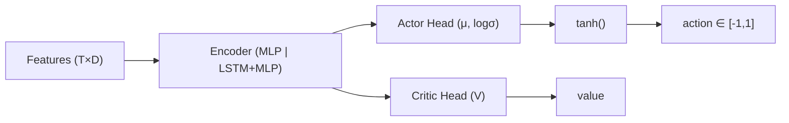

# 🧠 Model Card — Prometheus-PPO

**Model ID:** Prometheus-PPO  
**Version:** 1.1  
**Status:** Adopted (Draft → Review 済み)  
**Last Updated:** 2025-08-14 (JST)

> 目的：Noctria の「Prometheus Oracle」における **PPO（Proximal Policy Optimization）** ベースの連続アクション・ポリシーを、再現可能かつ安全に本番運用するための技術仕様と運用ガイドをひとつにまとめる。  
> 参照：`../architecture/Plan-Layer.md` / `../apis/Do-Layer-Contract.md` / `../qa/Testing-And-QA.md` / `../observability/Observability.md` / `../security/Security-And-Access.md` / `../risks/Risk-Register.md` / `../roadmap/Release-Notes.md`

---

## 1. 概要（Summary）
- **タスク**：短〜中期の方向・強度シグナル生成（連続 `action ∈ [-1, 1]` → Do 層でロットへ写像）。  
- **入力**：Plan 層生成の特徴量テーブル `feature_df.parquet`（5m 足基準、リーク防止済、UTC）。  
- **出力**：`action`（-1..1）, `confidence`（0..1）, `meta`（regime/vol 他）, `trace_id`（貫通用）。  
- **連携**：Do 層の **Noctus Gate** で境界・抑制を強制 → 発注最適化 → 監査/評価（Check）。  
- **位置づけ**：King Noctria の意思決定を補助する**助言モデル**（単独での境界バイパスは禁止）。

---

## 2. Intended Use / 非対象
- **Intended**：BTCUSDT / ETHUSDT（5m）を中心とする、平常市場での方向性・強度の連続出力。  
- **非対象**：極端イベント（サーキットブレーカー相当）の瞬間対応、低流動銘柄、秒足スキャル（Levia が担当）。

---

## 3. データ & 特徴量（Plan 層準拠）
- **期間**：通常 24 ヶ月（ロール時 3–6 ヶ月スライド）。  
- **前処理**：UTC 固定、`max_fill_gap` 以内の F/BFill、ロール系は必ず `shift` でリーク防止。  
- **主特徴（例）**  
  - 価格/収益：`ret_{1,5,20}`, `zscore_{20,50}`  
  - テクニカル：`RSI(14)`, `MACD(12,26,9)`, `ATR(14)`  
  - ボラ・流動性：`HV_{20,60}`, `approx_spread`, `roll_vwap`  
  - フェーズ：`regime`, `vol_bucket`, `session_flag`  
- **正規化**：学習/推論とも `zscore_252` を原則（統計は学習窓で固定し、推論時は**固定統計**のみ使用）。

---

## 4. モデル構造（Architecture）
- **Actor/Critic**：MLP（`[128, 128]` ReLU）×2（Actor / Critic）。  
- **出力**：ガウシアン `μ, logσ` を Tanh で `[-1,1]` に制約（連続アクション）。  
- **任意**：`use_recurrence: true` で先頭に `LSTM(64)` を付与可能。  
- **正則化**：PPO clip + Entropy + 価値関数項。



---

## 5. 強化学習設定（PPO）
- **目的**：リスク調整収益（Sharpe_adj）最大化。  
- **環境**：スプレッド/手数料/スリッページ/約定遅延を**埋め込み**（擬似ブローカー）。  
- **検証法**：Walk-Forward（Train → Valid → Test の時系列前進）。

### 5.1 報酬関数（例）
`r_t = pnl_t - λ_dd * dd_penalty_t - λ_tc * trade_cost_t - λ_pos * |Δposition_t|`  
（`λ_dd=0.5, λ_tc=0.1, λ_pos=0.02` を初期値とし、`configs/model/prometheus_ppo.yml` で調整）

### 5.2 主要ハイパーパラメータ
| Param | 値（初期） | 説明 |
|---|---|---|
| `gamma` | 0.99 | 割引率 |
| `gae_lambda` | 0.95 | GAE |
| `clip_range` | 0.2 | PPO クリップ |
| `entropy_coef` | 0.003 | 探索 |
| `vf_coef` | 0.5 | 価値関数係数 |
| `lr` | 3e-4 | Cosine decay 基準 |
| `batch_size` | 4096 | サンプル/更新 |
| `n_epochs` | 10 | 更新エポック |
| `max_grad_norm` | 0.5 | 勾配クリップ |
| `seed` | 1337, 1729, 31415 | 再現性 |

---

## 6. 学習手順（Training Procedure）
1. **データ確定**：Plan 層の `feature_df.parquet` を WFO で固定（Git LFS/ハッシュ管理）。  
2. **設定固定**：`configs/model/prometheus_ppo.yml` と Git SHA をタグ付け。  
3. **学習**：Valid で早期停止（Sharpe_adj）。  
4. **テスト**：Test 区間は一度のみ評価 → ゴールデン（ハッシュ）を保存。  
5. **シャドー**：stg で 10 営業日（`howto-shadow-trading.md`）。  
6. **段階導入**：7% → 30% → 100%（`Strategy-Lifecycle.md` 準拠）。

**設定例（抜粋）**
```yaml
# configs/model/prometheus_ppo.yml
data:
  symbols: ["BTCUSDT","ETHUSDT"]
  timeframe: "5m"
  features_spec: "configs/feature_spec.json"
  wfo:
    train: "2024-01-01..2025-03-31"
    valid: "2025-04-01..2025-06-30"
    test:  "2025-07-01..2025-08-11"
model:
  arch: { encoder: "mlp", hidden: [128,128], recurrence: { use: false, hidden: 64 } }
  algo: "ppo"
  hyper:
    gamma: 0.99
    gae_lambda: 0.95
    clip_range: 0.2
    entropy_coef: 0.003
    vf_coef: 0.5
    lr: 0.0003
    batch_size: 4096
    n_epochs: 10
    max_grad_norm: 0.5
reward:
  lambda_dd: 0.5
  lambda_tc: 0.1
  lambda_pos: 0.02
runtime:
  seed: [1337,1729,31415]
  device: "auto"
  num_workers: 4
```

---

## 7. 推論 & 配信（Serving）
- **API**：Plan → Prometheus → Do（`API.md` / `Do-Layer-Contract.md` 準拠）。  
- **入力**：最新行の `features_dict.json` または `feature_df.parquet`。  
- **出力（例）**：
```json
{
  "action": 0.82,
  "confidence": 0.78,
  "ts": "2025-08-12T06:58:00Z",
  "trace_id": "20250812-065800Z-BTCUSDT-pp-7f3a",
  "meta": { "strategy": "Prometheus-PPO", "symbol": "BTCUSDT", "tf": "5m", "regime": "trending", "vol": "mid" }
}
```
- **写像（Do 層でのロット化一例）**：`qty = sign(action) * min(max_qty, base_qty * |action|^α)`（`α ≈ 1.0` 初期）。  
- **レイテンシ目標**：p95 ≤ 50ms（推論単体）。  
- **フェイルセーフ**：入力検証 NG / `confidence < min_conf` の場合は `action=0` を返却（FLAT）。

---

## 8. 評価（Validation & Metrics）
- **オフライン**：WFO Test → `Sharpe_adj / Sortino / MaxDD / WinRate / Turnover / P&L`。  
- **オンライン（シャドー）**：KPI 安定、`do_order_latency p95` 劣化なし、`risk_events_total` 0。  
- **本番（カナリア）**：各段階 3 営業日観測、重大アラート 0。

**評価出力（例）**
```json
{
  "env": "stg",
  "window": "2025-07-01..2025-08-11",
  "metrics": {
    "sharpe_adj": 1.08,
    "sortino": 1.45,
    "max_drawdown_pct": 7.9,
    "win_rate": 0.52,
    "turnover": 0.74
  },
  "seed": 1337,
  "git": "abc1234",
  "spec": "configs/model/prometheus_ppo.yml"
}
```

---

## 9. ガードレール（Safety & Risk）
- **Noctus Gate**：`max_position_qty`, `max_drawdown_pct`, `max_slippage_pct`, `losing_streak` を**強制**。  
- **Safemode**：`flags.risk_safemode=true` で境界 0.5x。  
- **抑制**：Ops/Risk が `flags.global_trading_pause` を即時切替可能。  
- **Non-Negotiables**：境界・契約の**バイパス禁止**（`Security-And-Access.md`）。  

---

## 10. 可観測性（Observability）
- **ログ先**：`obs_infer_calls`（dur_ms/success/staleness）・`obs_decisions`（採用時）・`obs_alerts`。  
- **トレース**：HTTP ヘッダ `X-Trace-Id` を必須、`trace_id` を P→Infer→D→Exec へ貫通。  
- **監視例**（分布の逸脱）：
```promql
# アクション平均が過去7日平均から乖離
abs( model_action_mean - scalar(avg_over_time(model_action_mean[7d])) ) > 0.2
```
- **ドリフト**：`action` 分布（mean/std/entropy）・`hit_rate`・`turnover` をダッシュボードで可視化。

---

## 11. 再現性（Reproducibility）
- **固定物**：`feature_spec.json` / `prometheus_ppo.yml` / seeds / Git SHA / 依存バージョン。  
- **成果物**：`artifacts/models/prometheus/1.1/` に `model.bin`, `scaler.pkl`, `report.json`, `manifest.json`。  
- **ハッシュ**：成果物ごとに SHA256、`audit` と `obs_train_jobs` に記録。  
- **環境**：Docker イメージタグと `requirements*.txt` を成果物にバンドル。

---

## 12. 限界 & 既知の課題（Limitations）
- レジーム急変時に反応遅延（`Risk-Register R-01`）。  
- スリッページモデルの外挿弱さ（極端相場で過小/過大推定）。  
- LSTM 併用時の過学習（短窓で顕著）→ 早期停止・正則化強化・Dropout 併用を推奨。

---

## 13. ライフサイクル & ゲーティング（Strategy-Lifecycle）
- **G0（起案）** → **G1（WFO 合格）** → **G2（stg シャドー 10 日）** → **G3（prod 7%）** → **G4（30%→100%）**。  
- ロールバック：`howto-rollback.md`、インシデントは `Incident-Postmortems.md` に記録。

---

## 14. API 連携（抜粋）
- **Plan トリガ**：`POST /api/v1/plan/collect`  
- **KPI 取得**：`GET /api/v1/check/kpi/summary`  
- **発注**：`POST /api/v1/do/orders`（`order_request.schema.json` 準拠、`Idempotency-Key` 必須）

---

## 15. I/O スキーマ & サンプル
```json
// 推論レスポンス（simplified）
{
  "action": -0.35,
  "confidence": 0.62,
  "ts": "2025-08-12T06:55:00Z",
  "trace_id": "20250812-065500Z-ETHUSDT-pp-1b9c",
  "meta": { "strategy":"Prometheus-PPO","symbol":"ETHUSDT","tf":"5m","regime":"range","vol":"low" }
}
```

---

## 16. セキュリティ & 倫理
- **PII/Secrets** を学習・ログに含めない。  
- **市場操作に該当しうる高速売買**は非対象（Levia へ分離）。  
- 意思決定は常に **King Noctria** の統治下（Hermes による説明責任）。

---

## 17. テスト & CI（`Testing-And-QA.md` 準拠）
- **契約テスト**：`obs_infer_calls` 書込、レスポンス schema、`trace_id` 貫通を CI で検証。  
- **閾値ゲート**（stg）：`do_order_latency_seconds p95 ≤ 0.5s`、`do_slippage_pct p90 ≤ 0.3%`、重大アラート 0。  
- **再現性テスト**：同 seeds でゴールデン出力のハッシュ一致。  

---

## 18. 変更履歴（Changelog）
- **2025-08-14**: v1.1  
  - `trace_id` の出力と E2E 貫通を明記、`obs_*` 連携を更新。  
  - フェイルセーフ（低信頼時は `action=0`）を仕様化。  
  - Mermaid 図を GitHub 互換で整形。  
  - 生成物の `manifest.json` 追加を明記。  
- **2025-08-12**: v1.0 初版（PPO 構成/報酬/学習/評価/安全/監視/再現性）
