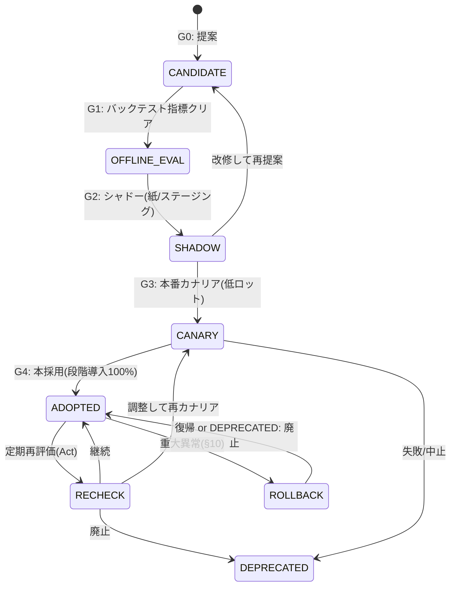
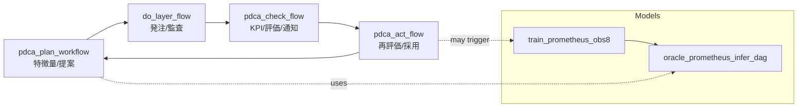

# ♻️ Strategy Lifecycle — Noctria Kingdom

**Version:** 1.0  
**Status:** Draft → Adopted (when merged)  
**Last Updated:** 2025-08-12 (JST)

> 目的：戦略の**生成 → 評価 → 採用 → 監視 → 廃止**を標準化し、Noctria の PDCA を高速かつ安全に回す。  
> 参照：`../governance/Vision-Governance.md` / `../architecture/Architecture-Overview.md` / `../operations/Runbooks.md` / `../operations/Airflow-DAGs.md` / `../operations/Config-Registry.md` / `../qa/Testing-And-QA.md` / `../security/Security-And-Access.md`

---

## 1. 定義とスコープ
- **戦略（Strategy）**：売買ルール/推論モデル/ロット決定ロジックの組み合わせ。  
- **候補（Candidate）**：Plan/Models の提案直後で、実運用未適用の状態。  
- **採用（Adopted）**：本番トラフィック/ロットを受けている状態。  
- **廃止（Deprecated）**：無効化済みだが復元可能なアーカイブ状態。

---

## 2. ライフサイクル全体像


---

## 3. 役割とRACI（要約）
| フェーズ | R（実行） | A（最終責任） | C（相談） | I（通知） |
|---|---|---|---|---|
| 提案（G0） | Veritas/Aurus/Prometheus | King | Noctus/Hermes | Ops |
| オフライン評価（G1） | Models/Check | King | Noctus/Hermes | Ops |
| シャドー（G2） | Ops/Models | King | Noctus/Hermes | 全員 |
| カナリア導入（G3） | Ops | King | Noctus/Hermes | 全員 |
| 本採用/段階導入（G4） | Ops | King | Noctus/Hermes | 全員 |
| 再評価/廃止 | Risk(Noctus)/Ops | King | Hermes/Models | 全員 |

> RACI原則は `../governance/Vision-Governance.md` §3.4 を正とする。

---

## 4. フェーズ詳細とゲート基準

### 4.1 G0: 提案（Candidate 登録）
- **インプット**：特徴量DF、設計メモ、学習設定、初期KPI見込み  
- **アーティファクト**：`strategy_proposal.md`（テンプレ §12.1）  
- **必須**：Hermes の説明要約（仮）、データリーク検証手順  
- **DAG/運用**：`pdca_plan_workflow` 完了後に起案

### 4.2 G1: オフライン評価（Backtest/WFO）
- **要件（最低基準 例）**  
  - `Sharpe (Test) >= 1.0`  
  - `MaxDD <= 10%`  
  - `WinRate >= 0.52`  
  - 取引数 `>= 200` / 市況バランスOK  
- **検証**：WFO、手数料/スリッページ込み、乱数シード複数  
- **アーティファクト**：`eval_report.json`、再現スクリプト  
- **通過条件**：Noctus リスク観点レビュー + Hermes 説明（確証度）

### 4.3 G2: シャドー（紙/ステージング）
- **方法**：本番相当データで**紙運用**（発注はしない） or `stg` 低ロット  
- **期間**：最低 10 営業日  
- **合否**：`kpi_summary.json` が G1 のレンジ内、重大リスクイベント無し

### 4.4 G3: カナリア導入（本番 低ロット）
- **配分**：`7% → 30% → 100%`（各3日、問題無ければ昇格）  
- **Safemode**：`risk_safemode: true`（Noctus境界を**半分**）  
- **中止条件**：連敗閾値/スリッページ閾値超過、MaxDDアラート、Hermes説明不整合

### 4.5 G4: 本採用（Adopted）
- **条件**：カナリア全ステップ基準クリア、Runbooks/Release-Notes 更新  
- **監視**：EoD で KPI 集計（`pdca_check_flow`）→ Act 層にフィードバック  
- **ドキュメント**：`strategy_release.json` 登録（§8）

### 4.6 再評価/廃止（Act）
- **トリガ**：MaxDD 閾値の 70% 到達、勝率低下、Regime Shift 検知、インシデント  
- **選択**：調整→再カナリア / 一時停止 / 廃止（アーカイブ）  
- **手順**：`Runbooks.md §8（ロールバック）` と `Incident-Postmortems.md`

---

## 5. 定量ゲート一覧（推奨値）
| 指標 | G1: Offline | G2: Shadow | G3: Canary | G4: Adopted（維持条件） |
|---|---:|---:|---:|---:|
| Sharpe (Test/期間) | ≥ 1.0 | ≥ 0.9 | ≥ 0.9 | ≥ 0.8 |
| MaxDD | ≤ 10% | ≤ 10% | ≤ 8% (Safemode) | ≤ 12% |
| WinRate | ≥ 0.52 | ≥ 0.50 | ≥ 0.50 | ≥ 0.50 |
| Slippage超過率 | — | — | ≤ 5% | ≤ 8% |
| 連敗数（閾値） | — | — | ≤ 連敗閾値 | ≤ 連敗閾値 |
> 例値。実際の閾値は `../operations/Config-Registry.md` の `risk_policy`/`observability.alerts` を正とする。

---

## 6. PDCA と Airflow の接続


---

## 7. A/B・シャドー運用の標準
- **シャドー**：本番入力に対して**発注しない**で KPI 記録（`shadow=true`）  
- **A/B**：**トラフィック/ロット配分**で比較（例：新 30% / 旧 70%）  
- **統計**：ブートストラップCI、勝率差の有意性、実質的有効サイズの確認  
- **期間**：最低 10 営業日 or 200 取引いずれか先

---

## 8. アーティファクト & レジストリ（必須保存物）
- **リリースメタ**：`strategy_release.json`（SemVer / 配分 / 関連モデル）  
- **評価レポート**：`eval_report.json`（閾値・KPI・分布）  
- **説明**：Hermes の説明要約（決定要因・逆風/順風）  
- **監査**：`audit_order.json`（Do層、**全件**）

```json
{
  "name": "Prometheus-PPO",
  "version": "1.2.0",
  "released_at": "2025-08-12T10:00:00Z",
  "traffic_share": {"prod": {"canary": 0.3, "stable": 0.7}},
  "model": {"id": "prometheus/1.2.0", "features": "feature_spec.json"},
  "risk_policy_ref": "config/prod.yml#risk_policy",
  "kpi_gate": {"sharpe": 0.9, "max_dd": 0.08, "win_rate": 0.5},
  "explain": {"summary": "ボラ上昇局面で優位。低流動時は抑制。"},
  "adr": "../adrs/ADR-20250812-prometheus-ppo-upgrade.md"
}
```

---

## 9. バージョニング & 段階導入
- **SemVer**：`MAJOR.MINOR.PATCH`（互換性/挙動の変化度で決定）  
- **段階導入**：`7% → 30% → 100%`（各3営業日、問題なければ昇格）  
- **互換性**：同一MAJOR 内でロールバック可能に設計

---

## 10. ロールバック/停止（運用）
- **全停止**：`flags.global_trading_pause=true`（即時抑制）  
- **段階ロールバック**：直前安定版へ配分戻し → KPI 回復確認  
- **インシデント**：`../incidents/Incident-Postmortems.md` に**24h以内**に草案  
- **再開**：Safemode のまま低ロットで再開 → 監視強化

---

## 11. 安全・リスク（Non-Negotiables）
1. Noctus の **リスク境界越境禁止**（`max_drawdown_pct`, `stop_loss_pct`, `take_profit_pct`）  
2. **監査ログ必須**（発注/約定/修正は `audit_order.json` に全件保存）  
3. 重要変更は **ADR** 作成（`../adrs/`）  
4. 運用変更は **Runbooks** 更新を同一PRで行う

---

## 12. テンプレ集

### 12.1 Proposal（提案）テンプレ
```md
# Strategy Proposal — {Name}
- 起案者/日付/Issue: #
- 目的:
- 戦略概要（手法/前提/相場観）:
- データ/特徴量（リーク対策含む）:
- ハイパラ/学習設定:
- 期待KPI（範囲）:
- リスク観点（Noctus所見）:
- Hermes説明（要因/弱点/想定逆風）:
- 実装/評価/運用計画（DAG/期間/配分）:
- ロールバック計画:
```

### 12.2 Release（採用）テンプレ
```md
# Strategy Release — {Name} v{X.Y.Z}
- 承認者: King / 参画: Council
- 配分: 7%→30%→100%（各3営業日）
- KPIゲート: Sharpe>=0.9, MaxDD<=8%, WinRate>=0.5
- 監視: pdca_check_flow（EoD）, 強化期間=7日
- ADR: ../adrs/ADR-YYYYMMDD-{slug}.md
- 変更点/互換性/影響:
- ロールバック条件:
```

### 12.3 Deprecation（廃止）テンプレ
```md
# Strategy Deprecation — {Name} v{X.Y.Z}
- 目的/背景:
- 廃止理由（KPI低下/リスク/重複/技術負債）:
- 代替戦略/移行計画:
- アーカイブ保存物（モデル/設定/監査）:
- 影響範囲/完了条件:
```

---

## 13. テスト & 品質（QA）
- **単体/統合**：`../qa/Testing-And-QA.md` に従う  
- **データ品質**：欠損/外れ値/時間整合の自動チェック  
- **再現性**：学習・推論・評価のコマンドを残す（シード固定）

---

## 14. 可観測性（Observability）
- KPI 出力：`kpi_summary.json`（Check層）  
- アラート：`observability.alerts` の閾値（`Config-Registry.md`）  
- ダッシュボード：GUI の PDCA Summary / Grafana（任意）

---

## 15. 変更履歴（Changelog）
- **2025-08-12**: 初版作成（フェーズ/Gates/Artifacts/AB/Rollback/Templates）

