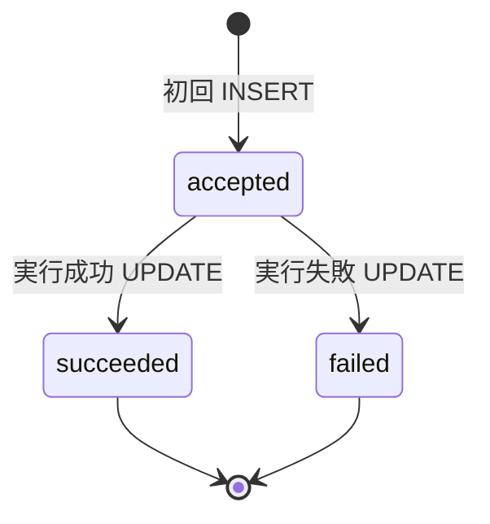

# Observability: Idempotency Ledger（設計と運用）
**Last Updated:** 2025-08-24 (JST)  
**Owner:** Do-Layer / SRE

---

## 0. 目的
`/do/order` の幂等挙動を一元的に管理・監査するための **idempo_ledger**（PGテーブル）の設計・運用指針。

- 参照: `../apis/Do-Layer-OrderAPI-Spec.md`
- 参照: `../architecture/contracts/ExecResult.md`

---

## 1. スキーマ要点
| カラム | 型 | 必須 | 説明 |
|---|---|---|---|
| `idempotency_key` | TEXT, PK | ✓ | 冪等キー（一意） |
| `request_digest` | TEXT | ✓ | 正規化リクエストの SHA-256 |
| `result_digest` | TEXT |  | 正規化結果の SHA-256 |
| `status` | TEXT | ✓ | `accepted | succeeded | failed` |
| `http_status` | INT | ✓ | 最終応答 HTTP |
| `response_payload_json` | JSONB |  | 前回の ExecResult（200再送用） |
| `first_seen_at` | TIMESTAMPTZ | ✓ | 初回記録 |
| `last_seen_at` | TIMESTAMPTZ | ✓ | 最終更新 |
| `expires_at` | TIMESTAMPTZ | ✓ | TTL（48h 推奨） |

> DDL は `migrations/20250824_add_idempo_ledger.sql` を参照。

---

## 2. ライフサイクル（状態遷移）

### 2.1 再送時のルール
- 同一キー **完全一致**: `status in (accepted, succeeded, failed)` でも **200** で前回結果返却（`succeeded` のみ再利用）。  
- 同一キー **差分あり**: **409** を返却。`request_digest` 不一致をログ出力。

---

## 3. 監視・可視化
- カウンタ
  - `idempotency_conflicts_total`（409 発生数）
  - `idempo_ledger_writes_total{status}`（accepted/succeeded/failed）
- ゲージ
  - `idempo_ledger_rows`
- ダッシュボード
  - 409 の推移、クライアント別の発生上位
  - 状態別件数と滞留

---

## 4. TTL & クリーンアップ
- 推奨 TTL: **48h**（取引決済やクライアント再送の許容時間に合わせる）
- クリーニング: 毎時 `DELETE FROM idempo_ledger WHERE expires_at < now();`
  - Airflow DAG または cron で運用
  - 削除前に `status='failed'` のうち 409 が多いキーをレポート

---

## 5. 運用ベストプラクティス
- `response_payload_json` は **機微情報を含めない**（正準 ExecResult）
- `result_digest` を保存して**再送 200 の同一性根拠**に使う
- ログには `idempotency_key` を**ハッシュ化**して出す（生値は避ける）

---

## 6. 変更履歴
- **2025-08-24**: 初版
