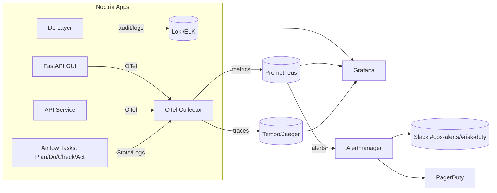

# 👁️ Observability — Noctria Kingdom

**Version:** 1.0  
**Status:** Draft → Adopted (when merged)  
**Last Updated:** 2025-08-12 (JST)

> 目的：Noctria の PDCA（Plan/Do/Check/Act）および運用全体を、**見える・わかる・直せる**状態に保つ。  
> 参照：`../governance/Vision-Governance.md` / `../operations/Runbooks.md` / `../operations/Airflow-DAGs.md` / `../operations/Config-Registry.md` / `../security/Security-And-Access.md` / `../apis/API.md` / `../apis/Do-Layer-Contract.md`

---

## 1. スコープ & ゴール
- **Signals**：Logs（構造化JSON）、Metrics（Prometheus）、Traces（OpenTelemetry）を**三本柱**で収集。  
- **Coverage**：Airflow（DAG/Task）, Plan/Do/Check/Act, GUI/API, Broker I/F, 評価/KPI パイプライン。  
- **Goals**  
  1) 失敗・遅延・逸脱を**5分以内に検知**（p95）  
  2) 問題の**原因箇所を1 hop以内**に特定（correlation_id）  
  3) インシデントの**再発防止**に繋がる証跡（audit & KPI）

---

## 2. スタック構成（概念図）


---

## 3. シグナルの定義（Logs / Metrics / Traces）

### 3.1 Logs（構造化 JSON）
- **必須フィールド**：`ts, level, msg, component, correlation_id, env, git`  
- **推奨フィールド**：`order_id, dag_id, task_id, strategy, symbol, duration_ms, status, user`  
- **例（Do層: 発注成功）**
```json
{
  "ts": "2025-08-12T06:58:05Z",
  "level": "INFO",
  "component": "do.order_execution",
  "msg": "order filled",
  "correlation_id": "6f1d3b34-...-a9f7",
  "order_id": "SIM-20250812-0001",
  "symbol": "BTCUSDT",
  "side": "BUY",
  "filled_qty": 0.5,
  "avg_price": 59001.0,
  "slippage_pct": 0.18,
  "env": "prod",
  "git": "abc1234"
}
```
> **PII/Secrets 禁止**。必要なら**ハッシュ化**または**伏字**（`Security-And-Access.md`）。

### 3.2 Metrics（Prometheus）
- **名前規約**：`<domain>_<object>_<measure>[_seconds/_total/_gauge]`  
- **共通ラベル**：`env, service, component, strategy, symbol, dag_id, task_id`  
- **例**  
  - `airflow_dag_sla_miss_total{dag_id="pdca_check_flow"}`  
  - `do_orders_submitted_total{strategy="Prometheus-PPO",symbol="BTCUSDT"}`  
  - `do_order_latency_seconds_bucket{le="0.5"}`（Histogram）  
  - `risk_events_total{kind="LOSING_STREAK",severity="HIGH"}`  
  - `broker_api_errors_total{exchange="example"}`

### 3.3 Traces（OpenTelemetry）
- **Span 名**：`plan.collect`, `plan.features`, `do.execute_order`, `do.wait_fill`, `check.evaluate_kpis`, `api.POST /do/orders`  
- **Span 属性**：`correlation_id, order_id, strategy, symbol, dag_id, task_id, env`  
- **伝播**：HTTP `traceparent` + `X-Correlation-ID` を**全Hopで引継ぎ**。

---

## 4. メトリクス・リファレンス（抜粋）
| Metric | Type | Labels（抜粋） | 意味/用途 |
|---|---|---|---|
| `airflow_dag_runs_total` | counter | `dag_id,status` | DAG 実行回数（status: success/failed） |
| `airflow_dag_sla_miss_total` | counter | `dag_id` | SLAミス回数（Alert対象） |
| `airflow_task_duration_seconds` | histogram | `dag_id,task_id,status` | タスク所要時間 |
| `plan_features_duration_seconds` | histogram | `symbol,tf` | 特徴量生成のレイテンシ |
| `do_orders_submitted_total` | counter | `strategy,symbol,side` | 発注受付数 |
| `do_order_latency_seconds` | histogram | `strategy,symbol` | Do層のp95監視 |
| `do_slippage_pct` | histogram | `strategy,symbol` | スリッページ分布（Alert対象） |
| `risk_events_total` | counter | `kind,severity` | リスクイベント件数 |
| `check_kpi_jobs_total` | counter | `status` | KPI集計の実行状況 |
| `kpi_win_rate` | gauge | `strategy` | 直近期間の勝率（GUI注釈用） |
| `kpi_max_dd_pct` | gauge | `strategy` | 直近期間の最大DD |
| `broker_api_latency_seconds` | histogram | `exchange,endpoint` | ブローカーAPIの遅延 |
| `broker_api_errors_total` | counter | `exchange,code` | ブローカーエラー発生数 |

> アラート閾値は原則 `../operations/Config-Registry.md` の `observability.alerts` を**正**とする。

---

## 5. アラートポリシー（Prometheus Rules）
- 方針：**短期ノイズに鈍感 / 本質的逸脱に敏感**（rate, percentile, for: を活用）。  
- 送信先：Slack `#ops-alerts`（運用）, `#risk-duty`（リスク）, PagerDuty（重大）。

```yaml
# deploy/alerts/noctria.rules.yml
groups:
  - name: airflow
    rules:
      - alert: DAGFailureRateHigh
        expr: |
          (sum(increase(airflow_dag_runs_total{status="failed"}[5m])) by (dag_id))
          /
          clamp_min(sum(increase(airflow_dag_runs_total[5m])) by (dag_id), 1)
          > (0.05)  # Config-Registry: observability.alerts.dag_fail_rate_pct
        for: 10m
        labels: {severity: warning}
        annotations:
          summary: "Airflow DAG failure rate > 5% ({{ $labels.dag_id }})"
          runbook: "docs/operations/Runbooks.md#9-1-airflow-スケジューラ停止"

  - name: do-layer
    rules:
      - alert: DoLayerLatencyHigh
        expr: histogram_quantile(0.95, sum(rate(do_order_latency_seconds_bucket[5m])) by (le)) > 0.5
        for: 5m
        labels: {severity: critical}
        annotations:
          summary: "Do-layer p95 latency > 0.5s"
          runbook: "docs/operations/Runbooks.md#5-airflow-運用dag操作の定石"

      - alert: SlippageSpike
        expr: histogram_quantile(0.90, sum(rate(do_slippage_pct_bucket[10m])) by (le)) > 0.3
        for: 10m
        labels: {severity: critical}
        annotations:
          summary: "Slippage 90p > 0.3% (spike)"
          action: "必要に応じて global_trading_pause を検討（Config-Registry.flags）"

      - alert: TradingPausedUnexpected
        expr: |
          max_over_time(flags_global_trading_pause[15m]) == 1
          and on() (hour() >= 1 and hour() <= 23)  # 時間帯は環境に応じ調整
        for: 15m
        labels: {severity: warning}
        annotations:
          summary: "Trading pause が継続中"
          action: "再開判断 or インシデント起票"

  - name: risk
    rules:
      - alert: LosingStreakThreshold
        expr: sum(increase(risk_events_total{kind="LOSING_STREAK"}[30m])) by (severity) > 0
        for: 0m
        labels: {severity: critical}
        annotations:
          summary: "Losing streak detected"
          action: "Safemode維持/強化、Runbooks参照"

  - name: kpi
    rules:
      - alert: KpiSummaryStale
        expr: time() - max(kpi_summary_timestamp_seconds) > 3600
        for: 10m
        labels: {severity: warning}
        annotations:
          summary: "KPI summary not updated > 1h"
          runbook: "docs/operations/Runbooks.md#9-3-kpi-未生成check層"
```

---

## 6. ダッシュボード設計（Grafana）
- **Top: PDCA Overview**  
  - PDCA DAG 状況（成功/失敗, SLAミス, 実行時間p95）  
  - Do-layer Latency p95 / Slippage p90  
  - Risk Events（kind×severity の heatmap）  
  - KPI（win_rate, max_dd_pct） by strategy  
- **ページ別**  
  - **Airflow**：DAG/Task Durations, Failures, Backfills  
  - **Do**：Latency・Slippage・Broker API Latency/Errors  
  - **Models**：推論レイテンシ/σ分布、モデルID別  
  - **KPI**：期間選択（7d/30d）で戦略横断比較

**PromQL 例**
```promql
# Do-layer latency p95
histogram_quantile(0.95, sum(rate(do_order_latency_seconds_bucket[5m])) by (le, strategy))

# Slippage p90 by symbol
histogram_quantile(0.90, sum(rate(do_slippage_pct_bucket{symbol=~"BTCUSDT|ETHUSDT"}[10m])) by (le, symbol))

# Airflow DAG SLA misses (last 24h, top 5)
topk(5, increase(airflow_dag_sla_miss_total[24h]))
```

**Grafana 注釈（インシデント/採用リリース）**
- `annotations` を API から投入：`/api/annotations`（内容：release_id, strategy, version, incident_id）  
- 例：Adopt 7%→30%→100% の**段階導入**ラインをタイムチャートへ表示。

---

## 7. ログ収集 & クエリ（Loki/ELK）
- **取り込み**：アプリから `stdout` JSON を収集（Docker driver / Promtail）。  
- **保存**：`/data/logs/YYYYMMDD/*.log`（ローカル）＋ 集約基盤（Loki/ELK）。  
- **LogQL 例**
```bash
# 直近のDo層エラー
{component="do.order_execution", level="ERROR"} |= "RISK_BOUNDARY_EXCEEDED"

# 戦略ごとの発注ログ集計
sum by (strategy) (count_over_time({component="do.order_execution"}[1h]))
```

---

## 8. トレーシング（OTel）
**コンフィグ例（Collector）**
```yaml
receivers:
  otlp:
    protocols: {http: {}, grpc: {}}

exporters:
  prometheus: {endpoint: "0.0.0.0:9464"}
  otlp:
    endpoint: "tempo:4317"
    tls: {insecure: true}

processors:
  batch: {}
  attributes:
    actions:
      - key: correlation_id
        from_context: X-Correlation-ID
        action: upsert

service:
  pipelines:
    traces: {receivers: [otlp], processors: [batch, attributes], exporters: [otlp]}
    metrics: {receivers: [otlp], processors: [batch], exporters: [prometheus]}
```
- **実装要点**：API/GUI/タスク内で `X-Correlation-ID` を**生成→伝播**。ログにも同値を出力して**相互参照**可能にする。

---

## 9. Airflow 連携
- **メトリクス**：Airflow の Prometheus エクスポートを**有効**にし、`/metrics` を収集。  
- **タグ**：`dag_id, task_id, owner` を**ラベル化**。  
- **Runbook**：失敗→ `Runbooks.md §9.1`、バックフィル→ `§12`。

---

## 10. KPI パイプラインの観測
- **Input**：`/data/execution_logs/*.json`（Do → Check）  
- **Process**：`check.evaluate_kpis` → `kpi_summary.json`（timestamp を**メトリクス化**：`kpi_summary_timestamp_seconds`）  
- **Output**：GUI / ダッシュボード。  
- **アラート**：`KpiSummaryStale`（§5）。

---

## 11. SLO / Error Budget（例）
| サービス | 指標 | 目標（30日） | 計測方法 |
|---|---|---|---|
| Do-layer | p95 latency | ≤ 500ms | `do_order_latency_seconds` |
| Airflow | DAG成功率 | ≥ 99% | `airflow_dag_runs_total`（成功/失敗） |
| KPI更新 | 更新遅延 | ≤ 60分 | `kpi_summary_timestamp_seconds` |
| Broker I/F | エラー率 | ≤ 1% | `broker_api_errors_total / requests_total` |

> 逸脱時は**エラーバジェット消費**を可視化し、変更凍結や Safemode 維持を検討。

---

## 12. セキュリティ & プライバシー
- Logs へ**Secrets/PII を出力禁止**。必要なら**hash/伏字**。  
- 監査ログ（`audit_order.json`）は**完全性維持**（改変不可ストレージ推奨）。  
- 可観測基盤へのアクセスは `Security-And-Access.md` の最小権限/監査を適用。

---

## 13. テスト / 変更管理
- **テスト**：ダミー生成器でメトリクス/ログ/アラートを**リハーサル**。  
- **CI**：Prometheus Rule/Loki LogQL の**静的チェック**。  
- **変更**：ダッシュボード/ルール更新は**同一PR**で `Runbooks.md` の運用差分を更新。

---

## 14. よくある質問（FAQ）
- **Q:** KPIが更新されないのにメトリクスは正常？  
  **A:** `check.evaluate_kpis` タスクのログと `kpi_*` メトリクスを参照。`KpiSummaryStale` ルールを確認。  
- **Q:** 取引停止フラグが自動でONになった？  
  **A:** `SlippageSpike`/`LosingStreakThreshold` の発火履歴と `flags_global_trading_pause` を確認。

---

## 15. 変更履歴（Changelog）
- **2025-08-12**: 初版作成（Signals/Rules/Dashboards/Tracing/SLO/セキュリティ）
