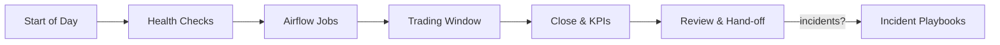

# 🧭 Runbooks — Noctria Kingdom Operations

**Version:** 1.0  
**Status:** Draft → Adopted (when merged)  
**Last Updated:** 2025-08-12 (JST)

> 目的：本番/検証環境での**日次運用・障害対応・変更適用**を、誰が読んでも同じ品質で実行できるようにする。  
> 関連：`../governance/Vision-Governance.md`, `../architecture/Architecture-Overview.md`, `../observability/Observability.md`, `../operations/Airflow-DAGs.md`, `../operations/Config-Registry.md`, `../security/Security-And-Access.md`

---

## 1. 対象範囲と前提
- 対象：Airflow、GUI(FastAPI)、戦略実行(Do層)、学習/評価(Plan/Check/Act) の日次運用と障害対応
- 対応環境：`prod` / `stg` / `dev`
- 前提：
  - アクセス権限は `Security-And-Access.md` の最小権限を満たすこと
  - 設定値は `../operations/Config-Registry.md` を正として変更すること
  - 重要判断は `../governance/Vision-Governance.md` の RACI / ガードレールに従うこと

---

## 2. サマリ（運用フロー）


---

## 3. 日次運用チェックリスト（SoD / EoD）

### 3.1 Start of Day（SoD, 市場前）
- [ ] Airflow `scheduler` / `webserver` / `worker` が起動（`/health` 200）  
- [ ] GUI `/healthz` が 200  
- [ ] 機密情報の期限（トークン/証明書）に警告なし  
- [ ] 前日の `exec_result` / `risk_event` の取り込み済み  
- [ ] **取引抑制フラグ** (`global_trading_pause`) = `false` を確認（本番のみ）

### 3.2 End of Day（EoD, 市場後）
- [ ] `pdca_check_flow` 実行完了（KPI生成）  
- [ ] `pdca_summary` 生成 → GUIに反映  
- [ ] 失敗DAGの再実行は **3回まで**。超えたらインシデント扱い  
- [ ] バックアップ/スナップショット完了確認  
- [ ] 次営業日のイベント/祝日設定を確認（Config-Registry）

---

## 4. スタック起動/停止（標準手順）
> 実コマンドは環境に合わせて `compose`/`systemd` を選択。以下は例。

```bash
# 起動
docker compose -f deploy/prod/docker-compose.yml up -d airflow-scheduler airflow-webserver airflow-worker gui

# 停止（計画停止時）
docker compose -f deploy/prod/docker-compose.yml stop gui
docker compose -f deploy/prod/docker-compose.yml stop airflow-worker airflow-webserver airflow-scheduler

# ログ
docker compose -f deploy/prod/docker-compose.yml logs -f airflow-scheduler
```

---

## 5. Airflow 運用（DAG操作の定石）
- DAG 一覧/依存は `../operations/Airflow-DAGs.md` を参照
- 原則：
  - **再実行は idempotent** に設計（副作用がある場合は Runbook に明記）
  - 失敗時の**自動リトライ回数**と**手動再実行手順**を統一

```bash
# DAGの有効化/無効化
airflow dags pause  train_prometheus_obs8
airflow dags unpause pdca_check_flow

# バックフィル（UTC基準）
airflow dags backfill -s 2025-08-01 -e 2025-08-12 pdca_check_flow

# 失敗タスクのクリア（依存含む）
airflow tasks clear -t <task_id> -s 2025-08-12 -e 2025-08-12 -y pdca_check_flow
```

---

## 6. 取引の一時停止/再開（グローバル抑制）
**目的**：異常検知・市場急変時に**全戦略の発注を即時停止**する。

```bash
# 抑制フラグ ON
./ops/tools/toggle_trading_pause.sh --env prod --on

# 抑制フラグ OFF（再開）
./ops/tools/toggle_trading_pause.sh --env prod --off
```

- 反映先：`Config-Registry.md` の `risk_policy.global_trading_pause`  
- GUI でも `/ops/pause` から切替可（権限必要）

---

## 7. 新規戦略の本番導入（Deploy/Adopt）
**前提**：`Strategy-Lifecycle.md` の承認済み、`Noctus` リスク審査OK、`Hermes` 説明文あり。

1. ステージングで 3 営業日 A/B 検証（`pdca_recheck.py` → KPI比較）  
2. King 承認後、本番に **低ロット** で段階導入（7→30→100%）  
3. `pdca_push.py` でバージョン採用 → `Release-Notes.md` 更新  
4. 監視（Lookback 24h）は「強化モード」（閾値半分）  
5. 重大異常があれば **§6 の抑制** で即停止 → インシデントへ

---

## 8. ロールバック（段階的復帰）
- 即時停止：§6 の抑制フラグ ON  
- 段階ロールバック：
  1) 最新戦略を無効化 → 直前安定版に切替  
  2) 影響データを除外フラグでマーキング  
  3) KPI を再集計し回復を確認  
- 完了後、`Incident-Postmortems.md` に発生から復帰までを記録

---

## 9. 障害対応プレイブック（種類別）

### 9.1 Airflow スケジューラ停止
症状：DAGが走らない、Web UIに `scheduler down`  
対処：
1) `systemctl status airflow-scheduler` / コンテナログ確認  
2) DB 接続/メッセージブローカーの死活確認  
3) `airflow db check` → 失敗なら `airflow db migrate` / 再起動  
4) 再開後に、失敗期間をバックフィル（§5）

### 9.2 発注遅延/約定異常（Do層）
症状：`exec_result.json` が遅延/異常値  
対処：
1) ブローカー疎通 `broker_adapter` ログ確認  
2) スリッページ閾値 > 実績？ オーバーなら自動停止トリガ  
3) 連敗閾値超過→ `risk_event.json` → 抑制フラグON（§6）

### 9.3 KPI 未生成（Check層）
症状：ダッシュボードが更新されない  
対処：
1) `pdca_check_flow` 失敗タスクをクリア→再実行  
2) 原因がデータ欠損なら `Plan-Layer` のリカバリ手順へ  
3) 復旧後、`pdca_summary` を手動実行

---

## 10. バックアップ & リストア
- バックアップ対象：
  - `pdca_logs/**/*.json`（監査・評価・KPI）
  - 戦略リリースメタ（`strategy_release.json`）
  - 学習済みモデル（`/models/**`）
  - 設定（`Config-Registry`）
- 頻度：日次（EoD），重要DAG実行後のスナップショット
- リストア手順（概略）：
  1) 対象日のスナップショットをマウント  
  2) 監査ログ→`exec_result`再構成（必要時）  
  3) `pdca_check_flow` をバックフィル実行

---

## 11. 機密/アクセス（運用観点）
- 秘密は **環境変数 or Vault**。平文ファイル禁止  
- アクセス権は **最小権限**＋**監査ログ**を有効化  
- 運用者の権限変更は `Security-And-Access.md` の申請フロー必須

---

## 12. メンテナンスウィンドウ
- 定例：毎週 火曜 02:00–03:00 JST（本番）  
- 内容：OSパッチ/ライブラリアップデート/DBメンテ  
- 影響：取引停止→GUIバナー表示→完了後の健全性チェック必須

---

## 13. 変更管理（運用手順への反映）
- 重要変更は **必ず同一PRで Runbooks を更新**  
- 承認フロー：`Vision-Governance.md` の RACI に従う  
- 採用後：`Release-Notes.md` と `CHANGELOG` を更新

---

## 14. 監視・アラート閾値（要点）
- 主要メトリクスと閾値は `../observability/Observability.md` を正とする  
- 代表：
  - **DAG 失敗率**：> 5%（5分間） → Pager  
  - **スリッページ**：閾値超過 3 回/10 分 → 取引抑制  
  - **連敗数**：ポリシー超過 → 取引抑制＋インシデント起票

---

## 15. テンプレ & ショートカット

### 15.1 手順テンプレ（新規Runbook条項）
```md
## {手順名}
- 目的:
- 前提:
- 手順:
- ロールバック:
- 検証/完了条件:
- 監査ログ/保存先:
```

### 15.2 よく使うコマンド集
```bash
# Airflow 健全性
curl -s http://localhost:8080/health

# 直近失敗タスク一覧
airflow tasks list pdca_check_flow --tree
airflow tasks failed --since 1d

# GUI 健全性
curl -s http://localhost:8000/healthz
```

### 15.3 連絡・エスカレーション（運用表）
| 種別 | 連絡先 | 役割 |
|---|---|---|
| On-call Ops | #ops-oncall | 一次対応 |
| Risk Duty (Noctus) | #risk-duty | リスク判断 |
| Council | #council | 重要決定 |
| King | #king | 最終承認 |

---

## 16. 既知の課題（Known Issues）
- Airflow バックフィルで高頻度 I/O が発生 → ストレージ IOPS 制限に注意
- 一部ブローカーのテスト環境でレート制限が厳格 → 夜間にまとめて検証

---

## 17. 変更履歴（Changelog）
- **2025-08-12**: 初版作成（SoD/EoD, 抑制/導入/ロールバック, 障害, 監視, テンプレ）

