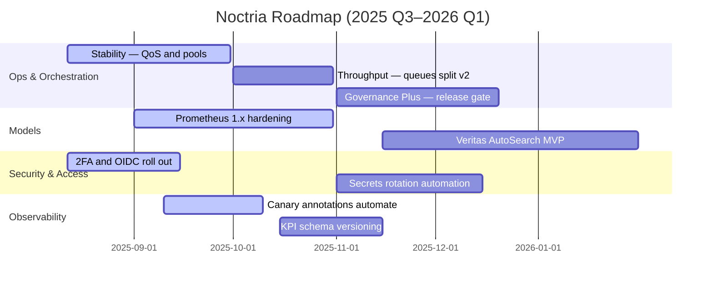

# 🗺 Roadmap & OKRs — Noctria Kingdom
<!-- AUTODOC:BEGIN mode=git_log path_globs=docs/roadmap/*.md title=OKR/ロードマップ更新履歴（最近30） limit=30 since=2025-08-01 -->
### OKR/ロードマップ更新履歴（最近30）

- **e79166f** 2025-08-16T00:51:44+09:00 — docs: full-wrap AUTODOC + sync from partials (by Veritas Machina)
  - `docs/00_index/00-INDEX.md`
  - `docs/00_index/00-INDEX.md.bak`
  - `"docs/Next Actions \342\200\224 Noctria PDCA Hardening Plan.md"`
  - `"docs/Next Actions \342\200\224 Noctria PDCA Hardening Plan.md.bak"`
  - `docs/Noctria_Kingdom_System_Design_v2025-08.md`
  - `docs/Noctria_Kingdom_System_Design_v2025-08.md.bak`
  - `docs/README.md`
  - `docs/README.md.bak`
  - `docs/_partials/apis/Do-Layer-Contract/01_scope_principles.md`
  - `docs/_partials/apis/Do-Layer-Contract/01_scope_principles.md.bak`
  - `docs/_partials/apis/Do-Layer-Contract/02_flow_overview.md`
  - `docs/_partials/apis/Do-Layer-Contract/02_flow_overview.md.bak`
  - `docs/_partials/apis/Do-Layer-Contract/03_entities_schemas.md`
  - `docs/_partials/apis/Do-Layer-Contract/03_entities_schemas.md.bak`
  - `docs/_partials/apis/Do-Layer-Contract/04_order_request.md`
  - `docs/_partials/apis/Do-Layer-Contract/04_order_request.md.bak`
  - `docs/_partials/apis/Do-Layer-Contract/05_exec_result.md`
  - `docs/_partials/apis/Do-Layer-Contract/05_exec_result.md.bak`
  - `docs/_partials/apis/Do-Layer-Contract/06_audit_order.md`
  - `docs/_partials/apis/Do-Layer-Contract/06_audit_order.md.bak`
- **51ddf2a** 2025-08-15T19:53:46+09:00 — docs: AUTODOCブロック挿入および本文更新 (by Veritas Machina)
  - `docs/00_index/00-INDEX.md`
  - `docs/00_index/00-INDEX.md.bak`
  - `docs/README.md`
  - `docs/README.md.bak`
  - `docs/_partials/apis/Do-Layer-Contract/01_scope_principles.md`
  - `docs/_partials/apis/Do-Layer-Contract/01_scope_principles.md.bak`
  - `docs/_partials/apis/Do-Layer-Contract/02_flow_overview.md`
  - `docs/_partials/apis/Do-Layer-Contract/02_flow_overview.md.bak`
  - `docs/_partials/apis/Do-Layer-Contract/03_entities_schemas.md`
  - `docs/_partials/apis/Do-Layer-Contract/03_entities_schemas.md.bak`
  - `docs/_partials/apis/Do-Layer-Contract/04_order_request.md`
  - `docs/_partials/apis/Do-Layer-Contract/04_order_request.md.bak`
  - `docs/_partials/apis/Do-Layer-Contract/05_exec_result.md`
  - `docs/_partials/apis/Do-Layer-Contract/05_exec_result.md.bak`
  - `docs/_partials/apis/Do-Layer-Contract/06_audit_order.md`
  - `docs/_partials/apis/Do-Layer-Contract/06_audit_order.md.bak`
  - `docs/_partials/apis/Do-Layer-Contract/07_financial_correctness.md`
  - `docs/_partials/apis/Do-Layer-Contract/07_financial_correctness.md.bak`
  - `docs/_partials/apis/Do-Layer-Contract/08_idempotency_concurrency.md`
  - `docs/_partials/apis/Do-Layer-Contract/08_idempotency_concurrency.md.bak`
- **7111b30** 2025-08-15T19:38:34+09:00 — docs: AUTODOCブロック挿入および本文更新 (by Veritas Machina)
  - `docs/00_index/00-INDEX.md`
  - `docs/00_index/00-INDEX.md.bak`
  - `docs/README.md`
  - `docs/README.md.bak`
  - `docs/_partials/apis/Do-Layer-Contract/01_scope_principles.md`
  - `docs/_partials/apis/Do-Layer-Contract/02_flow_overview.md`
  - `docs/_partials/apis/Do-Layer-Contract/03_entities_schemas.md`
  - `docs/_partials/apis/Do-Layer-Contract/04_order_request.md`
  - `docs/_partials/apis/Do-Layer-Contract/05_exec_result.md`
  - `docs/_partials/apis/Do-Layer-Contract/06_audit_order.md`
  - `docs/_partials/apis/Do-Layer-Contract/07_financial_correctness.md`
  - `docs/_partials/apis/Do-Layer-Contract/08_idempotency_concurrency.md`
  - `docs/_partials/apis/Do-Layer-Contract/09_error_codes.md`
  - `docs/_partials/apis/Do-Layer-Contract/10_samples_min.md`
  - `docs/_partials/apis/Do-Layer-Contract/11_contract_tests.md`
  - `docs/_partials/apis/Do-Layer-Contract/12_changelog.md`
  - `docs/adrs/ADRs.md`
  - `docs/adrs/ADRs.md.bak`
  - `docs/apis/Do-Layer-Contract.md`
  - `docs/apis/Do-Layer-Contract.md.bak`
- **30ae379** 2025-08-15T18:55:06+09:00 — 📄 AutoDoc: update docs from index (by Veritas Machina)
  - `action`
  - `data/decisions/ledger.csv`
  - `data/models/prometheus/PPO/obs8/latest`
  - `data/models/prometheus/PPO/obs8/manual__2025-08-11T14:18:10+00:00/metadata.json`
  - `data/models/prometheus/PPO/obs8/manual__2025-08-11T14:18:10+00:00/model.zip`
  - `data/models/prometheus/PPO/obs8/manual__2025-08-11T14:19:41+00:00/metadata.json`
  - `data/models/prometheus/PPO/obs8/manual__2025-08-11T14:19:41+00:00/model.zip`
  - `data/models/prometheus/PPO/obs8/manual__2025-08-11T14:22:19+00:00/metadata.json`
  - `data/models/prometheus/PPO/obs8/manual__2025-08-11T14:22:19+00:00/model.zip`
  - `data/models/prometheus/PPO/obs8/manual__2025-08-11T14:33:11+00:00/metadata.json`
  - `data/models/prometheus/PPO/obs8/manual__2025-08-11T14:33:11+00:00/model.zip`
  - `data/models/prometheus/PPO/obs8/manual__2025-08-11T15:44:05+00:00/metadata.json`
  - `data/models/prometheus/PPO/obs8/manual__2025-08-11T15:44:05+00:00/model.zip`
  - `data/models/prometheus/PPO/obs8/manual__2025-08-11T16:20:12.935706+00:00/metadata.json`
  - `data/models/prometheus/PPO/obs8/manual__2025-08-11T16:20:12.935706+00:00/model.zip`
  - `data/models/prometheus/PPO/obs8/manual__2025-08-11T16:21:36.023694+00:00/metadata.json`
  - `data/models/prometheus/PPO/obs8/manual__2025-08-11T16:21:36.023694+00:00/model.zip`
  - `data/models/prometheus/PPO/obs8/manual__2025-08-11T16:27:02.701382+00:00/metadata.json`
  - `data/models/prometheus/PPO/obs8/manual__2025-08-11T16:27:02.701382+00:00/model.zip`
  - `data/models/prometheus/PPO/obs8/manual__2025-08-11T17:21:59.539332+00:00/metadata.json`
- **d09c7ae** 2025-08-15T05:31:20+09:00 — docs: update from 00-INDEX.md sync (by Veritas Machina)
  - `docs/00_index/00-INDEX.md`
  - `docs/_generated/update_docs.log`
  - `docs/adrs/ADRs.md`
  - `docs/apis/API.md`
  - `docs/apis/Do-Layer-Contract.md`
  - `docs/apis/observability/Observability.md`
  - `docs/architecture/Architecture-Overview.md`
  - `docs/architecture/Plan-Layer.md`
  - `docs/governance/Coding-Standards.md`
  - `docs/governance/Vision-Governance.md`
  - `docs/incidents/Incident-Postmortems.md`
  - `docs/models/ModelCard-Prometheus-PPO.md`
  - `docs/models/Strategy-Lifecycle.md`
  - `docs/observability/Observability.md`
  - `docs/operations/Airflow-DAGs.md`
  - `docs/operations/Config-Registry.md`
  - `docs/operations/Runbooks.md`
  - `docs/qa/Testing-And-QA.md`
  - `docs/risks/Risk-Register.md`
  - `docs/roadmap/Release-Notes.md`
- **8021926** 2025-08-14T03:12:38+09:00 — Update Roadmap-OKRs.md (by Noctoria)
  - `docs/roadmap/Roadmap-OKRs.md`
- **1bd84f1** 2025-08-14T03:04:19+09:00 — Update Release-Notes.md (by Noctoria)
  - `docs/roadmap/Release-Notes.md`
- **c193ed7** 2025-08-12T16:09:23+09:00 — Roadmap-OKRs.md を更新 (by Noctoria)
  - `docs/roadmap/Roadmap-OKRs.md`
- **513e712** 2025-08-12T16:03:18+09:00 — Release-Notes.md を更新 (by Noctoria)
  - `docs/roadmap/Release-Notes.md`
- **1fc087b** 2025-08-12T03:04:38+09:00 — Create Roadmap-OKRs.md (by Noctoria)
  - `docs/roadmap/Roadmap-OKRs.md`
- **0757b67** 2025-08-12T03:04:22+09:00 — Create Release-Notes.md (by Noctoria)
  - `docs/roadmap/Release-Notes.md`
<!-- AUTODOC:END -->

**Document Version:** 1.1  
**Status:** Adopted  
**Planning Window:** 2025 Q3–2026 Q1  
**Last Updated:** 2025-08-14 (JST)

> 目的：Noctria の**中期ロードマップ**と**OKR（Objectives & Key Results）**を一元管理し、PDCA を継続的に前進させる。  
> 参照：`../governance/Vision-Governance.md` / `../architecture/Architecture-Overview.md` / `../operations/Runbooks.md` / `../operations/Airflow-DAGs.md` / `../operations/Config-Registry.md` / `../observability/Observability.md` / `../apis/Do-Layer-Contract.md` / `../risks/Risk-Register.md` / `./Release-Notes.md`

---

## 1) スコープ & 原則
- **スコープ**：機能 / 運用 / セキュリティ / モデル / 可観測性に跨る横断優先順位。  
- **原則**：
  1. **Guardrails First** — Noctus 境界 / 監査 / Secrets を期限より優先。  
  2. **Measure What Matters** — すべての KR を**観測可能メトリクス**に紐づける。  
  3. **Docs-as-Code** — 変更は**同一 PR で文書更新**し、`Release-Notes.md` へ反映。  
  4. **Small Safe Steps** — 段階導入（7%→30%→100%）を標準運用。  
  5. **Traceable by Design** — `trace_id` の E2E 貫通（Plan→Infer→Do→Exec）を前提化。

---

## 2) 時間軸・リリース計画（暫定）
- **2025.08 Foundation**：初版ドキュメント/契約/標準（※リリース済）  
- **2025.09 Stability**：運用耐性と監視強化、Do 層 QoS 安定  
- **2025.10 Throughput**：発注最適化 v2、Airflow キュー分離  
- **2025.12 Governance Plus**：Two-Person / 監査の自動化、セキュアリリースゲート  
- **2026.01 Alpha Models**：Prometheus 1.x 強化、Veritas 自動探索 MVP



> メモ：Mermaid の Gantt は GitHub 互換構文で記述（記号は ASCII、括弧は未使用）。

---

## 3) 戦略テーマ（Pillars）
1. **Reliability & Safety** — 失敗を早く検知し安全に止める  
2. **Execution Performance** — Do 層のレイテンシとスリッページ最適化  
3. **Model Excellence** — 再現性と優位性の持続（WFO / シャドー / 段階導入）  
4. **Security & Governance** — 最小権限・監査・Two-Person Rule の自動化  
5. **Dev Velocity** — テスト / CI と構成管理の摩擦低減

---

## 4) OKRs（2025 Q3–Q4 / 2026 Q1）
> スコア評価は **0.0–1.0**。`Owner` はロール名、計測は `Observability.md` のメトリクスを正。

### O-1 Reliability & Safety（Owner: Ops + Risk）
- **KR1.1**：`airflow_dag_success_rate`（月次）≥ **99.2%** を 2 か月連続で達成  
- **KR1.2**：重大アラートから**一次反応 ≤ 5m (p95)** を 30 日継続  
- **KR1.3**：`risk_policy` 越境による **実発注ゼロ**（0 件）  
- **KR1.4**：`KpiSummaryStale` アラート **0 件/週**（4 週平均）

### O-2 Execution Performance（Owner: Do）
- **KR2.1**：`do_order_latency_seconds` **p95 ≤ 0.40s**（prod、平日日中、14 日連続）  
- **KR2.2**：`do_slippage_pct` **p90 ≤ 0.30%** を 4 週連続達成（対象シンボル）  
- **KR2.3**：`broker_api_errors_total / requests_total ≤ 1%`（10m 窓、月次平均）

### O-3 Model Excellence（Owner: Models + Risk）
- **KR3.1**：Prometheus 1.x（stg シャドー）で **Sharpe_adj +5%**（対 2025.08 基準）  
- **KR3.2**：本番カナリア中（7%→30%）の **MaxDD ≤ 8%**（Safemode ON）  
- **KR3.3**：`sigma_mean` の逸脱監視を導入し、閾値越え**自動アラート稼働**

### O-4 Security & Governance（Owner: Sec + King）
- **KR4.1**：**Secrets in repo = 0**（gitleaks/CI 100% パス）  
- **KR4.2**：`Two-Person Gate` を `risk_policy` / `flags` / `API` / `Do-Contract` に適用（**4/4 完了**）  
- **KR4.3**：Secrets ローテ **90 日**の**自動通知 + Runbook 運用**が稼働（prod）

### O-5 Dev Velocity（Owner: Arch + Ops）
- **KR5.1**：PR → stg デプロイの **リードタイム中央値 ≤ 2h**  
- **KR5.2**：E2E スモーク（stg）**合格率 ≥ 95%**（直近 30 日）  
- **KR5.3**：契約/スキーマ破壊変更 **0 件**（`jsonschema` CI で検出ゼロ）

---

## 5) マイルストーン（Deliverables）
| 期限 | マイルストーン | 受け入れ基準（DoD） | Owner |
|---|---|---|---|
| 2025-09-30 | Stability 完了 | Pools/Queues 設計、SLA ダッシュ可視化、Runbook 改訂、KR1.1 初達成 | Ops |
| 2025-10-31 | Throughput 完了 | 発注最適化 v2、p95≤0.40s、スリッページ p90≤0.30% | Do |
| 2025-12-20 | Governance Plus 完了 | Two-Person Gate 自動化、監査 WORM、注釈連携 | Sec/Arch |
| 2026-01-31 | Alpha Models 完了 | Veritas MVP、Prometheus 1.x Gate 通過、段階導入 30% | Models |

---

## 6) 依存関係（Cross-Team / Docs）
- **Runbooks**：抑制度 / ロールバック / バックフィル手順の改訂（各変更と同一 PR）  
- **Config-Registry**：`flags` / `risk_policy` / `observability.alerts` の差分管理  
- **Observability**：Rules / ダッシュボード / 注釈 API（KR 計測ソース）  
- **Do-Layer-Contract**：最小互換での拡張（Breaking は `/v2` 案で ADR 起票）

---

## 7) リスク & 対応（抜粋）
| リスク | 影響 | 緩和策 | 出口条件 |
|---|---|---|---|
| ブローカー障害長期化 | 発注停止 / 機会損失 | 代替経路・指数バックオフ・抑制 | Error rate ≤1% を 7 日維持 |
| スキーマドリフト | 連携失敗 | `jsonschema` CI / 契約テスト | 連続 30 日 破壊ゼロ |
| モデル優位性劣化 | KPI 低下 | シャドー 10 日 / 段階導入 / 再学習 | G3/G4 Gate を再達成 |

> 詳細は `../risks/Risk-Register.md`（R-02 / R-03 / R-09 / R-08）参照。

---

## 8) 測定 & データソース（例）
| KR | メトリクス/クエリ | 粒度 | 出力先 |
|---|---|---|---|
| KR1.1 | `airflow_dag_runs_total{status}` → 成功率 | 日/週/月 | Grafana: Airflow Board |
| KR2.1 | `histogram_quantile(0.95, do_order_latency_seconds_bucket)` | 5 分 | Grafana: Do QoS |
| KR2.2 | `histogram_quantile(0.90, do_slippage_pct_bucket)` | 10 分 | Grafana: Do QoS |
| KR3.1 | `kpi_sharpe_adj{env="stg"}` | 1 日 | PDCA Summary |
| KR4.1 | gitleaks CI 結果（0 件） | PR 毎 | GitHub Checks |
| KR5.1 | CI timestamps（PR→Deploy） | PR 毎 | Pipeline Board |

---

## 9) ガバナンス & カデンス
- **Weekly Council**：OKR 進捗 / リスク / ブロッカーのレビュー（30 分）  
- **Monthly Review**：スコア暫定評価、優先順位再配置、`Release-Notes.md` 更新  
- **Quarter Close**：スコア確定（0.0–1.0）、次期 OKR 起案、必要な ADR を確定

---

## 10) 変更管理（運用）
- 変更は**同一 PR**で：コード＋ Docs（本書 / Runbooks / Config / Observability / API / Contract）。  
- 破壊的変更は **ADR 必須**（`adrs/`）、`Release-Notes.md` の **Breaking** に明記。  
- マイルストーン達成時は `Release-Notes.md` に**リリース名**と**要点**を追記。

---

## 11) スコアリング規約（OKR Rubric）
- **0.0** 未着手、**0.3** 部分達成、**0.7** ほぼ達成、**1.0** 完全達成（定量条件クリア）  
- 途中で条件を**緩めない**（緩和は別 KR として再定義）  
- 計測不能な KR は**無効**。必ずメトリクス or 監査可能イベントに紐づける。

---

## 12) テンプレ（OKR エントリ）
```md
### O-x {Objective（定性的な方向）}
- KR{x.1}: {定量条件 / 閾値 / 期間} — Owner: {Role}
- KR{x.2}: ...
- 計測: {メトリクス / クエリ / 出力先}
- リスク: {主要リスクと緩和策リンク}
```

---

## 13) 変更履歴（Changelog）
- **2025-08-14**: v1.1  
  - Mermaid Gantt を GitHub 互換で再整形（括弧/記号を回避）。  
  - 原則に `Traceable by Design` を追記。  
  - 2FA/OIDC の進捗を反映（ロールアウト期間を明示）。  
- **2025-08-12**: v1.0 初版（テーマ / OKR / ガント / 測定 / ガバナンス / テンプレ）

<!-- AUTOGEN:CHANGELOG START -->

### 🛠 Updates since: `2025-08-13 18:12 UTC`

- `4715c7b` 2025-08-15T05:12:32+09:00 — **Update update_docs_from_index.py** _(by Noctoria)_
  - `scripts/update_docs_from_index.py`
- `c20a9bd` 2025-08-15T04:58:31+09:00 — **Create update_docs_from_index.py** _(by Noctoria)_
  - `scripts/update_docs_from_index.py`
- `969f987` 2025-08-15T04:36:32+09:00 — **Update pdca_summary.py** _(by Noctoria)_
  - `noctria_gui/routes/pdca_summary.py`
- `a39c7db` 2025-08-15T04:14:15+09:00 — **Update observability.py** _(by Noctoria)_
  - `src/plan_data/observability.py`
- `09a3e13` 2025-08-15T03:51:14+09:00 — **Update Aurus_Singularis.py** _(by Noctoria)_
  - `src/strategies/veritas_generated/Aurus_Singularis.py`
- `aea152c` 2025-08-15T03:34:12+09:00 — **Update strategy_detail.py** _(by Noctoria)_
  - `noctria_gui/routes/strategy_detail.py`
- `3bc997c` 2025-08-15T03:23:40+09:00 — **Update strategy_detail.py** _(by Noctoria)_
  - `noctria_gui/routes/strategy_detail.py`
- `482da8a` 2025-08-15T03:02:26+09:00 — **Update pdca_recheck.py** _(by Noctoria)_
  - `noctria_gui/routes/pdca_recheck.py`
- `feef06f` 2025-08-15T02:33:44+09:00 — **Update docker-compose.yaml** _(by Noctoria)_
  - `airflow_docker/docker-compose.yaml`
- `e4e3005` 2025-08-15T02:15:13+09:00 — **Update __init__.py** _(by Noctoria)_
  - `noctria_gui/__init__.py`
- `4b38d3b` 2025-08-15T01:48:52+09:00 — **Update path_config.py** _(by Noctoria)_
  - `src/core/path_config.py`
- `00fc537` 2025-08-15T01:44:12+09:00 — **Create kpi_minidemo.py** _(by Noctoria)_
  - `src/plan_data/kpi_minidemo.py`
- `daa5865` 2025-08-15T01:37:54+09:00 — **Update Aurus_Singularis.py** _(by Noctoria)_
  - `src/strategies/veritas_generated/Aurus_Singularis.py`
- `5e52eca` 2025-08-15T01:35:28+09:00 — **Update Aurus_Singularis.py** _(by Noctoria)_
  - `src/strategies/veritas_generated/Aurus_Singularis.py`
- `e320246` 2025-08-15T01:34:39+09:00 — **Update Aurus_Singularis.py** _(by Noctoria)_
  - `src/strategies/veritas_generated/Aurus_Singularis.py`
- `de39f94` 2025-08-15T01:33:29+09:00 — **Create Aurus_Singularis.py** _(by Noctoria)_
  - `src/strategies/veritas_generated/Aurus_Singularis.py`
- `e4c82d5` 2025-08-15T01:16:27+09:00 — **Update pdca_recheck.py** _(by Noctoria)_
  - `noctria_gui/routes/pdca_recheck.py`
- `47a5847` 2025-08-15T01:06:11+09:00 — **Update main.py** _(by Noctoria)_
  - `noctria_gui/main.py`
- `15188ea` 2025-08-15T00:59:08+09:00 — **Update __init__.py** _(by Noctoria)_
  - `noctria_gui/__init__.py`
- `1b4c2ec` 2025-08-15T00:41:34+09:00 — **Create statistics_routes.py** _(by Noctoria)_
  - `noctria_gui/routes/statistics_routes.py`
- `49795a6` 2025-08-15T00:34:44+09:00 — **Update pdca_recheck.py** _(by Noctoria)_
  - `noctria_gui/routes/pdca_recheck.py`
- `4d7dd70` 2025-08-15T00:28:18+09:00 — **Update act_service.py** _(by Noctoria)_
  - `src/core/act_service.py`
- `1d38c3c` 2025-08-14T22:21:33+09:00 — **Create policy_engine.py** _(by Noctoria)_
  - `src/core/policy_engine.py`
- `dcdd7f4` 2025-08-14T22:15:59+09:00 — **Update airflow_client.py** _(by Noctoria)_
  - `src/core/airflow_client.py`
- `e66ac97` 2025-08-14T22:08:25+09:00 — **Update pdca_recheck.py** _(by Noctoria)_
  - `noctria_gui/routes/pdca_recheck.py`
- `6c49b8e` 2025-08-14T21:58:17+09:00 — **Update pdca_summary.py** _(by Noctoria)_
  - `noctria_gui/routes/pdca_summary.py`
- `e0b9eaa` 2025-08-14T21:53:00+09:00 — **Update pdca_summary_service.py** _(by Noctoria)_
  - `src/plan_data/pdca_summary_service.py`
- `368203e` 2025-08-14T21:44:48+09:00 — **Update pdca_summary.py** _(by Noctoria)_
  - `noctria_gui/routes/pdca_summary.py`
- `cc9da23` 2025-08-14T21:32:42+09:00 — **Update pdca_routes.py** _(by Noctoria)_
  - `noctria_gui/routes/pdca_routes.py`
- `434d2e2` 2025-08-14T21:23:55+09:00 — **Update pdca_routes.py** _(by Noctoria)_
  - `noctria_gui/routes/pdca_routes.py`
- `d0df823` 2025-08-14T21:18:54+09:00 — **Update decision_registry.py** _(by Noctoria)_
  - `src/core/decision_registry.py`
- `1eaed26` 2025-08-14T21:08:01+09:00 — **Update pdca_routes.py** _(by Noctoria)_
  - `noctria_gui/routes/pdca_routes.py`
- `b557920` 2025-08-14T21:03:59+09:00 — **Update strategy_evaluator.py** _(by Noctoria)_
  - `src/core/strategy_evaluator.py`
- `0c7a12f` 2025-08-14T21:00:00+09:00 — **Create decision_registry.py** _(by Noctoria)_
  - `src/core/decision_registry.py`
- `2f034a5` 2025-08-14T20:58:16+09:00 — **Update pdca_summary.html** _(by Noctoria)_
  - `noctria_gui/templates/pdca_summary.html`
- `28bb890` 2025-08-14T20:51:37+09:00 — **Update pdca_routes.py** _(by Noctoria)_
  - `noctria_gui/routes/pdca_routes.py`
- `307da2d` 2025-08-14T20:49:15+09:00 — **Create act_service.py** _(by Noctoria)_
  - `src/core/act_service.py`
- `bf993f3` 2025-08-14T20:41:12+09:00 — **Update pdca_summary.html** _(by Noctoria)_
  - `noctria_gui/templates/pdca_summary.html`
- `4b7ca22` 2025-08-14T20:35:18+09:00 — **Update pdca_routes.py** _(by Noctoria)_
  - `noctria_gui/routes/pdca_routes.py`
- `3880c7b` 2025-08-14T20:32:42+09:00 — **Update pdca_summary.html** _(by Noctoria)_
  - `noctria_gui/templates/pdca_summary.html`
- `074b6cf` 2025-08-14T20:24:03+09:00 — **Update pdca_routes.py** _(by Noctoria)_
  - `noctria_gui/routes/pdca_routes.py`
- `46d639d` 2025-08-14T20:17:49+09:00 — **Update strategy_evaluator.py** _(by Noctoria)_
  - `src/core/strategy_evaluator.py`
- `f63e897` 2025-08-14T20:12:50+09:00 — **Update veritas_recheck_dag.py** _(by Noctoria)_
  - `airflow_docker/dags/veritas_recheck_dag.py`
- `7c3785e` 2025-08-14T20:08:26+09:00 — **Create veritas_recheck_all_dag.py** _(by Noctoria)_
  - `airflow_docker/dags/veritas_recheck_all_dag.py`
- `49fe520` 2025-08-14T15:41:00+09:00 — **main.py を更新** _(by Noctoria)_
  - `noctria_gui/main.py`
- `3648612` 2025-08-14T15:35:27+09:00 — **pdca_routes.py を更新** _(by Noctoria)_
  - `noctria_gui/routes/pdca_routes.py`
- `f7f1972` 2025-08-14T06:32:19+09:00 — **Update base_hud.html** _(by Noctoria)_
  - `noctria_gui/templates/base_hud.html`
- `eae18c6` 2025-08-14T06:21:35+09:00 — **Update pdca_summary.html** _(by Noctoria)_
  - `noctria_gui/templates/pdca_summary.html`
- `1d6047c` 2025-08-14T06:10:33+09:00 — **Update pdca_summary.html** _(by Noctoria)_
  - `noctria_gui/templates/pdca_summary.html`
- `3c55ed0` 2025-08-14T06:04:20+09:00 — **Create dammy** _(by Noctoria)_
  - `noctria_gui/static/vendor/dammy`
- `7b4624d` 2025-08-14T05:45:03+09:00 — **Update pdca_summary.html** _(by Noctoria)_
  - `noctria_gui/templates/pdca_summary.html`
- `35e4c50` 2025-08-14T04:49:16+09:00 — **Update main.py** _(by Noctoria)_
  - `noctria_gui/main.py`
- `6c88b9f` 2025-08-14T04:31:58+09:00 — **Update pdca_summary.html** _(by Noctoria)_
  - `noctria_gui/templates/pdca_summary.html`
- `1a0b00e` 2025-08-14T04:29:17+09:00 — **Update pdca_summary.py** _(by Noctoria)_
  - `noctria_gui/routes/pdca_summary.py`
- `2b51ef9` 2025-08-14T04:27:11+09:00 — **Create pdca_summary_service.py** _(by Noctoria)_
  - `src/plan_data/pdca_summary_service.py`
- `6ff093a` 2025-08-14T04:24:34+09:00 — **Update main.py** _(by Noctoria)_
  - `noctria_gui/main.py`
- `7e2e056` 2025-08-14T04:20:51+09:00 — **Create pdca_control.html** _(by Noctoria)_
  - `noctria_gui/templates/pdca_control.html`
- `cf248ee` 2025-08-14T04:15:18+09:00 — **Update pdca_recheck.py** _(by Noctoria)_
  - `noctria_gui/routes/pdca_recheck.py`
- `d8e0d6e` 2025-08-14T04:12:02+09:00 — **Create airflow_client.py** _(by Noctoria)_
  - `src/core/airflow_client.py`

<!-- AUTOGEN:CHANGELOG END -->
