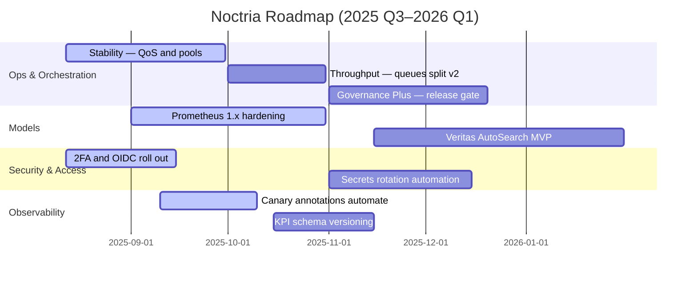

# 🗺 Roadmap & OKRs — Noctria Kingdom

**Document Version:** 1.1  
**Status:** Adopted  
**Planning Window:** 2025 Q3–2026 Q1  
**Last Updated:** 2025-08-14 (JST)

> 目的：Noctria の**中期ロードマップ**と**OKR（Objectives & Key Results）**を一元管理し、PDCA を継続的に前進させる。  
> 参照：`../governance/Vision-Governance.md` / `../architecture/Architecture-Overview.md` / `../operations/Runbooks.md` / `../operations/Airflow-DAGs.md` / `../operations/Config-Registry.md` / `../observability/Observability.md` / `../apis/Do-Layer-Contract.md` / `../risks/Risk-Register.md` / `./Release-Notes.md`

---

## 1) スコープ & 原則
- **スコープ**：機能 / 運用 / セキュリティ / モデル / 可観測性に跨る横断優先順位。  
- **原則**：
  1. **Guardrails First** — Noctus 境界 / 監査 / Secrets を期限より優先。  
  2. **Measure What Matters** — すべての KR を**観測可能メトリクス**に紐づける。  
  3. **Docs-as-Code** — 変更は**同一 PR で文書更新**し、`Release-Notes.md` へ反映。  
  4. **Small Safe Steps** — 段階導入（7%→30%→100%）を標準運用。  
  5. **Traceable by Design** — `trace_id` の E2E 貫通（Plan→Infer→Do→Exec）を前提化。

---

## 2) 時間軸・リリース計画（暫定）
- **2025.08 Foundation**：初版ドキュメント/契約/標準（※リリース済）  
- **2025.09 Stability**：運用耐性と監視強化、Do 層 QoS 安定  
- **2025.10 Throughput**：発注最適化 v2、Airflow キュー分離  
- **2025.12 Governance Plus**：Two-Person / 監査の自動化、セキュアリリースゲート  
- **2026.01 Alpha Models**：Prometheus 1.x 強化、Veritas 自動探索 MVP



> メモ：Mermaid の Gantt は GitHub 互換構文で記述（記号は ASCII、括弧は未使用）。

---

## 3) 戦略テーマ（Pillars）
1. **Reliability & Safety** — 失敗を早く検知し安全に止める  
2. **Execution Performance** — Do 層のレイテンシとスリッページ最適化  
3. **Model Excellence** — 再現性と優位性の持続（WFO / シャドー / 段階導入）  
4. **Security & Governance** — 最小権限・監査・Two-Person Rule の自動化  
5. **Dev Velocity** — テスト / CI と構成管理の摩擦低減

---

## 4) OKRs（2025 Q3–Q4 / 2026 Q1）
> スコア評価は **0.0–1.0**。`Owner` はロール名、計測は `Observability.md` のメトリクスを正。

### O-1 Reliability & Safety（Owner: Ops + Risk）
- **KR1.1**：`airflow_dag_success_rate`（月次）≥ **99.2%** を 2 か月連続で達成  
- **KR1.2**：重大アラートから**一次反応 ≤ 5m (p95)** を 30 日継続  
- **KR1.3**：`risk_policy` 越境による **実発注ゼロ**（0 件）  
- **KR1.4**：`KpiSummaryStale` アラート **0 件/週**（4 週平均）

### O-2 Execution Performance（Owner: Do）
- **KR2.1**：`do_order_latency_seconds` **p95 ≤ 0.40s**（prod、平日日中、14 日連続）  
- **KR2.2**：`do_slippage_pct` **p90 ≤ 0.30%** を 4 週連続達成（対象シンボル）  
- **KR2.3**：`broker_api_errors_total / requests_total ≤ 1%`（10m 窓、月次平均）

### O-3 Model Excellence（Owner: Models + Risk）
- **KR3.1**：Prometheus 1.x（stg シャドー）で **Sharpe_adj +5%**（対 2025.08 基準）  
- **KR3.2**：本番カナリア中（7%→30%）の **MaxDD ≤ 8%**（Safemode ON）  
- **KR3.3**：`sigma_mean` の逸脱監視を導入し、閾値越え**自動アラート稼働**

### O-4 Security & Governance（Owner: Sec + King）
- **KR4.1**：**Secrets in repo = 0**（gitleaks/CI 100% パス）  
- **KR4.2**：`Two-Person Gate` を `risk_policy` / `flags` / `API` / `Do-Contract` に適用（**4/4 完了**）  
- **KR4.3**：Secrets ローテ **90 日**の**自動通知 + Runbook 運用**が稼働（prod）

### O-5 Dev Velocity（Owner: Arch + Ops）
- **KR5.1**：PR → stg デプロイの **リードタイム中央値 ≤ 2h**  
- **KR5.2**：E2E スモーク（stg）**合格率 ≥ 95%**（直近 30 日）  
- **KR5.3**：契約/スキーマ破壊変更 **0 件**（`jsonschema` CI で検出ゼロ）

---

## 5) マイルストーン（Deliverables）
| 期限 | マイルストーン | 受け入れ基準（DoD） | Owner |
|---|---|---|---|
| 2025-09-30 | Stability 完了 | Pools/Queues 設計、SLA ダッシュ可視化、Runbook 改訂、KR1.1 初達成 | Ops |
| 2025-10-31 | Throughput 完了 | 発注最適化 v2、p95≤0.40s、スリッページ p90≤0.30% | Do |
| 2025-12-20 | Governance Plus 完了 | Two-Person Gate 自動化、監査 WORM、注釈連携 | Sec/Arch |
| 2026-01-31 | Alpha Models 完了 | Veritas MVP、Prometheus 1.x Gate 通過、段階導入 30% | Models |

---

## 6) 依存関係（Cross-Team / Docs）
- **Runbooks**：抑制度 / ロールバック / バックフィル手順の改訂（各変更と同一 PR）  
- **Config-Registry**：`flags` / `risk_policy` / `observability.alerts` の差分管理  
- **Observability**：Rules / ダッシュボード / 注釈 API（KR 計測ソース）  
- **Do-Layer-Contract**：最小互換での拡張（Breaking は `/v2` 案で ADR 起票）

---

## 7) リスク & 対応（抜粋）
| リスク | 影響 | 緩和策 | 出口条件 |
|---|---|---|---|
| ブローカー障害長期化 | 発注停止 / 機会損失 | 代替経路・指数バックオフ・抑制 | Error rate ≤1% を 7 日維持 |
| スキーマドリフト | 連携失敗 | `jsonschema` CI / 契約テスト | 連続 30 日 破壊ゼロ |
| モデル優位性劣化 | KPI 低下 | シャドー 10 日 / 段階導入 / 再学習 | G3/G4 Gate を再達成 |

> 詳細は `../risks/Risk-Register.md`（R-02 / R-03 / R-09 / R-08）参照。

---

## 8) 測定 & データソース（例）
| KR | メトリクス/クエリ | 粒度 | 出力先 |
|---|---|---|---|
| KR1.1 | `airflow_dag_runs_total{status}` → 成功率 | 日/週/月 | Grafana: Airflow Board |
| KR2.1 | `histogram_quantile(0.95, do_order_latency_seconds_bucket)` | 5 分 | Grafana: Do QoS |
| KR2.2 | `histogram_quantile(0.90, do_slippage_pct_bucket)` | 10 分 | Grafana: Do QoS |
| KR3.1 | `kpi_sharpe_adj{env="stg"}` | 1 日 | PDCA Summary |
| KR4.1 | gitleaks CI 結果（0 件） | PR 毎 | GitHub Checks |
| KR5.1 | CI timestamps（PR→Deploy） | PR 毎 | Pipeline Board |

---

## 9) ガバナンス & カデンス
- **Weekly Council**：OKR 進捗 / リスク / ブロッカーのレビュー（30 分）  
- **Monthly Review**：スコア暫定評価、優先順位再配置、`Release-Notes.md` 更新  
- **Quarter Close**：スコア確定（0.0–1.0）、次期 OKR 起案、必要な ADR を確定

---

## 10) 変更管理（運用）
- 変更は**同一 PR**で：コード＋ Docs（本書 / Runbooks / Config / Observability / API / Contract）。  
- 破壊的変更は **ADR 必須**（`adrs/`）、`Release-Notes.md` の **Breaking** に明記。  
- マイルストーン達成時は `Release-Notes.md` に**リリース名**と**要点**を追記。

---

## 11) スコアリング規約（OKR Rubric）
- **0.0** 未着手、**0.3** 部分達成、**0.7** ほぼ達成、**1.0** 完全達成（定量条件クリア）  
- 途中で条件を**緩めない**（緩和は別 KR として再定義）  
- 計測不能な KR は**無効**。必ずメトリクス or 監査可能イベントに紐づける。

---

## 12) テンプレ（OKR エントリ）
```md
### O-x {Objective（定性的な方向）}
- KR{x.1}: {定量条件 / 閾値 / 期間} — Owner: {Role}
- KR{x.2}: ...
- 計測: {メトリクス / クエリ / 出力先}
- リスク: {主要リスクと緩和策リンク}
```

---

## 13) 変更履歴（Changelog）
- **2025-08-14**: v1.1  
  - Mermaid Gantt を GitHub 互換で再整形（括弧/記号を回避）。  
  - 原則に `Traceable by Design` を追記。  
  - 2FA/OIDC の進捗を反映（ロールアウト期間を明示）。  
- **2025-08-12**: v1.0 初版（テーマ / OKR / ガント / 測定 / ガバナンス / テンプレ）
